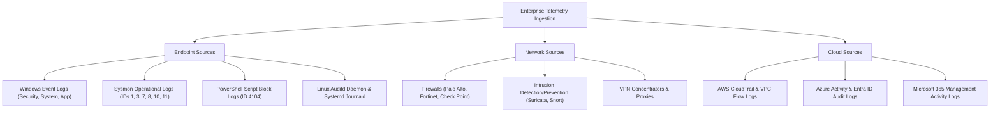
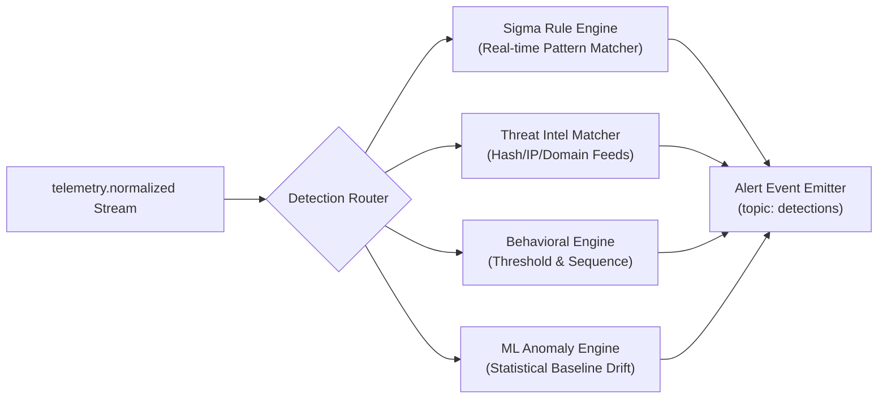
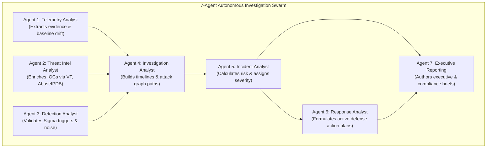
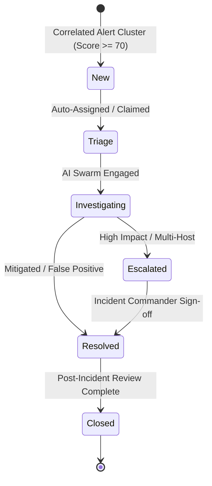
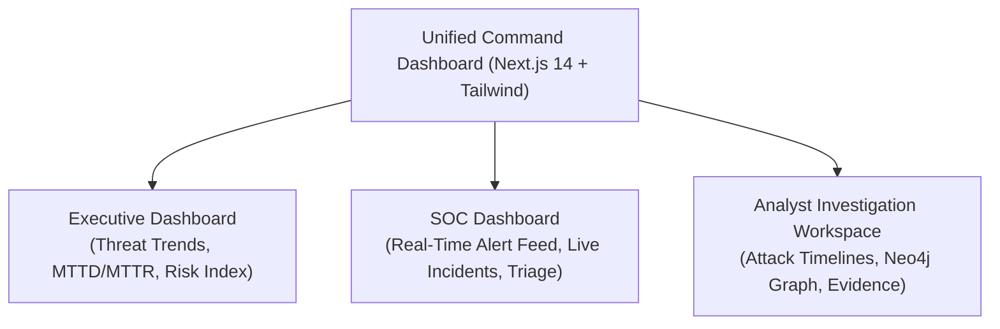
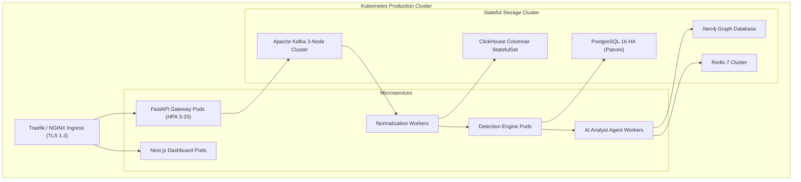

# SKYNET: Architecture Design Document (ADD)
# Autonomous AI-Powered SOC & XDR Platform

**System Designation:** SKYNET Architecture Design Document (ADD)  
**Document Version:** 1.0  
**Status:** Approved Architectural Baseline  
**Classification:** Confidential / Enterprise Restricted  
**Primary Repository Reference:** [SKYNET Workspace](file:///d:/hackathon/hackex/SKYNET)  
**Companion Documents:** [SRS.md](file:///d:/hackathon/hackex/SKYNET/SRS.md) | [MVP_ROADMAP.md](file:///d:/hackathon/hackex/SKYNET/MVP_ROADMAP.md) | [ROADMAP.md](file:///d:/hackathon/hackex/SKYNET/ROADMAP.md)

---

## Table of Contents

1. [Architecture Goals](#1-architecture-goals)
2. [Architecture Principles](#2-architecture-principles)
3. [Enterprise Architecture Overview](#3-enterprise-architecture-overview)
4. [Collection Layer](#4-collection-layer)
5. [Streaming Layer](#5-streaming-layer)
6. [Normalization Layer](#6-normalization-layer)
7. [Detection Layer](#7-detection-layer)
8. [Correlation Layer](#8-correlation-layer)
9. [Attack Graph Engine](#9-attack-graph-engine)
10. [Autonomous Investigation Layer](#10-autonomous-investigation-layer)
11. [Incident Management Layer](#11-incident-management-layer)
12. [SOAR Architecture](#12-soar-architecture)
13. [Dashboard Architecture](#13-dashboard-architecture)
14. [Security Architecture](#14-security-architecture)
15. [Deployment Architecture](#15-deployment-architecture)
16. [Disaster Recovery](#16-disaster-recovery)
17. [Future Architecture Evolution](#17-future-architecture-evolution)

---

## 1. Architecture Goals

The SKYNET architecture is engineered to achieve the following foundational technical goals:
- **Automate Tier-1 SOC Operations**: Eliminate manual repetitive triage by autonomously parsing logs, validating detections, enriching indicators, generating timelines, and writing incident dossiers.
- **Scale to Enterprise Workloads**: Sustain continuous throughput exceeding **100,000 Events Per Second (EPS)** with sub-second analytical aggregations across billions of historical events.
- **Support Hybrid, Cloud & On-Premise Deployments**: Provide uniform operating telemetry across bare-metal datacenters, air-gapped secure facilities, and multi-cloud VPCs (AWS, Azure, GCP).
- **Provide Explainable AI Investigations**: Guarantee that every automated conclusion, severity ranking, and containment recommendation is backed by a deterministic chain-of-thought with citations to raw forensic telemetry.
- **Maintain High Availability & Fault Tolerance**: Ensure 99.9% uptime with zero message loss across Kafka partitions, ClickHouse clusters, and PostgreSQL state databases.
- **Enable Secure Active Automation**: Safeguard defensive interventions (SOAR) through cryptographic authorization tokens and human-in-the-loop (HITL) approval gates.

---

## 2. Architecture Principles

```
  ┌───────────────┐     ┌───────────────┐     ┌───────────────┐
  │  Scalability  │     │  Resilience   │     │   Security    │
  │  (Horizontal) │     │ (Zero-Loss)   │     │  (Zero-Trust) │
  └───────┬───────┘     └───────┬───────┘     └───────┬───────┘
          │                     │                     │
          └───────────────┬─────┴─────────────────────┘
                          │
          ┌───────────────┴───────────────┐
          │ Observability │  Modularity   │
          │ (Full Traces) │ (Microservice)│
          └───────────────┴───────────────┘
```

1. **Scalability**: All critical services—ingestion gateways, stream workers, detection nodes, and query engines—must be decoupled and horizontally scalable without service interruption.
2. **Resilience**: The system design enforces zero single points of failure (No SPOF). Storage and streaming layers incorporate multi-broker replication and local client buffering.
3. **Security**: Enforce Zero-Trust Architecture across all tiers: mutual TLS (mTLS) for transport, least privilege role-based access, and cryptographic signing for active defense commands.
4. **Observability**: Maintain full visibility into telemetry pipelines via OpenTelemetry distributed tracing, Prometheus performance metrics, and structured OpenSearch logs.
5. **Modularity**: Components interact via standard contracts (REST, gRPC, Kafka topics, and MCP JSON-RPC 2.0), allowing independent upgrades and microservice isolation.

---

## 3. Enterprise Architecture Overview

```
                      ┌────────────────────────────────────────┐
                      │           TELEMETRY SOURCES            │
                      │ Windows │ Linux │ Syslog │ Cloud Logs  │
                      └───────────────────┬────────────────────┘
                                          │ mTLS Encrypted
                                          ▼
                      ┌────────────────────────────────────────┐
                      │          COLLECTION SERVICES           │
                      │  Windows Agent │ Linux Daemon │ Syslog │
                      └───────────────────┬────────────────────┘
                                          │ Batched Events
                                          ▼
                      ┌────────────────────────────────────────┐
                      │         KAFKA EVENT STREAMING          │
                      │  Topics: telemetry.raw │ normalized    │
                      └───────────────────┬────────────────────┘
                                          │
                                          ▼
                      ┌────────────────────────────────────────┐
                      │          NORMALIZATION LAYER           │
                      │    OCSF / ECS Parser & Field Mapping   │
                      └─────────────┬────────────────────┬─────┘
                                    │                    │
                                    ▼                    ▼
       ┌───────────────────────────────────┐    ┌───────────────────────────┐
       │          DETECTION LAYER          │    │    CLICKHOUSE STORAGE     │
       │ Sigma │ Threat Intel │ ML Anomaly │    │   (High-Velocity Events)  │
       └────────────────┬──────────────────┘    └───────────────────────────┘
                        │ Alert Events
                        ▼
       ┌───────────────────────────────────┐    ┌───────────────────────────┐
       │         CORRELATION LAYER         │    │    ATTACK GRAPH ENGINE    │
       │ Host │ User │ Time Window │ TTP   │◄──►│       (Neo4j Graph)       │
       └────────────────┬──────────────────┘    └───────────────────────────┘
                        │ Correlated Clusters
                        ▼
       ┌───────────────────────────────────────────────────────────────┐
       │                AI INVESTIGATION AGENTS SWARM                  │
       │   Telemetry │ Threat Intel │ Investigation │ Incident │ Resp   │
       └────────────────┬──────────────────────────────────────────────┘
                        │ Synthesized Incident Package
                        ▼
       ┌───────────────────────────────────┐    ┌───────────────────────────┐
       │      CASE MANAGEMENT (PG 16)      │    │      SOAR AUTOMATION      │
       │ Incidents, Evidence, Audit Ledger │◄──►│ Active Defense & Approval │
       └────────────────┬──────────────────┘    └─────────────┬─────────────┘
                        │                                     │ Signed Commands
                        ▼                                     ▼
       ┌───────────────────────────────────┐    ┌───────────────────────────┐
       │       DASHBOARD & REPORTING       │    │     HOST REMEDIATOR       │
       │ Next.js 14 Executive / SOC Views  │    │  (Block, Kill, Isolate)   │
       └───────────────────────────────────┘    └───────────────────────────┘
```

---

## 4. Collection Layer

### 4.1 Purpose
The Collection Layer operates at the perimeter of the infrastructure, gathering raw telemetry from all enterprise endpoints, network equipment, and cloud subscriptions while enforcing zero host degradation.

### 4.2 Sources



- **Endpoint Collectors**: Lightweight Python/C++ system services running on Windows and Linux hosts. Windows agents capture ETW (Event Tracing for Windows) and Sysmon; Linux daemons stream `auditd` netlink sockets.
- **Network Ingestion**: Syslog receiver binding to ports 514 (UDP) and 6514 (Syslog over TLS), buffering RFC 5424 streams directly to Kafka.
- **Cloud Connectors**: Serverless ingestion workers pulling audit records via AWS SQS/Kinesis and Azure Event Hubs.

---

## 5. Streaming Layer

### 5.1 Technology: Apache Kafka (or Redpanda)
Kafka serves as the enterprise central nervous system, decoupling asynchronous ingestion from downstream processing workers and providing persistent multi-subscriber buffering.

### 5.2 Responsibilities
- **High-Throughput Ingestion**: Ingest up to 100,000 EPS across partitioned message topics.
- **Queue Management & Load Balancing**: Dynamically distribute processing across consumer groups.
- **Fault Tolerance**: Maintain replication factor of 3 with min-ISR of 2; zero message drop upon single broker loss.
- **Event Replay**: Retain raw streams for 7 days, allowing retrospective re-evaluation of new Sigma rules against past data.

### 5.3 Core Kafka Topics

| Topic Name | Key Partitioning | Retention | Purpose |
|---|---|---|---|
| `telemetry.raw` | `device_uuid` / `source_ip` | 7 Days | Unparsed, raw multi-format JSON/Syslog payloads from collectors. |
| `telemetry.normalized` | `device_uuid` | 7 Days | Standardized OCSF/ECS events consumed by ClickHouse and Detection Engine. |
| `detections` | `alert_id` | 30 Days | Output of Sigma/IOC matching engine; trigger for correlation workers. |
| `incidents` | `incident_id` | 90 Days | High-priority correlated packages consumed by AI investigation agents. |

---

## 6. Normalization Layer

### 6.1 Purpose
Transforms disparate, proprietary log formats into a single, standardized schema based on the **Open Cybersecurity Schema Framework (OCSF)** and **Elastic Common Schema (ECS)**.

### 6.2 Normalization Functions
1. **Field Mapping**: Maps vendor-specific syntax to canonical attributes.
2. **Data Type Casting & Timestamp Alignment**: Converts all timestamps into microsecond-precision UTC (`DateTime64(6, 'UTC')`).
3. **Geo-IP & Asset Context Enrichment**: Enriches IP addresses with MaxMind GeoLite2 ASN/Country and matches hostnames against asset inventory databases.

#### Canonical Field Mapping Example
| Original Field Name | Source Format | Normalized Canonical Field |
|---|---|---|
| `SourceIP` / `IpAddress` | Windows Event Log | `source.ip` |
| `src_ip` / `src` | Syslog Firewall | `source.ip` |
| `DestinationPort` / `dst_port` | Sysmon / Netflow | `destination.port` |
| `NewProcessName` / `Image` | Windows Sysmon Event 1 | `process.name` |
| `comm` / `exe` | Linux Auditd | `process.name` |
| `TargetUserName` / `user` | Windows 4624 / Linux Auth | `user.name` |

### 6.3 Unified Event Object Schema (JSON)
```json
{
  "event_id": "9b1deb4d-3b7d-4bad-9bdd-2b0d7b3dcb6d",
  "event_timestamp": "2026-09-25T12:00:00.104921Z",
  "event_type": "process_create",
  "event_action": "started",
  "event_outcome": "success",
  "device": {
    "uuid": "win-srv-dc01-5829",
    "hostname": "win-srv-dc01.corp.internal",
    "os": "windows_server_2022",
    "ip": "10.0.1.10"
  },
  "user": {
    "name": "svc_backup",
    "domain": "CORP"
  },
  "process": {
    "pid": 4812,
    "name": "powershell.exe",
    "path": "C:\\Windows\\System32\\WindowsPowerShell\\v1.0\\powershell.exe",
    "command_line": "powershell.exe -ep bypass -nop -enc SQBFAFgA...",
    "hash_sha256": "3b7d4bad9bdd2b0d7b3dcb6d9b1deb4d3b7d4bad9bdd2b0d7b3dcb6d9b1deb4d",
    "parent_pid": 1024,
    "parent_name": "cmd.exe"
  },
  "network": {
    "destination_ip": "185.220.101.5",
    "destination_port": 443,
    "protocol": "tcp"
  },
  "raw_payload": "..."
}
```

---

## 7. Detection Layer

### 7.1 Components



1. **Sigma Engine**: Translates open-source community Sigma rules into compiled streaming predicates evaluated on incoming event objects.
2. **Threat Intelligence Matcher**: Compares observed hashes, domains, and IP addresses in memory against Redis threat lookups.
3. **Behavioral Detection Engine**: Evaluates stateful event sequences over sliding windows (e.g., credential dumping followed by network beaconing).
4. **ML Anomaly Engine**: Statistical modeling (Isolation Forests / Z-score deviations) evaluating baseline drift in network transfer volume and process spawn rarity.

### 7.2 Supported Detections
- **Brute Force**: Rapid authentication failures ($\ge 5$ within 60s) targeting a single account.
- **Password Spraying**: Low-and-slow authentication failures targeting $\ge 10$ distinct users from a single source IP.
- **Malware Execution**: Known malicious binary execution, LOLBins exploitation (`certutil -urlcache`, `mshta`).
- **Phishing Activity**: Suspicious macro spawning script interpreters (`winword.exe` $\rightarrow$ `powershell.exe`).
- **PowerShell Abuse**: Base64 encoded execution, download cradles (`DownloadString`), unmanaged PowerShell injection.
- **Lateral Movement**: Remote service creation (`sc.exe create`), WMI process execution (`wmic process call create`), Pass-the-Hash.
- **Privilege Escalation**: LSASS memory access, SAM registry dumping, unquoted service path exploitation.
- **Data Exfiltration**: Unusual large outbound transfers over DNS tunnels or encrypted HTTPS to rare domains.

---

## 8. Correlation Layer

### 8.1 Purpose
The Correlation Layer eliminates alert fatigue by condensing hundreds of raw alerts into meaningful, high-context incident candidates.

### 8.2 Correlation Keys & Temporal Windowing
Alerts are clustered within a sliding time window $T_{\text{window}} = 15 \text{ minutes}$ using composite identity keys:
$$\text{Correlation Key} = \{ \text{HostUUID} \} \lor \{ \text{UserAccount} \} \lor \{ \text{Source/Destination IP} \} \lor \{ \text{ProcessHash} \}$$

### 8.3 Correlation Scenario Example: Account Compromise Chain

```
[Failed Logon (4625) x 8] ──┐
                            ├─► [Time Window: 15m] ──► [Key: user=jsmith, host=DC01]
[Successful Logon (4624)] ──┤
                            │
[New Device IP Observed] ───┤
                            │
[Privilege Token Added] ────┘
                            │
                            ▼
              ┌───────────────────────────┐
              │ CORRELATED INCIDENT EVENT │
              │ Potential Account Takeover│
              │  & Privilege Escalation   │
              │   Severity: CRITICAL      │
              └───────────────────────────┘
```

---

## 9. Attack Graph Engine

### 9.1 Technology: Neo4j Graph Database
The Attack Graph Engine provides visual and algorithmic contextualization of adversary movement across enterprise infrastructure.

### 9.2 Entity Types (Nodes)
- `(:User)`: Active Directory / local accounts (`user_name`, `domain`, `privilege_level`).
- `(:Host)`: Endpoints and servers (`hostname`, `ip`, `os`, `criticality`).
- `(:Process)`: Executed binaries (`name`, `pid`, `cmdline`, `hash`).
- `(:File)`: Created, modified, or quarantined files (`path`, `hash_sha256`).
- `(:IP)` / `(:Domain)`: External and internal network indicators.
- `(:Alert)` / `(:Incident)`: Operational alert and case entities.

### 9.3 Relationships (Edges)
```cypher
(:User)-[:AUTHENTICATED_TO {timestamp, method}]->(:Host)
(:Process)-[:SPAWNED_BY]->(:Process)
(:Process)-[:CONNECTED_TO {port, bytes}]->(:IP)
(:Process)-[:WROTE_FILE]->(:File)
(:File)-[:DOWNLOADED_FROM]->(:Domain)
(:Alert)-[:TRIGGERED_ON]->(:Host)
```

### 9.4 Purpose & Graph Traversal
- **Blast Radius Analysis**: Identify all hosts reached by a compromised credential using Cypher shortest-path queries.
- **Lateral Movement Visualization**: Trace adversary traversal across network segments in the Next.js visual graph canvas.

---

## 10. Autonomous Investigation Layer

SKYNET operates a specialized swarm of 7 AI SOC Analysts orchestrated using **LangGraph**:



| Agent | Role | Primary Responsibilities |
|---|---|---|
| **Agent 1** | **Telemetry Analyst** | Mines raw ClickHouse event tables for surrounding context within $T \pm 15\text{m}$. |
| **Agent 2** | **Threat Intel Analyst** | Evaluates hashes, IPs, and domains against VirusTotal, AbuseIPDB, URLhaus, and MISP. |
| **Agent 3** | **Detection Analyst** | Evaluates true-positive vs false-positive probability; filters administrative scripts. |
| **Agent 4** | **Investigation Analyst** | Reconstructs microsecond-stamped attack timelines and traces Neo4j attack graph hops. |
| **Agent 5** | **Incident Analyst** | Computes composite risk score ($0–100$), authoring root cause technical analysis. |
| **Agent 6** | **Response Analyst** | Formulates advisory containment actions (`BLOCK_IP`, `KILL_PROCESS`, `ISOLATE_DEVICE`). |
| **Agent 7** | **Executive Reporting** | Synthesizes plain-language executive summaries and maps metrics to ISO 27001/NIST. |

---

## 11. Incident Management Layer

### 11.1 Incident Lifecycle State Machine



### 11.2 Incident Data Structure
- **Core Identifiers**: `incident_id` (UUID), `incident_number` (`INC-2026-XXXX`).
- **Severity & Priority**: `severity` (`LOW`, `MEDIUM`, `HIGH`, `CRITICAL`), `risk_score` ($0–100$).
- **Evidence Locker**: Array of raw `event_id` references, memory hashes, process execution trees.
- **Chronological Timeline**: Microsecond-ordered sequence of adversary actions with causality tags.
- **Analyst Notes & Audit**: Timestamped operator comments, reassignment logs, and containment actions taken.

---

## 12. SOAR Architecture

### 12.1 Supported Defensive Actions
- `BLOCK_IP`: Injects local Windows Firewall / Linux `iptables` / perimeter firewall rules blocking source/destination traffic.
- `DISABLE_USER`: Suspends compromised Active Directory or local operating system user accounts.
- `QUARANTINE_FILE`: Encrypts malicious file using AES-256 and moves it to a secure endpoint isolation directory.
- `ISOLATE_ENDPOINT`: Drops all network traffic on host except C2 management socket to SKYNET gateway.
- `CREATE_TICKET`: Synchronizes incident state to Jira / ServiceNow ticketing systems.
- `SEND_NOTIFICATION`: Dispatches rich Markdown alerts to Telegram, Slack, Microsoft Teams, and Email.

### 12.2 Execution Modes & Governance
1. **Automatic Execution (Low-Risk Actions)**:
   - Non-disruptive actions (e.g., Block known external C2 IP on perimeter, quarantine unexecuted file).
   - Executed autonomously if confidence $> 95\%$ and risk score $> 80$.
2. **Approval-Based Execution (High-Risk Actions)**:
   - Disruptive operations (e.g., Isolate Domain Controller, terminate critical host process tree, disable domain admin).
   - **MANDATES** Human-in-the-Loop (HITL) authorization via interactive Telegram button or Web Dashboard.
   - Enforces one-time **ED25519-signed token authorization** with 5-minute expiration.

---

## 13. Dashboard Architecture

The frontend is a modern Next.js 14 web application providing three tailored operational views:



1. **Executive Dashboard**: High-level telemetry for CISOs and security leadership displaying risk posture, compliance adherence (NIST CSF / ISO 27001), active compromised asset count, and operational MTTD/MTTR dials.
2. **SOC Dashboard**: Central operational workspace displaying the real-time alert triage feed, active incident Kanban board, and threat intelligence lookups.
3. **Analyst Investigation Workspace**: Forensic split-screen interface displaying interactive attack timelines, Neo4j relationship graphs, raw event JSON drawers, and the AI Analyst reasoning pane with approval buttons.

---

## 14. Security Architecture

### 14.1 Authentication & Identity Governance
- **SSO Integration**: Enterprise Identity Providers integrated via **Keycloak**, supporting **OAuth2**, **OpenID Connect (OIDC)**, and **SAML 2.0**.
- **Multi-Factor Authentication (MFA)**: Enforced across all analyst and administrative sessions via TOTP (RFC 6238) or FIDO2 WebAuthn tokens.
- **Agent Identity**: Device agents authenticate using Mutual TLS (mTLS) with X.509 certificates verified against an internal Subordinate CA.

### 14.2 Authorization & RBAC Matrix
| Role | View Alerts | Triage Incidents | Modify Rules | Trigger Low SOAR | Approve High SOAR | System Config |
|---|:---:|:---:|:---:|:---:|:---:|:---:|
| `L1 Analyst` | Yes | Yes | No | Advisory | No | No |
| `L2 Analyst` | Yes | Yes | Yes | Yes | No | No |
| `Threat Hunter` | Yes | Yes | Custom Queries | Yes | No | Read-Only |
| `Incident Responder` | Yes | Yes | Yes | Yes | Yes | No |
| `Administrator` | Yes | Yes | Yes | Yes | Yes | Full Access |

### 14.3 Security Controls
- **Secrets Governance**: Threat intelligence API tokens and database credentials are held in HashiCorp Vault or Kubernetes Secrets mounted in-memory.
- **Audit Logging**: Every action is cryptographically recorded in an append-only, SHA-256 hash-chained audit ledger.
- **API Defense**: Token Bucket rate limiting via Redis (120 req/min for agents, 60 req/min for users).

---

## 15. Deployment Architecture



- **Containerization**: Standardized OCI-compliant minimal container images built with Docker and Alpine Linux/Distroless bases.
- **Orchestration**: Kubernetes with Helm chart packaging (`skynet-core`) supporting Horizontal Pod Autoscalers (HPA).
- **CI/CD Pipeline**: GitHub Actions workflows running automated SAST (CodeQL/Trivy), unit tests, multi-arch container builds, Cosign image signing, and ArgoCD GitOps deployment.
- **Observability**: Prometheus metrics scraping `/metrics` endpoints, Grafana operational dashboards, and OpenSearch for centralized service log analysis.

---

## 16. Disaster Recovery

### 16.1 Recovery Objectives
- **Recovery Point Objective (RPO)**: **$\le 15$ Minutes** (Maximum allowable data loss during catastrophic disaster).
- **Recovery Time Objective (RTO)**: **$\le 30$ Minutes** (Maximum allowable downtime before primary ingestion is restored).

### 16.2 Backup & Failover Strategy
- **PostgreSQL**: Continuous Write-Ahead Logging (WAL) archiving to geo-redundant S3 object storage with daily full snapshots. Automatic standby failover managed via Patroni.
- **ClickHouse**: Scheduled automated snapshots using `clickhouse-backup` pushed to secondary cloud storage.
- **Neo4j**: Daily consistent graph backups and transaction log streaming.
- **Automated Restore Validation**: Bi-weekly automated restore verification executing synthetic query validation in an isolated staging namespace.

---

## 17. Future Architecture Evolution

The SKYNET architecture follows a clear versioned progression:

```
[Version 1.0 (Current Baseline)]
Autonomous Tier-1 SOC MVP ➔ Rule Detection, IOC Enrichment, 7-Agent Swarm, HITL SOAR
                           │
                           ▼
[Version 2.0: Advanced Correlation & Graph Reasoning]
Cross-telemetry Graph Machine Learning (GNNs) ➔ Multi-Cloud Identity Correlation
                           │
                           ▼
[Version 3.0: Multi-Agent Autonomous Investigations]
Multi-Agent Dynamic Debate ➔ Autonomous Hypothesis Formulation ➔ Memory Vector Stores
                           │
                           ▼
[Version 4.0: Enterprise Multi-Tenant Platform]
MSSP Tenant Data Isolation ➔ Cross-Tenant Threat Intel Federation ➔ Custom Tenant Playbooks
                           │
                           ▼
[Version 5.0: Predictive & Autonomous Active Defense]
Bayesian Zero-Touch Host Containment ➔ Predictive Cyber Defense ➔ Generative Deception Grids
```

- **Version 2.0 (Advanced Correlation)**: Graph Neural Networks (GNNs) analyzing Neo4j topology to identify stealthy, slow-moving advanced persistent threats (APTs).
- **Version 3.0 (Autonomous Investigations)**: Autonomous multi-agent debate protocols where investigation agents challenge findings to eliminate false positives.
- **Version 4.0 (Enterprise Multi-Tenant Platform)**: Logical and physical tenant database partitioning enabling MSSPs to manage hundreds of organizations securely.
- **Version 5.0 (Predictive Security Operations)**: Machine-speed autonomous zero-touch containment using reinforcement learning and adaptive deception networks.

---

*End of Architecture Design Document (ADD) — SKYNET Version 1.0.*
