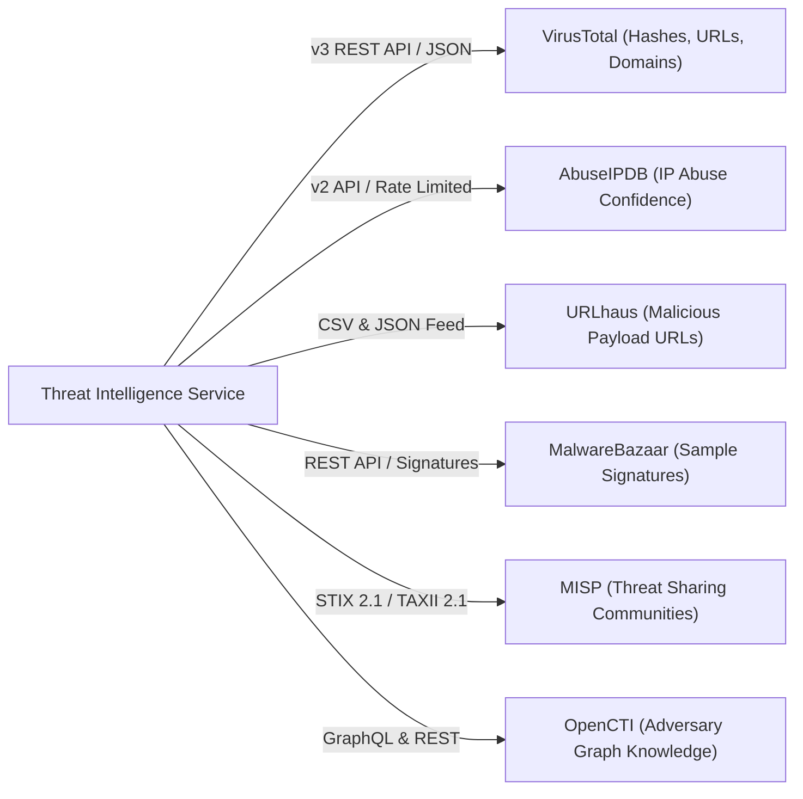
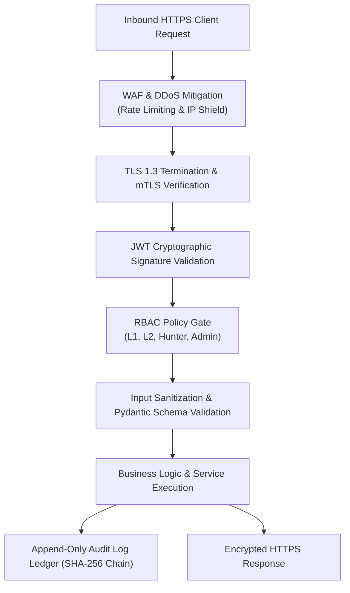

# SKYNET: API Specification & Integration Guide
# Autonomous AI-Powered SOC & XDR Platform

**System Designation:** SKYNET API Specification & Integration Guide  
**Document Version:** 1.0  
**Status:** Approved Integration & API Baseline  
**Classification:** Confidential / Enterprise Restricted  
**Primary Repository Reference:** [SKYNET Workspace](file:///d:/hackathon/hackex/SKYNET)  
**Companion Documents:** [SRS.md](file:///d:/hackathon/hackex/SKYNET/SRS.md) | [ADD.md](file:///d:/hackathon/hackex/SKYNET/ADD.md) | [HLD.md](file:///d:/hackathon/hackex/SKYNET/HLD.md) | [LLD.md](file:///d:/hackathon/hackex/SKYNET/LLD.md) | [DDD.md](file:///d:/hackathon/hackex/SKYNET/DDD.md)

---

## Table of Contents

1. [Purpose](#1-purpose)
2. [API Standards & Conventions](#2-api-standards--conventions)
3. [Authentication APIs](#3-authentication-apis)
   - 3.1 [Login](#31-login)
   - 3.2 [Refresh Token](#32-refresh-token)
   - 3.3 [Logout](#33-logout)
4. [Alert Management APIs](#4-alert-management-apis)
   - 4.1 [Get Alerts](#41-get-alerts)
   - 4.2 [Get Alert by ID](#42-get-alert-by-id)
   - 4.3 [Update Alert](#43-update-alert)
5. [Incident Management APIs](#5-incident-management-apis)
   - 5.1 [Create Incident](#51-create-incident)
   - 5.2 [Get Incident](#52-get-incident)
   - 5.3 [Update Incident](#53-update-incident)
   - 5.4 [Close Incident](#54-close-incident)
6. [Investigation APIs](#6-investigation-apis)
   - 6.1 [Generate Attack Timeline](#61-generate-attack-timeline)
   - 6.2 [Collect Evidence](#62-collect-evidence)
   - 6.3 [Investigation Summary](#63-investigation-summary)
7. [Threat Intelligence APIs](#7-threat-intelligence-apis)
   - 7.1 [IP Reputation](#71-ip-reputation)
   - 7.2 [Domain Reputation](#72-domain-reputation)
   - 7.3 [URL Analysis](#73-url-analysis)
   - 7.4 [File Hash Lookup](#74-file-hash-lookup)
8. [SOAR Active Defense APIs](#8-soar-active-defense-apis)
   - 8.1 [Block IP](#81-block-ip)
   - 8.2 [Disable User](#82-disable-user)
   - 8.3 [Isolate Host](#83-isolate-host)
   - 8.4 [Create Ticket](#84-create-ticket)
9. [Threat Intelligence Integrations](#9-threat-intelligence-integrations)
10. [Notification Integrations](#10-notification-integrations)
11. [Ticketing Integrations](#11-ticketing-integrations)
12. [Directory Integrations](#12-directory-integrations)
13. [Streaming & WebSocket APIs](#13-streaming--websocket-apis)
14. [Rate Limiting Strategy](#14-rate-limiting-strategy)
15. [Error Handling & Error Contracts](#15-error-handling--error-contracts)
16. [API Security Architecture](#16-api-security-architecture)
17. [Acceptance Criteria](#17-acceptance-criteria)

---

## 1. Purpose

This API Specification & Integration Guide defines the communication protocols, authentication flows, RESTful schemas, WebSocket streaming endpoints, and enterprise connectors for **SKYNET**.

It serves as the definitive integration reference for frontend engineers, backend developers, integration partners, and external automated systems connecting to the SKYNET Autonomous SOC/XDR gateway.

---

## 2. API Standards & Conventions

- **Protocol**: HTTPS (strictly enforcing TLS 1.3).
- **Base URL**: `https://<skynet-gateway>/api/v1`
- **Authentication**: OAuth 2.0 with JSON Web Tokens (JWT) passed in the HTTP `Authorization` header as `Bearer <token>`.
- **Payload Format**: `application/json` (UTF-8 encoded).
- **Timestamp Standard**: ISO-8601 with microsecond precision in UTC (`YYYY-MM-DDTHH:MM:SS.ffffffZ`).
- **HTTP Status Codes**:
  - `200 OK`: Request succeeded.
  - `201 Created`: Resource successfully created.
  - `202 Accepted`: Asynchronous operation queued (e.g., SOAR approval action).
  - `400 Bad Request`: Validation failure.
  - `401 Unauthorized`: Missing or invalid JWT.
  - `403 Forbidden`: Insufficient RBAC role permissions.
  - `404 Not Found`: Target resource does not exist.
  - `429 Too Many Requests`: Rate limit threshold exceeded.
  - `500 Internal Server Error`: Unhandled server exception.

---

## 3. Authentication APIs

### 3.1 Login
Exchanges operator credentials and mandatory MFA token for an access and refresh token pair.

- **Endpoint**: `POST /api/v1/auth/login`
- **Headers**: `Content-Type: application/json`
- **Request Body**:
```json
{
  "username": "analyst_jsmith",
  "password": "SuperSecurePassword2026!",
  "totp_token": "684920"
}
```
- **Response `200 OK`**:
```json
{
  "access_token": "eyJhbGciOiJIUzI1NiIsInR5cCI6IkpXVCJ9...",
  "refresh_token": "eyJhbGciOiJIUzI1NiIsInR5cCI6IkpXVCJ9...",
  "token_type": "bearer",
  "expires_in": 900,
  "user": {
    "id": "e83b12dc-4829-4b10-91dc-82b1deb4dcb6",
    "username": "analyst_jsmith",
    "role": "L1_ANALYST"
  }
}
```

### 3.2 Refresh Token
Renews an expired short-lived access token using a valid refresh token.

- **Endpoint**: `POST /api/v1/auth/refresh`
- **Request Body**:
```json
{
  "refresh_token": "eyJhbGciOiJIUzI1NiIsInR5cCI6IkpXVCJ9..."
}
```
- **Response `200 OK`**:
```json
{
  "access_token": "eyJhbGciOiJIUzI1NiIsInR5cCI6IkpXVCJ9...",
  "expires_in": 900,
  "token_type": "bearer"
}
```

### 3.3 Logout
Invalidates the current session and adds the JWT identifier (`jti`) to the Redis revocation blacklist.

- **Endpoint**: `POST /api/v1/auth/logout`
- **Headers**: `Authorization: Bearer <token>`
- **Response `200 OK`**:
```json
{
  "success": true,
  "message": "Session successfully invalidated."
}
```

---

## 4. Alert Management APIs

### 4.1 Get Alerts
Retrieves a paginated list of detection alerts filtered by operational criteria.

- **Endpoint**: `GET /api/v1/alerts`
- **Query Parameters**:
  - `severity`: `CRITICAL` | `HIGH` | `MEDIUM` | `LOW`
  - `status`: `NEW` | `ACKNOWLEDGED` | `SUPPRESSED` | `CLOSED`
  - `assigned_to`: UUID
  - `source`: `SIGMA_RULE` | `IOC_MATCH` | `BEHAVIORAL_ANOMALY`
  - `start_date`: ISO-8601 Timestamp
  - `end_date`: ISO-8601 Timestamp
  - `limit`: Integer (Default: 50, Max: 500)
  - `offset`: Integer (Default: 0)
- **Response `200 OK`**:
```json
{
  "total": 1,
  "limit": 50,
  "offset": 0,
  "items": [
    {
      "id": "3b7d4bad-9bdd-2b0d-7b3d-cb6d9b1deb4d",
      "title": "Suspicious Encoded PowerShell Execution",
      "description": "Base64 encoded execution flag observed under cmd.exe",
      "severity": "HIGH",
      "source": "SIGMA_RULE",
      "status": "NEW",
      "assigned_to": null,
      "created_at": "2026-09-25T12:00:00.104921Z"
    }
  ]
}
```

### 4.2 Get Alert by ID
Fetches the detailed record of an alert including the raw matching log event.

- **Endpoint**: `GET /api/v1/alerts/{id}`
- **Response `200 OK`**:
```json
{
  "id": "3b7d4bad-9bdd-2b0d-7b3d-cb6d9b1deb4d",
  "title": "Suspicious Encoded PowerShell Execution",
  "severity": "HIGH",
  "source": "SIGMA_RULE",
  "mitre_technique": "T1059.001",
  "host_uuid": "win-srv-dc01-5829",
  "status": "NEW",
  "raw_event": {
    "process_name": "powershell.exe",
    "command_line": "powershell.exe -ep bypass -nop -enc SQBFAFgA...",
    "parent_process": "cmd.exe",
    "user": "CORP\\jsmith"
  },
  "created_at": "2026-09-25T12:00:00.104921Z"
}
```

### 4.3 Update Alert
Modifies alert status or reassigns alert ownership.

- **Endpoint**: `PATCH /api/v1/alerts/{id}`
- **Request Body**:
```json
{
  "status": "ACKNOWLEDGED",
  "assigned_to": "e83b12dc-4829-4b10-91dc-82b1deb4dcb6"
}
```
- **Response `200 OK`**:
```json
{
  "id": "3b7d4bad-9bdd-2b0d-7b3d-cb6d9b1deb4d",
  "status": "ACKNOWLEDGED",
  "assigned_to": "e83b12dc-4829-4b10-91dc-82b1deb4dcb6",
  "updated_at": "2026-09-25T12:05:00.000000Z"
}
```

---

## 5. Incident Management APIs

### 5.1 Create Incident
Promotes an alert cluster or manually initiates an incident case.

- **Endpoint**: `POST /api/v1/incidents`
- **Request Body**:
```json
{
  "title": "Potential Domain Controller Compromise",
  "severity": "CRITICAL",
  "priority": "P1_CRITICAL",
  "description": "Correlated PowerShell execution and outbound C2 connection from DC01",
  "alert_ids": ["3b7d4bad-9bdd-2b0d-7b3d-cb6d9b1deb4d"]
}
```
- **Response `201 Created`**:
```json
{
  "id": "5829921a-4bad-9bdd-2b0d-7b3dcb6d9b1d",
  "incident_number": "INC-2026-00482",
  "status": "NEW",
  "severity": "CRITICAL",
  "created_at": "2026-09-25T12:10:00.000000Z"
}
```

### 5.2 Get Incident
Retrieves full incident case details, linked evidence, and assigned analyst.

- **Endpoint**: `GET /api/v1/incidents/{id}`
- **Response `200 OK`**:
```json
{
  "id": "5829921a-4bad-9bdd-2b0d-7b3dcb6d9b1d",
  "incident_number": "INC-2026-00482",
  "title": "Potential Domain Controller Compromise",
  "severity": "CRITICAL",
  "priority": "P1_CRITICAL",
  "status": "INVESTIGATING",
  "summary": "Attacker leveraged compromised credentials to execute encoded PowerShell and established a persistent C2 beacon.",
  "root_cause": "Phishing email delivering weaponized macro document that spawned unmanaged PowerShell.",
  "assigned_to": "e83b12dc-4829-4b10-91dc-82b1deb4dcb6",
  "created_at": "2026-09-25T12:10:00.000000Z",
  "closed_at": null
}
```

### 5.3 Update Incident
Updates incident title, severity, priority, or investigation notes.

- **Endpoint**: `PUT /api/v1/incidents/{id}`
- **Request Body**:
```json
{
  "status": "INVESTIGATING",
  "priority": "P1_CRITICAL",
  "notes": "Analyst engaged. Host isolation initiated."
}
```
- **Response `200 OK`**: Returns updated incident object.

### 5.4 Close Incident
Closes an incident case with post-mortem resolution details.

- **Endpoint**: `POST /api/v1/incidents/{id}/close`
- **Request Body**:
```json
{
  "resolution_reason": "CONTAINED_AND_REMEDIATED",
  "closing_notes": "Rogue process killed, outbound C2 IP blocked on perimeter, user password reset."
}
```
- **Response `200 OK`**:
```json
{
  "id": "5829921a-4bad-9bdd-2b0d-7b3dcb6d9b1d",
  "status": "CLOSED",
  "closed_at": "2026-09-25T13:00:00.000000Z"
}
```

---

## 6. Investigation APIs

### 6.1 Generate Attack Timeline
Triggers the Investigation Service to query ClickHouse for surrounding telemetry ($T \pm 15\text{m}$) and construct an ordered causality sequence.

- **Endpoint**: `POST /api/v1/investigations/timeline`
- **Request Body**:
```json
{
  "incident_id": "5829921a-4bad-9bdd-2b0d-7b3dcb6d9b1d"
}
```
- **Response `200 OK`**:
```json
{
  "incident_id": "5829921a-4bad-9bdd-2b0d-7b3dcb6d9b1d",
  "timeline_count": 3,
  "events": [
    {
      "timestamp": "2026-09-25T11:58:12.102910Z",
      "stage": "INITIAL_ACCESS",
      "description": "User jsmith opened invoice.docm from Outlook client",
      "technique": "T1566.001"
    },
    {
      "timestamp": "2026-09-25T12:00:00.104921Z",
      "stage": "EXECUTION",
      "description": "WINWORD.EXE spawned powershell.exe with -enc flag",
      "technique": "T1059.001"
    },
    {
      "timestamp": "2026-09-25T12:00:04.928102Z",
      "stage": "COMMAND_AND_CONTROL",
      "description": "powershell.exe established TCP connection to 185.220.101.5:443",
      "technique": "T1071.001"
    }
  ]
}
```

### 6.2 Collect Evidence
Appends a verified forensic artifact to the incident's Evidence Locker.

- **Endpoint**: `POST /api/v1/investigations/evidence`
- **Request Body**:
```json
{
  "incident_id": "5829921a-4bad-9bdd-2b0d-7b3dcb6d9b1d",
  "evidence_type": "FILE_HASH",
  "value": "ed01ebf8333400e9475143523f192f7ddd3e3d4892c49e591a458fcb34b5fc0b",
  "source": "Sysmon_Event_1"
}
```
- **Response `201 Created`**: Returns evidence ID and recorded timestamp.

### 6.3 Investigation Summary
Fetches the AI-synthesized investigation package.

- **Endpoint**: `GET /api/v1/investigations/{id}/summary`
- **Response `200 OK`**:
```json
{
  "incident_id": "5829921a-4bad-9bdd-2b0d-7b3dcb6d9b1d",
  "risk_score": 92,
  "confidence": 0.96,
  "mitre_kill_chain": ["T1566.001", "T1059.001", "T1071.001"],
  "affected_hosts": ["win-srv-dc01.corp.internal"],
  "recommended_actions": [
    {
      "priority": 1,
      "action": "BLOCK_IP",
      "target": "185.220.101.5"
    },
    {
      "priority": 2,
      "action": "KILL_PROCESS",
      "target": "PID_4812"
    }
  ]
}
```

---

## 7. Threat Intelligence APIs

### 7.1 IP Reputation
- **Endpoint**: `GET /api/v1/ioc/ip/{ip}`
- **Response `200 OK`**:
```json
{
  "indicator": "185.220.101.5",
  "reputation": "MALICIOUS",
  "confidence": 98,
  "abuse_score": 100,
  "country_code": "DE",
  "asn": "AS208294",
  "source": "AbuseIPDB",
  "cached": true
}
```

### 7.2 Domain Reputation
- **Endpoint**: `GET /api/v1/ioc/domain/{domain}`
- **Response `200 OK`**:
```json
{
  "indicator": "malicious-c2-update.com",
  "reputation": "MALICIOUS",
  "confidence": 94,
  "category": "Command and Control",
  "source": "VirusTotal"
}
```

### 7.3 URL Analysis
- **Endpoint**: `GET /api/v1/ioc/url/{url}`
- **Response `200 OK`**:
```json
{
  "indicator": "http://185.220.101.5/payload.exe",
  "reputation": "MALICIOUS",
  "confidence": 100,
  "threat_type": "malware_download",
  "source": "URLhaus"
}
```

### 7.4 File Hash Lookup
- **Endpoint**: `GET /api/v1/ioc/hash/{hash}`
- **Response `200 OK`**:
```json
{
  "indicator": "ed01ebf8333400e9475143523f192f7ddd3e3d4892c49e591a458fcb34b5fc0b",
  "reputation": "MALICIOUS",
  "confidence": 99,
  "malware_family": "CobaltStrike",
  "positives": 64,
  "total": 72,
  "source": "VirusTotal"
}
```

---

## 8. SOAR Active Defense APIs

### 8.1 Block IP
Injects dynamic firewall drop rules at the endpoint or network boundary.

- **Endpoint**: `POST /api/v1/response/block-ip`
- **Request Body**:
```json
{
  "ip": "185.220.101.5",
  "incident_id": "5829921a-4bad-9bdd-2b0d-7b3dcb6d9b1d",
  "direction": "BOTH"
}
```
- **Response `200 OK`**:
```json
{
  "action_id": "9b1deb4d-3b7d-4bad-9bdd-2b0d7b3dcb6d",
  "status": "EXECUTED",
  "firewall_rule": "SKYNET_BLOCK_185.220.101.5",
  "executed_at": "2026-09-25T12:15:00.000000Z"
}
```

### 8.2 Disable User
Suspends a compromised identity in Active Directory / LDAP.

- **Endpoint**: `POST /api/v1/response/disable-user`
- **Request Body**:
```json
{
  "username": "CORP\\jsmith",
  "incident_id": "5829921a-4bad-9bdd-2b0d-7b3dcb6d9b1d",
  "reason": "Compromised credential beaconing"
}
```
- **Response `200 OK`**:
```json
{
  "action_id": "a1b2c3d4-e5f6-4a1b-8c2d-3e4f5a6b7c8d",
  "status": "USER_DISABLED",
  "target_user": "CORP\\jsmith"
}
```

### 8.3 Isolate Host
Severs all endpoint network connections except the C2 socket to the SKYNET gateway.

- **Endpoint**: `POST /api/v1/response/isolate-host`
- **Request Body**:
```json
{
  "host_uuid": "win-srv-dc01-5829",
  "incident_id": "5829921a-4bad-9bdd-2b0d-7b3dcb6d9b1d",
  "approval_token": "ED25519_SIGNED_TOKEN_HERE"
}
```
- **Response `200 OK`**:
```json
{
  "action_id": "f1e2d3c4-b5a6-4f1e-8d2c-3b4a5f6e7d8c",
  "status": "HOST_ISOLATED",
  "host_uuid": "win-srv-dc01-5829"
}
```

### 8.4 Create Ticket
Synchronizes an incident case to an external ticketing platform (Jira / ServiceNow).

- **Endpoint**: `POST /api/v1/response/create-ticket`
- **Request Body**:
```json
{
  "incident_id": "5829921a-4bad-9bdd-2b0d-7b3dcb6d9b1d",
  "integration": "JIRA",
  "project_key": "SEC"
}
```
- **Response `201 Created`**:
```json
{
  "ticket_id": "SEC-1492",
  "url": "https://corp.atlassian.net/browse/SEC-1492",
  "status": "CREATED"
}
```

---

## 9. Threat Intelligence Integrations



---

## 10. Notification Integrations

- **Email**: Dispatches HTML formatted executive reports via SMTP / SendGrid over TLS.
- **Slack**: Posts rich Slack Block Kit alerts with inline `[Acknowledge]` and `[Investigate]` buttons.
- **Microsoft Teams**: Dispatches Adaptive Card payloads to incoming webhook channels.
- **Discord**: Pushes embedded JSON alerts for SOC lab environments.
- **Custom Webhooks**: Emits HMAC-SHA256 signed JSON payloads to subscriber URLs.

---

## 11. Ticketing Integrations

- **ServiceNow**: Ingests into Table API (`api/now/table/incident`) with state bi-directional mapping.
- **Jira Software**: Connects via Jira REST API v3 using API Tokens, auto-populating issue fields.
- **Freshservice & Zendesk**: REST API connectors mapping severity to ticket priority.

---

## 12. Directory Integrations

- **Active Directory**: Communicates over LDAPS (Port 636) to audit accounts and enforce account disablement.
- **Azure Entra ID**: Authenticates via Microsoft Graph API client credentials to revoke user sessions.
- **Keycloak / LDAP**: Standard OpenID Connect (OIDC) identity brokering.

---

## 13. Streaming & WebSocket APIs

For real-time operational dashboard feeds, SKYNET exposes a high-concurrency WebSocket endpoint:

- **WebSocket URI**: `wss://<skynet-gateway>/ws/alerts`
- **Authentication**: Connection handshake requires `?token=<jwt>` query parameter.
- **Client Heartbeat**: Client sends `{"type": "ping"}` every 30s; server responds with `{"type": "pong"}`.
- **Stream Message Format**:
```json
{
  "event": "ALERT_TRIGGERED",
  "alert_id": "3b7d4bad-9bdd-2b0d-7b3d-cb6d9b1deb4d",
  "severity": "CRITICAL",
  "title": "Suspicious PowerShell C2 Beacon",
  "host": "win-srv-dc01.corp.internal",
  "timestamp": "2026-09-25T12:00:00.104921Z"
}
```

---

## 14. Rate Limiting Strategy

Rate limiting is enforced at the API Gateway using **Redis Token Bucket** algorithms:

| Endpoint Category | Rate Limit Quota | Key Namespace | Action on Exceeded |
|---|---|---|---|
| **Authentication APIs** | **10 Requests / Minute** | `rate:auth:<ip>` | HTTP 429 + 5m IP Cooldown |
| **Investigation APIs** | **100 Requests / Minute** | `rate:inv:<user_id>` | HTTP 429 + Retry-After header |
| **IOC Enrichment APIs** | **500 Requests / Minute** | `rate:ioc:<user_id>` | HTTP 429 + Queue throttle |
| **Agent Telemetry Push** | **120 Requests / Minute** | `rate:agent:<uuid>` | HTTP 429 + Backoff retry |

---

## 15. Error Handling & Error Contracts

All API failure responses return a uniform JSON error structure:

```json
{
  "error": true,
  "message": "Access denied: User does not hold INCIDENT_RESPONDER role required to execute active defense containment.",
  "code": "AUTH_INSUFFICIENT_PERMISSIONS",
  "timestamp": "2026-09-25T12:15:00.104921Z",
  "details": {
    "required_role": "INCIDENT_RESPONDER",
    "assigned_role": "L1_ANALYST",
    "attempted_action": "ISOLATE_HOST"
  }
}
```

---

## 16. API Security Architecture



---

## 17. Acceptance Criteria

The API layer shall be certified for operational deployment when:
1. **Analyst Workflow Coverage**: All endpoints for alert triage, incident case updates, evidence collection, and reporting execute cleanly with $100\%$ schema conformance.
2. **External Integration Success**: Connectors to VirusTotal, AbuseIPDB, Slack, Jira, and Active Directory complete requests within SLA limits ($< 2\text{s}$).
3. **SOAR Active Response**: Successfully triggers IP blocking and host isolation with verifiable execution confirmations.
4. **RBAC Enforcement**: Confirms that unauthorized roles cannot execute privileged endpoints (e.g., L1 analyst cannot isolate endpoints).
5. **Streaming Reliability**: WebSocket endpoint delivers real-time alert events to 1,000 concurrent browser clients with $< 100\text{ms}$ latency.
6. **Audit Completeness**: 100% of modifying API calls write immutable audit log records.

---

*End of API Specification & Integration Guide — SKYNET Version 1.0.*
