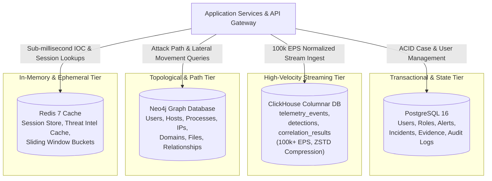
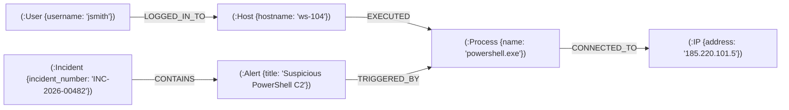
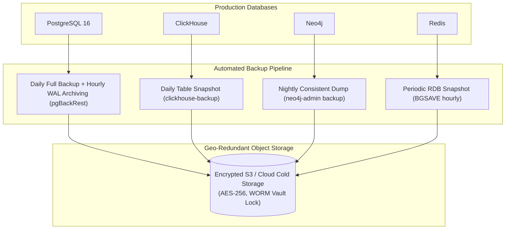

# SKYNET: Database Design Document (DDD)
# Autonomous AI-Powered SOC & XDR Platform

**System Designation:** SKYNET Database Design Document (DDD)  
**Document Version:** 1.0  
**Status:** Approved Database Architecture Baseline  
**Classification:** Confidential / Enterprise Restricted  
**Primary Repository Reference:** [SKYNET Workspace](file:///d:/hackathon/hackex/SKYNET)  
**Companion Documents:** [SRS.md](file:///d:/hackathon/hackex/SKYNET/SRS.md) | [ADD.md](file:///d:/hackathon/hackex/SKYNET/ADD.md) | [HLD.md](file:///d:/hackathon/hackex/SKYNET/HLD.md) | [LLD.md](file:///d:/hackathon/hackex/SKYNET/LLD.md) | [API_SPEC.md](file:///d:/hackathon/hackex/SKYNET/API_SPEC.md)

---

## Table of Contents

1. [Purpose](#1-purpose)
2. [Database Architecture Overview](#2-database-architecture-overview)
3. [PostgreSQL Design (Transactional & State)](#3-postgresql-design)
   - 3.1 [Users Table](#31-users-table)
   - 3.2 [Roles Table](#32-roles-table)
   - 3.3 [Alerts Table](#33-alerts-table)
   - 3.4 [Incidents Table](#34-incidents-table)
   - 3.5 [Evidence Table](#35-evidence-table)
   - 3.6 [Audit Logs Table](#36-audit-logs-table)
4. [ClickHouse Design (Telemetry & Analytics)](#4-clickhouse-design)
   - 4.1 [telemetry_events Table](#41-telemetry_events-table)
   - 4.2 [detections Table](#42-detections-table)
   - 4.3 [correlation_results Table](#43-correlation_results-table)
5. [Neo4j Attack Graph Design (Topology & Pathing)](#5-neo4j-attack-graph-design)
   - 5.1 [Node Types](#51-node-types)
   - 5.2 [Relationship Types](#52-relationship-types)
   - 5.3 [Graph Traversal Schema](#53-graph-traversal-schema)
6. [Redis Design (Cache, Queues & Ephemeral Context)](#6-redis-design)
   - 6.1 [Key Namespaces & Data Structures](#61-key-namespaces--data-structures)
   - 6.2 [Cached IOC Object Structure](#62-cached-ioc-object-structure)
7. [Data Retention & Lifecycle Policies](#7-data-retention--lifecycle-policies)
8. [Backup Strategy & Disaster Recovery](#8-backup-strategy--disaster-recovery)
9. [Performance Requirements & Benchmarks](#9-performance-requirements--benchmarks)
10. [Security & Cryptographic Requirements](#10-security--cryptographic-requirements)
11. [Disaster Recovery Objectives (RPO/RTO)](#11-disaster-recovery-objectives-rporto)
12. [Acceptance Criteria](#12-acceptance-criteria)

---

## 1. Purpose

This Database Design Document (DDD) establishes the canonical persistence architecture for **SKYNET**. 

To meet the competing demands of massive ingestion throughput (100,000+ EPS), petabyte-scale historical analytics, strict ACID compliance for case management, real-time graph traversal for lateral movement analysis, and sub-millisecond in-memory caching, SKYNET employs a **Polyglot Persistence Architecture**:
- **PostgreSQL 16**: Transactional state, user management, incident cases, evidence lockers, and immutable audit logs.
- **ClickHouse**: High-velocity columnar storage for raw telemetry, normalized OCSF/ECS events, and detection logs.
- **Neo4j**: Native labeled property graph modeling attack paths, host/identity connections, and compromised asset blast radius.
- **Redis 7**: In-memory cache for threat intelligence lookups, token blacklists, sliding-window rate limiters, and temporary agent blackboard state.

---

## 2. Database Architecture Overview



---

## 3. PostgreSQL Design

PostgreSQL 16 serves as the authoritative transactional system of record. All schemas enforce strict foreign-key integrity, non-nullable timestamping, UUID primary keys, and dedicated B-tree/GIN indices.

### 3.1 Users Table
Stores operator, engineer, and administrative credentials, MFA configurations, and status.

```sql
CREATE EXTENSION IF NOT EXISTS "uuid-ossp";

CREATE TABLE users (
    id UUID PRIMARY KEY DEFAULT gen_random_uuid(),
    username VARCHAR(100) UNIQUE NOT NULL,
    email VARCHAR(255) UNIQUE NOT NULL,
    password_hash TEXT NOT NULL,
    role_id UUID NOT NULL REFERENCES roles(id) ON DELETE RESTRICT,
    status VARCHAR(50) NOT NULL DEFAULT 'ACTIVE', -- ACTIVE, SUSPENDED, DEACTIVATED
    created_at TIMESTAMP WITH TIME ZONE NOT NULL DEFAULT NOW(),
    updated_at TIMESTAMP WITH TIME ZONE NOT NULL DEFAULT NOW()
);

CREATE INDEX idx_users_username ON users(username);
CREATE INDEX idx_users_email ON users(email);
CREATE INDEX idx_users_role_id ON users(role_id);
```

### 3.2 Roles Table
Stores Role-Based Access Control (RBAC) role definitions and associated permission scopes.

```sql
CREATE TABLE roles (
    id UUID PRIMARY KEY DEFAULT gen_random_uuid(),
    role_name VARCHAR(100) UNIQUE NOT NULL, -- L1_ANALYST, L2_ANALYST, THREAT_HUNTER, INCIDENT_RESPONDER, ADMIN
    description TEXT
);

-- Default System Roles
INSERT INTO roles (role_name, description) VALUES
('L1_ANALYST', 'Tier-1 SOC Analyst: Alert review, triage, and advisory response execution'),
('L2_ANALYST', 'Tier-2 SOC Analyst: In-depth forensic investigation and case management'),
('THREAT_HUNTER', 'Threat Hunter: Custom hunting queries across ClickHouse and Neo4j graph'),
('INCIDENT_RESPONDER', 'Incident Commander: Authorizes high-risk active defense containment actions'),
('ADMIN', 'System Administrator: Full configuration, user provisioning, and policy management');
```

### 3.3 Alerts Table
Stores individual detection events triggered by the detection engine.

```sql
CREATE TABLE alerts (
    id UUID PRIMARY KEY DEFAULT gen_random_uuid(),
    title VARCHAR(255) NOT NULL,
    description TEXT NOT NULL,
    severity VARCHAR(20) NOT NULL, -- LOW, MEDIUM, HIGH, CRITICAL
    source VARCHAR(100) NOT NULL, -- SIGMA_RULE, IOC_MATCH, BEHAVIORAL_ANOMALY
    status VARCHAR(50) NOT NULL DEFAULT 'NEW', -- NEW, ACKNOWLEDGED, SUPPRESSED, CLOSED
    assigned_to UUID REFERENCES users(id) ON DELETE SET NULL,
    created_at TIMESTAMP WITH TIME ZONE NOT NULL DEFAULT NOW(),
    updated_at TIMESTAMP WITH TIME ZONE NOT NULL DEFAULT NOW()
);

CREATE INDEX idx_alerts_severity ON alerts(severity);
CREATE INDEX idx_alerts_status ON alerts(status);
CREATE INDEX idx_alerts_created_at ON alerts(created_at DESC);
CREATE INDEX idx_alerts_assigned_to ON alerts(assigned_to);
```

### 3.4 Incidents Table
Stores consolidated, correlated security cases escalated for investigation and containment.

```sql
CREATE TABLE incidents (
    id UUID PRIMARY KEY DEFAULT gen_random_uuid(),
    incident_number VARCHAR(50) UNIQUE NOT NULL, -- e.g., 'INC-2026-00104'
    title VARCHAR(255) NOT NULL,
    description TEXT,
    severity VARCHAR(20) NOT NULL, -- LOW, MEDIUM, HIGH, CRITICAL
    priority VARCHAR(20) NOT NULL, -- P1_CRITICAL, P2_HIGH, P3_MODERATE, P4_LOW
    status VARCHAR(50) NOT NULL DEFAULT 'NEW', -- NEW, ASSIGNED, INVESTIGATING, ESCALATED, RESOLVED, CLOSED
    assigned_to UUID REFERENCES users(id) ON DELETE SET NULL,
    created_at TIMESTAMP WITH TIME ZONE NOT NULL DEFAULT NOW(),
    resolved_at TIMESTAMP WITH TIME ZONE,
    closed_at TIMESTAMP WITH TIME ZONE
);

CREATE INDEX idx_incidents_number ON incidents(incident_number);
CREATE INDEX idx_incidents_status ON incidents(status);
CREATE INDEX idx_incidents_severity ON incidents(severity);
CREATE INDEX idx_incidents_created_at ON incidents(created_at DESC);
```

### 3.5 Evidence Table
Maintains an immutable evidence locker linking forensic artifacts to active incidents.

```sql
CREATE TABLE evidence (
    id UUID PRIMARY KEY DEFAULT gen_random_uuid(),
    incident_id UUID NOT NULL REFERENCES incidents(id) ON DELETE CASCADE,
    evidence_type VARCHAR(50) NOT NULL, -- RAW_LOG, FILE_HASH, MEMORY_ARTIFACT, NETWORK_FLOW
    value TEXT NOT NULL, -- SHA256 string, IP, or raw payload excerpt
    source VARCHAR(100) NOT NULL, -- ClickHouse, Sysmon, Windows Event Log
    timestamp TIMESTAMP WITH TIME ZONE NOT NULL DEFAULT NOW()
);

CREATE INDEX idx_evidence_incident_id ON evidence(incident_id);
CREATE INDEX idx_evidence_type ON evidence(evidence_type);
```

### 3.6 Audit Logs Table
Immutable, cryptographically chained ledger recording all administrative, case, and SOAR actions.

```sql
CREATE TABLE audit_logs (
    id UUID PRIMARY KEY DEFAULT gen_random_uuid(),
    user_id UUID NOT NULL, -- Operator UUID or system service UUID
    action VARCHAR(255) NOT NULL, -- LOGIN, BLOCK_IP, ISOLATE_HOST, UPDATE_CASE
    resource VARCHAR(255) NOT NULL, -- Target resource URI or ID
    old_value JSONB,
    new_value JSONB,
    timestamp TIMESTAMP WITH TIME ZONE NOT NULL DEFAULT NOW()
);

CREATE INDEX idx_audit_logs_user_id ON audit_logs(user_id);
CREATE INDEX idx_audit_logs_action ON audit_logs(action);
CREATE INDEX idx_audit_logs_timestamp ON audit_logs(timestamp DESC);
CREATE INDEX idx_audit_logs_new_value_gin ON audit_logs USING GIN (new_value);
```

---

## 4. ClickHouse Design

ClickHouse is deployed as the analytical backbone to ingest normalized security events at sustained rates exceeding **100,000 EPS** with sub-second aggregate query response times.

### 4.1 telemetry_events Table
Stores all normalized security event logs conforming to OCSF/ECS standards.

```sql
CREATE DATABASE IF NOT EXISTS skynet;

CREATE TABLE IF NOT EXISTS skynet.telemetry_events (
    event_id UUID,
    event_time DateTime64(6, 'UTC'),
    host LowCardinality(String),
    user LowCardinality(String),
    src_ip IPv6,
    dst_ip IPv6,
    process String,
    command_line String,
    event_type LowCardinality(String), -- process_create, network_connect, authentication
    severity LowCardinality(String),   -- INFORMATIONAL, LOW, MEDIUM, HIGH, CRITICAL
    raw_log String CODEC(ZSTD(3))
)
ENGINE = MergeTree()
PARTITION BY toYYYYMM(event_time)
ORDER BY (
    event_time,
    host,
    event_type
)
TTL toDateTime(event_time) + INTERVAL 180 DAY;
```

- **Partitioning Strategy**: Partitioned monthly (`toYYYYMM(event_time)`) to enable instant drop/detach operations during data lifecycle pruning.
- **Ordering Strategy**: Ordered by `(event_time, host, event_type)` to maximize sparse index locality and minimize read amplification during timeline reconstruction.
- **Compression**: Column `raw_log` uses `ZSTD(3)` compression, yielding an average $7\times$ storage footprint reduction.

### 4.2 detections Table
Stores historical detection triggers generated by the Sigma and IOC engines.

```sql
CREATE TABLE IF NOT EXISTS skynet.detections (
    detection_id UUID,
    rule_name LowCardinality(String),
    severity LowCardinality(String),
    mitre_technique LowCardinality(String), -- e.g., 'T1059.001', 'T1071'
    event_id UUID,
    created_at DateTime64(6, 'UTC')
)
ENGINE = MergeTree()
PARTITION BY toYYYYMM(created_at)
ORDER BY (created_at, severity, rule_name)
TTL toDateTime(created_at) + INTERVAL 730 DAY; -- 2 Years
```

### 4.3 correlation_results Table
Stores multi-event correlation outputs produced by the Correlation Service.

```sql
CREATE TABLE IF NOT EXISTS skynet.correlation_results (
    correlation_id UUID,
    incident_id UUID,
    related_events Array(UUID),
    score UInt8, -- Composite threat score 0 to 100
    created_at DateTime64(6, 'UTC')
)
ENGINE = MergeTree()
PARTITION BY toYYYYMM(created_at)
ORDER BY (created_at, score)
TTL toDateTime(created_at) + INTERVAL 730 DAY;
```

---

## 5. Neo4j Attack Graph Design

Neo4j models enterprise attack topology, mapping multi-hop entity relationships to visualize kill chains, assess lateral movement, and determine blast radius.

### 5.1 Node Types
- `(:User {username: String, domain: String, is_admin: Boolean})`
- `(:Host {hostname: String, ip: String, os: String, uuid: String})`
- `(:IP {address: String, is_external: Boolean, abuse_score: Integer})`
- `(:Domain {fqdn: String, reputation: String})`
- `(:Process {name: String, pid: Integer, cmdline: String, hash: String})`
- `(:File {path: String, hash_sha256: String})`
- `(:Alert {alert_id: String, title: String, severity: String})`
- `(:Incident {incident_number: String, priority: String})`

### 5.2 Relationship Types
- `(:User)-[:LOGGED_IN_TO {timestamp: DateTime, auth_type: String}]->(:Host)`
- `(:Host)-[:CONNECTED_TO {port: Integer, protocol: String, bytes: Integer}]->(:IP)`
- `(:Process)-[:SPAWNED {timestamp: DateTime}]->(:Process)`
- `(:File)-[:DOWNLOADED_FROM {timestamp: DateTime}]->(:Domain)`
- `(:Alert)-[:TRIGGERED_BY]->(:Process)`
- `(:Incident)-[:CONTAINS]->(:Alert)`

### 5.3 Graph Traversal Schema (Lateral Movement & C2 Chain)



```cypher
// Cypher Query Example: Find Blast Radius of Compromised Account jsmith
MATCH (u:User {username: 'jsmith'})-[:LOGGED_IN_TO*1..3]->(h:Host)
RETURN u.username, collect(DISTINCT h.hostname) AS compromised_hosts;
```

---

## 6. Redis Design

Redis 7 serves as the sub-millisecond ephemeral cache, token blacklist, and queue state storage.

### 6.1 Key Namespaces & Data Structures

| Key Pattern | Data Structure | TTL | Purpose |
|---|---|---|---|
| `ioc:ip:<ipv4_ipv6>` | String (JSON) | 30 Days | Cached reputation score and verdict from AbuseIPDB. |
| `ioc:hash:<sha256>` | String (JSON) | 30 Days | Cached VirusTotal / MalwareBazaar analysis verdict. |
| `ioc:domain:<fqdn>` | String (JSON) | 30 Days | Cached domain reputation and category. |
| `auth:session:<user_id>` | Hash | 7 Days | Active operator session metadata and refresh token. |
| `auth:blacklist:<jwt_jti>` | String | 15 Minutes | Revoked access tokens. |
| `rate:auth:<client_ip>` | String (Counter) | 60 Seconds | Sliding window authentication rate limiter (10 req/min). |
| `investigation:state:<id>`| Hash | 24 Hours | Ephemeral blackboard state shared across AI SOC agents. |

### 6.2 Cached IOC Object Structure (JSON)
```json
{
  "indicator": "1.1.1.1",
  "reputation": "malicious",
  "source": "VirusTotal",
  "confidence": 95,
  "last_updated": "2026-09-25T12:00:00Z"
}
```

---

## 7. Data Retention & Lifecycle Policies

To satisfy compliance standards while controlling infrastructure storage costs, data lifecycles are enforced programmatically:

| Data Store | Table / Collection | Retention Period | Enforcement Mechanism |
|---|---|---|---|
| **ClickHouse** | `telemetry_events` | **180 Days** | Table `TTL toDateTime(event_time) + INTERVAL 180 DAY` |
| **ClickHouse** | `detections` | **2 Years** (730 Days) | Table `TTL toDateTime(created_at) + INTERVAL 730 DAY` |
| **PostgreSQL** | `alerts` | **2 Years** | Scheduled pg_cron worker archiving old records |
| **PostgreSQL** | `incidents` & `evidence` | **5 Years** | Partitioned archival table in cold storage |
| **PostgreSQL** | `audit_logs` | **7 Years** | WORM-compliant immutable ledger for ISO 27001 / SOC 2 |
| **Redis** | `ioc:*` | **30 Days** | Redis key expiration (`EXPIRE key 2592000`) |

---

## 8. Backup Strategy & Disaster Recovery



- **PostgreSQL**: Daily full physical backup combined with continuous Write-Ahead Log (WAL) archiving to secondary cloud storage using `pgBackRest`.
- **ClickHouse**: Daily table snapshots executed via `clickhouse-backup`, compressing cold partitions to remote S3 buckets.
- **Neo4j**: Nightly consistent graph exports using `neo4j-admin database dump`.
- **Redis**: Hourly RDB snapshots (`BGSAVE`) backed up to local block storage and synced to cloud daily.

---

## 9. Performance Requirements & Benchmarks

| Operation / Query Type | Target Latency Threshold | Optimization Strategy |
|---|---|---|
| **Alert Query (Filtered by Severity & Status)** | **$< 2.0 \text{ Seconds}$** | Composite B-Tree index on `(severity, status, created_at DESC)` |
| **Incident Query (Full Case Dossier)** | **$< 3.0 \text{ Seconds}$** | Single-query eager load of evidence and join with assigned user |
| **IOC Cache Lookup** | **$< 500 \text{ Milliseconds}$** | In-memory Redis String key lookup ($< 2\text{ms}$ in local VPC) |
| **Timeline Generation (50k Events Window)** | **$< 5.0 \text{ Seconds}$** | ClickHouse primary index search on `(event_time, host)` |
| **Ingestion Pipeline Throughput** | **$\ge 100,000 \text{ EPS}$** | Kafka batching (10,000 events/batch) with ClickHouse async inserts |

---

## 10. Security & Cryptographic Requirements

1. **Encryption at Rest**:
   - All persistent volumes for PostgreSQL, ClickHouse, Neo4j, and Kafka are encrypted using **AES-256-XTS** via Linux LUKS or cloud-managed KMS keys.
2. **In-Transit Encryption**:
   - All client-to-database and inter-service database connections enforce **TLS 1.3** with certificate validation.
3. **Database RBAC & Least Privilege**:
   - Application services connect via non-superuser database roles restricted to specific schema DML permissions (`SELECT`, `INSERT`, `UPDATE`).
4. **Secret Rotation**:
   - Database credentials and connection URIs are dynamically provisioned and rotated every 30 days via HashiCorp Vault.
5. **Immutable Audit Logs**:
   - PostgreSQL audit log records are protected against update or deletion via row-level trigger locks and append-only grants.
6. **Encrypted Backups**:
   - All backup snapshots are encrypted with customer-managed keys (GPG / KMS) prior to network transmission to cold object storage.

---

## 11. Disaster Recovery Objectives

- **Recovery Point Objective (RPO)**: **$\le 15$ Minutes**  
  *Guaranteed maximum allowable data loss in the event of an unrecoverable datacenter disaster.*
- **Recovery Time Objective (RTO)**: **$\le 30$ Minutes**  
  *Guaranteed maximum allowable system restoration time to achieve operational log ingestion and alert detection.*

---

## 12. Acceptance Criteria

The database layer shall be formally certified for enterprise deployment when:
1. **Sustained Ingestion**: Ingests **100,000 EPS** continuously for 60 minutes into ClickHouse without backpressure drops or table lock contention.
2. **Case Persistence**: Correctly creates and persists incident cases, evidence records, and assignment transitions in PostgreSQL.
3. **Graph Traversal**: Neo4j builds attack trees and traverses multi-hop lateral movement paths in $< 1$ second.
4. **Audit Immutability**: Confirms that audit logs cannot be updated or deleted, maintaining a verified continuous record of events.
5. **Investigation SLA**: Timeline builder extracts a $T \pm 15\text{m}$ event window from ClickHouse in $< 5$ seconds.

---

*End of Database Design Document (DDD) — SKYNET Version 1.0.*
