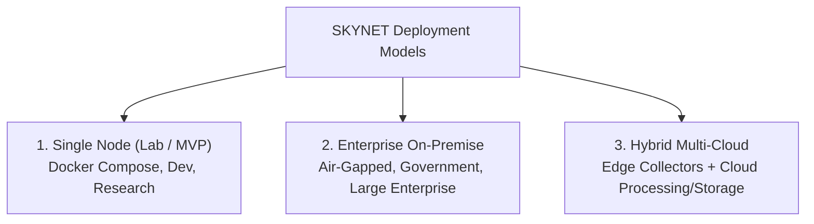
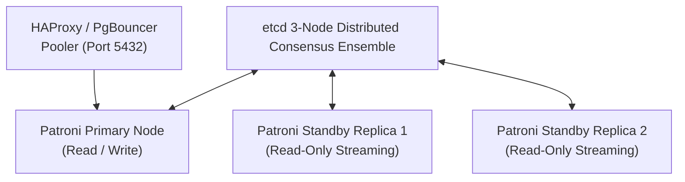
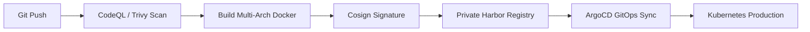

# SKYNET: Deployment & Infrastructure Guide
# Autonomous AI-Powered SOC & XDR Platform

**System Designation:** SKYNET Deployment & Infrastructure Guide (Document 9)  
**Document Version:** 1.0  
**Status:** Approved Production Infrastructure Baseline  
**Classification:** Confidential / Enterprise Restricted  
**Primary Repository Reference:** [SKYNET Workspace](file:///d:/hackathon/hackex/SKYNET)  
**Companion Documents:** [SRS.md](file:///d:/hackathon/hackex/SKYNET/SRS.md) | [ADD.md](file:///d:/hackathon/hackex/SKYNET/ADD.md) | [HLD.md](file:///d:/hackathon/hackex/SKYNET/HLD.md) | [LLD.md](file:///d:/hackathon/hackex/SKYNET/LLD.md) | [DDD.md](file:///d:/hackathon/hackex/SKYNET/DDD.md) | [RUNBOOK.md](file:///d:/hackathon/hackex/SKYNET/RUNBOOK.md)

---

## Table of Contents

1. [Purpose](#1-purpose)
2. [Supported Deployment Models](#2-supported-deployment-models)
3. [Production Architecture](#3-production-architecture)
4. [Kubernetes Architecture & Namespaces](#4-kubernetes-architecture--namespaces)
5. [Hardware & Infrastructure Sizing Matrix](#5-hardware--infrastructure-sizing-matrix)
6. [Kafka Cluster Design](#6-kafka-cluster-design)
7. [ClickHouse Cluster Architecture](#7-clickhouse-cluster-architecture)
8. [PostgreSQL High Availability (Patroni)](#8-postgresql-high-availability-patroni)
9. [Neo4j Graph Database Cluster](#9-neo4j-graph-database-cluster)
10. [Redis High Availability (Sentinel & Cluster)](#10-redis-high-availability-sentinel--cluster)
11. [Network Segmentation & Security Architecture](#11-network-segmentation--security-architecture)
12. [Monitoring, Metrics & Observability](#12-monitoring-metrics--observability)
13. [CI/CD Automation Pipeline](#13-cicd-automation-pipeline)
14. [Backup & Archival Strategy](#14-backup--archival-strategy)
15. [Disaster Recovery Design](#15-disaster-recovery-design)
16. [Production Acceptance Criteria](#16-production-acceptance-criteria)

---

## 1. Purpose

This Deployment & Infrastructure Guide defines the production hosting topology, Kubernetes resource allocations, clustering configurations, network security controls, and disaster recovery architectures for **SKYNET**.

It serves as the definitive runbook for site reliability engineers (SREs), infrastructure architects, and DevSecOps practitioners deploying SKYNET across enterprise datacenters, private cloud enclaves, or hybrid multi-cloud environments.

---

## 2. Supported Deployment Models



1. **Single Node (Lab / MVP)**:
   - *Target*: Security research, development testing, small lab demonstrations.
   - *Topology*: Docker Compose running all services (Frontend, Backend, PostgreSQL, Redis, ClickHouse, Kafka) on a single physical workstation or VM.
2. **Enterprise On-Premise**:
   - *Target*: Critical infrastructure, defense, healthcare, and finance requiring strict air-gapped compliance.
   - *Topology*: Multi-node bare-metal Kubernetes cluster with dedicated Kafka, ClickHouse, Patroni PostgreSQL, and Neo4j clusters.
3. **Hybrid Cloud**:
   - *Target*: Distributed multinational enterprises and MSSPs.
   - *Topology*: Lightweight on-premise collectors stream encrypted telemetry over mTLS back to an auto-scaling AWS/Azure/GCP Kubernetes control plane.

---

## 3. Production Architecture

```
                  ┌────────────────────────────────────────┐
                  │       ENTERPRISE LOAD BALANCER         │
                  │   F5 BIG-IP / AWS ALB / Cloudflare     │
                  └───────────────────┬────────────────────┘
                                      │ TLS 1.3 Termination
                                      ▼
                  ┌────────────────────────────────────────┐
                  │        INGRESS API GATEWAY (K8s)       │
                  │     Traefik / NGINX Ingress / WAF      │
                  └───────────────────┬────────────────────┘
                                      │
          ┌───────────────────────────┼───────────────────────────┐
          │                           │                           │
          ▼                           ▼                           ▼
┌───────────────────┐       ┌───────────────────┐       ┌───────────────────┐
│  Frontend Pods    │       │  Backend API Pods │       │  AI Agent Workers │
│  (Next.js 14 HPA) │       │  (FastAPI HPA)    │       │  (LangGraph Swarm)│
└───────────────────┘       └─────────┬─────────┘       └─────────┬─────────┘
                                      │                           │
                                      ▼                           ▼
                  ┌────────────────────────────────────────┐
                  │       APACHE KAFKA CLUSTER (HA)        │
                  │     Topics: telemetry, alerts, cases   │
                  └─────────────┬────────────────────┬─────┘
                                │                    │
                                ▼                    ▼
       ┌───────────────────────────────────┐    ┌───────────────────────────┐
       │     DETECTION & CORRELATION       │    │    CLICKHOUSE CLUSTER     │
       │    Sigma, IOC & Graph Workers     │    │   (3 Shards, 2 Replicas)  │
       └────────────────┬──────────────────┘    └───────────────────────────┘
                        │
                        ▼
       ┌───────────────────────────────────────────────────────────────┐
       │               ENTERPRISE DATABASE CLUSTERS                    │
       │   PostgreSQL (Patroni HA) │ Neo4j Core │ Redis Sentinel       │
       └───────────────────────────────────────────────────────────────┘
```

---

## 4. Kubernetes Architecture & Namespaces

Production workloads are segregated into dedicated Kubernetes namespaces:
- **`skynet-core`**: Core user-facing and ingestion microservices (`frontend`, `backend-api`, `gateway`).
- **`skynet-data`**: Distributed stateful services (`kafka-cluster`, `clickhouse-shards`, `postgres-patroni`, `neo4j-cluster`, `redis-sentinel`).
- **`skynet-security`**: Detection workers, correlation engines, AI analyst pods, and SOAR executors.
- **`skynet-monitoring`**: Observability telemetry stack (`prometheus`, `grafana`, `opensearch`, `alertmanager`).

---

## 5. Hardware & Infrastructure Sizing Matrix

| Metric / Dimension | Small Deployment | Medium Deployment | Large Deployment |
|---|:---:|:---:|:---:|
| **Concurrent Analysts** | Up to 25 Analysts | Up to 100 Analysts | 500+ Analysts / MSSP |
| **Ingestion Throughput** | Up to 10,000 EPS | Up to 50,000 EPS | **100,000 to 500,000 EPS** |
| **Compute Sizing** | 8 vCPU | 32 vCPU | **128 vCPU** |
| **Memory Allocation** | 32 GB RAM | 128 GB RAM | **512 GB RAM** |
| **Storage Capacity** | 500 GB NVMe | 5 TB NVMe | **50 TB NVMe + S3 Cold Tier** |
| **Kubernetes Worker Nodes** | 3 Nodes | 6 Nodes | **12+ Distributed Bare-Metal Nodes** |

---

## 6. Kafka Cluster Design

- **Cluster Sizing**: 3 to 5 distributed broker nodes managed by KRaft (Kafka Raft Metadata mode).
- **Core Topics**:
  - `telemetry.raw` (24 Partitions, Cleanup: `delete`, Retention: 7 Days).
  - `telemetry.normalized` (24 Partitions, Cleanup: `delete`, Retention: 7 Days).
  - `detections` (12 Partitions, Cleanup: `delete`, Retention: 30 Days).
  - `correlations` (12 Partitions, Cleanup: `delete`, Retention: 30 Days).
  - `incidents` (6 Partitions, Cleanup: `compact,delete`, Retention: 90 Days).
  - `audit` (6 Partitions, Cleanup: `compact`, Retention: 365 Days).
- **Replication**: `replication.factor = 3`, `min.insync.replicas = 2`.

---

## 7. ClickHouse Cluster Architecture

- **Cluster Topology**: 3 Shards with 2 Replicas per shard (Total: 6 ClickHouse instances).
- **Coordination**: ClickHouse Keeper (3-node ensemble) managing distributed DDL queries.
- **Compression**: Dedicated column codecs (`DoubleDelta`, `T64`, `ZSTD(3)`).
- **Storage Tiering**:
  - *Hot Tier*: Local NVMe SSD holding the past 14 days of uncompressed data.
  - *Warm Tier*: EBS / SAN SSD storage holding 15 to 90 days.
  - *Cold Tier*: Automated S3 Object Storage archive for 91 to 180 days.

---

## 8. PostgreSQL High Availability (Patroni)



- **Clustering Engine**: **Patroni** backed by an `etcd` distributed consensus ensemble.
- **Failover SLA**: Automatic leader election and failover within **10 seconds** of primary node failure.
- **Connection Pooling**: PgBouncer managing transaction-level connection pooling.

---

## 9. Neo4j Graph Database Cluster

- **Cluster Configuration**: Neo4j Causal Clustering topology.
  - **3 Core Servers**: Maintain consensus using the Raft protocol; accept read and write operations.
  - **2 Read Replicas**: Scale out read-heavy attack path traversal and timeline queries.

---

## 10. Redis High Availability (Sentinel & Cluster)

- **Topology**: 3 Redis Master nodes with 3 Sentinel monitoring daemons.
- **Failover**: Automated master failover with virtual IP reassignment; client connection failover in $< 2\text{s}$.

---

## 11. Network Segmentation & Security Architecture

```
[INTERNET / CLIENTS] ──► [DMZ Network] (Traefik Ingress, WAF)
                             │
                             ▼
                     [SOC Application Network] (FastAPI, Next.js, AI Swarm)
                             │
                             ▼
                     [Database Network (Isolated)] (Postgres, ClickHouse, Neo4j, Kafka)
```

- **Network Policies**: Kubernetes Calico CNI enforcing strict microsegmentation. Pods in `skynet-core` cannot reach raw database ports directly without going through designated service proxies.

---

## 12. Monitoring, Metrics & Observability

- **Metrics Pipeline**: Prometheus scrapes `/metrics` across all microservices, exporters (Postgres Exporter, ClickHouse Exporter, JMX Kafka Exporter).
- **Visualization**: Grafana dashboards monitoring EPS throughput, detection latencies ($P_{50}, P_{95}, P_{99}$), and worker pod CPU/memory saturation.
- **Log Aggregation**: Fluent Bit shipping JSON container logs to an OpenSearch 3-node cluster.
- **Alertmanager**: Pushes infrastructure alerts directly to PagerDuty and internal SOC Ops channels.

---

## 13. CI/CD Automation Pipeline



1. **Static Analysis**: CodeQL, SonarQube, and Semgrep audit code.
2. **Container Security**: Trivy inspects base images; Grype verifies SBOM manifests.
3. **Image Signing**: Cosign signs images using private enterprise keys before registry admission.
4. **GitOps Deployment**: ArgoCD reconciles Helm releases against target clusters.

---

## 14. Backup & Archival Strategy

| Component | Backup Frequency | Target Location | Retention |
|---|---|---|---|
| **PostgreSQL** | Daily Full + Hourly WAL | S3 Bucket (Object Lock) | 90 Days |
| **ClickHouse** | Daily Partition Snapshot | Geo-Redundant S3 Cold Vault | 180 Days |
| **Neo4j** | Nightly Consistent Dump | Encrypted Backup Store | 30 Days |
| **Redis** | Hourly RDB Snapshots | Local Volume + Nightly Cloud Sync | 7 Days |

---

## 15. Disaster Recovery Design

- **Recovery Point Objective (RPO)**: **$\le 15$ Minutes**.
- **Recovery Time Objective (RTO)**: **$\le 30$ Minutes**.
- **Cross-Region Replication**: Asynchronous database replication to a secondary cold standby datacenter.

---

## 16. Production Acceptance Criteria

An infrastructure deployment shall be accepted into production only when:
1. **High Availability**: Survives random termination of any single Kubernetes worker node, Kafka broker, or database instance without data loss.
2. **Sustained Scale**: Validates continuous 100,000 EPS ingestion over 60 minutes with zero consumer lag.
3. **Rolling Zero-Downtime Upgrades**: Successfully executes rolling updates of API and detection pods with zero dropped HTTP requests.

---

*End of Deployment & Infrastructure Guide (Document 9) — SKYNET Version 1.0.*
