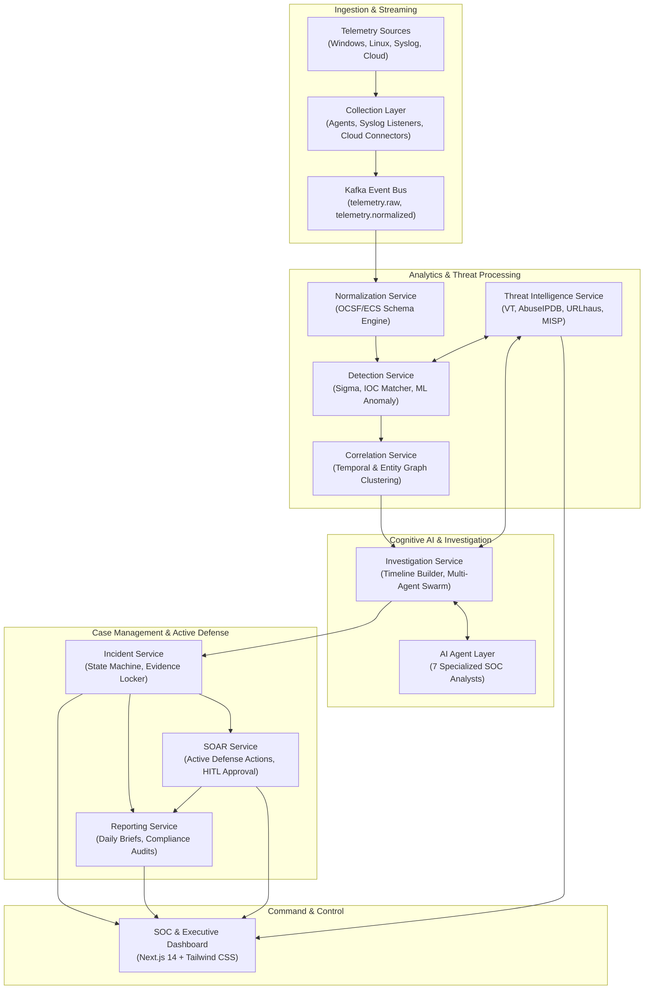
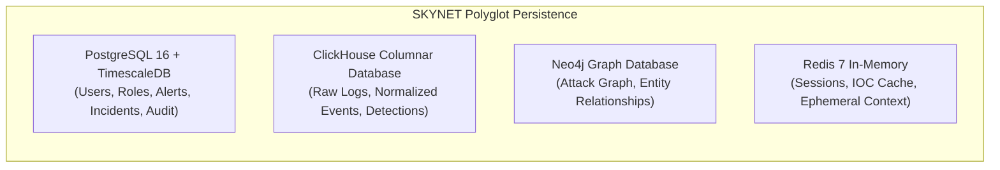
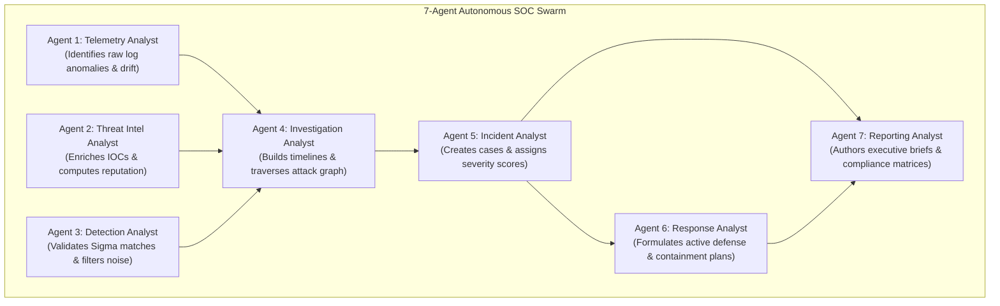

# SKYNET: High-Level Design (HLD)
# Autonomous AI-Powered SOC & XDR Platform

**System Designation:** SKYNET High-Level Design (HLD)  
**Document Version:** 1.0  
**Status:** Approved Architectural Specification  
**Classification:** Confidential / Enterprise Restricted  
**Primary Repository Reference:** [SKYNET Workspace](file:///d:/hackathon/hackex/SKYNET)  
**Companion Documents:** [SRS.md](file:///d:/hackathon/hackex/SKYNET/SRS.md) | [ADD.md](file:///d:/hackathon/hackex/SKYNET/ADD.md) | [LLD.md](file:///d:/hackathon/hackex/SKYNET/LLD.md) | [MVP_ROADMAP.md](file:///d:/hackathon/hackex/SKYNET/MVP_ROADMAP.md)

---

## Table of Contents

1. [Purpose](#1-purpose)
2. [System Overview](#2-system-overview)
3. [High-Level Component Architecture](#3-high-level-component-architecture)
4. [Core Services](#4-core-services)
   - 4.1 [Authentication Service](#41-authentication-service)
   - 4.2 [Telemetry Service](#42-telemetry-service)
   - 4.3 [Threat Intelligence Service](#43-threat-intelligence-service)
   - 4.4 [Detection Service](#44-detection-service)
   - 4.5 [Correlation Service](#45-correlation-service)
   - 4.6 [Investigation Service](#46-investigation-service)
   - 4.7 [Incident Service](#47-incident-service)
   - 4.8 [SOAR Service](#48-soar-service)
   - 4.9 [Reporting Service](#49-reporting-service)
5. [Data Storage Architecture](#5-data-storage-architecture)
6. [AI Agent Layer](#6-ai-agent-layer)
7. [External Integrations](#7-external-integrations)
8. [Security Controls](#8-security-controls)
9. [Scalability Strategy](#9-scalability-strategy)
10. [Availability Targets](#10-availability-targets)
11. [Monitoring & Observability](#11-monitoring--observability)
12. [Future Expansion](#12-future-expansion)

---

## 1. Purpose

This High-Level Design (HLD) document defines the architectural decomposition, core service boundaries, operational contracts, and end-to-end data flows of the **SKYNET** platform. 

The HLD serves as the definitive engineering blueprint for implementation teams, DevOps architects, and autonomous coding assistants, translating the business and functional mandates of the [Software Requirements Specification (SRS)](file:///d:/hackathon/hackex/SKYNET/SRS.md) into decoupled, horizontally scalable, and resilient microservices.

---

## 2. System Overview

SKYNET is an autonomous, AI-driven Security Operations Center (SOC) and Extended Detection & Response (XDR) platform designed to eliminate analyst fatigue and dramatically compress Mean Time to Detect (MTTD) and Mean Time to Respond (MTTR).

The platform consists of nine core functional subsystems:
1. **Telemetry Collection**: High-throughput cross-platform event ingestion.
2. **Event Processing**: Line-speed validation, enrichment, and normalization.
3. **Threat Detection**: Multi-engine analysis (Sigma, IOC, Heuristic, ML).
4. **Event Correlation**: Temporal and entity-based clustering of related alerts.
5. **Investigation Automation**: Multi-agent cognitive reasoning and timeline reconstruction.
6. **Threat Intelligence**: Global threat feed enrichment and automated IOC scoring.
7. **Incident Management**: Case tracking, evidence locker, and audit governance.
8. **SOAR Automation**: Cryptographically governed, policy-gated active defense.
9. **Reporting & Dashboards**: Real-time C2 visualizations, compliance audits, and KPI tracking.

---

## 3. High-Level Component Architecture



---

## 4. Core Services

### 4.1 Authentication Service
- **Purpose**: Provides centralized identity management, zero-trust authentication, and session enforcement.
- **Responsibilities**:
  - Authenticate human operators via Single Sign-On (OIDC/OAuth2/SAML) and local fallback.
  - Enforce Multi-Factor Authentication (TOTP / FIDO2).
  - Issue cryptographically signed short-lived JSON Web Tokens (JWT).
  - Manage session revocation and token blacklisting.
- **Inputs**: Username, Password, MFA Token, Refresh Token.
- **Outputs**: Access Token (JWT, 15m expiration), Refresh Token (7d expiration), User Identity Scope.
- **Dependencies**: Keycloak / Entra ID, PostgreSQL (User Store), Redis (Blacklist).

### 4.2 Telemetry Service
- **Purpose**: Reliably gathers security event streams from heterogeneous enterprise endpoints and networks.
- **Sources**: Windows Event Logs, Microsoft Sysmon, Linux Auditd, Firewalls, IDS/IPS, VPN logs, AWS CloudTrail, Azure Activity.
- **Outputs**: Ingested raw event records batched and pushed to Kafka topic `telemetry.raw`.
- **Dependencies**: Endpoint Agents (`windows_agent.py`, `linux_agent.py`), Syslog Daemon, Apache Kafka.

### 4.3 Threat Intelligence Service
- **Purpose**: Enriches Indicators of Compromise (IOCs) in real time to classify adversary infrastructure.
- **Inputs**: IP Addresses, Domain Names, URLs, File Hashes (MD5, SHA1, SHA256).
- **Integrations**: VirusTotal v3, AbuseIPDB v2, URLhaus, MalwareBazaar, MISP, OpenCTI.
- **Outputs**: Normalized Threat Context (Verdict: `BENIGN`, `SUSPICIOUS`, `MALICIOUS`; Risk Score: $0–100$; Confidence: $0.0–1.0$).
- **Dependencies**: Redis Cache (24h TTL for hashes, 6h for IPs), External API Gateway.

### 4.4 Detection Service
- **Purpose**: Evaluates normalized event streams against detection rules to flag malicious activity.
- **Detection Methods**:
  - **Sigma Rules**: Community and proprietary YAML rules compiled to stream evaluation predicates.
  - **IOC Matching**: High-performance in-memory hash and IP set intersection.
  - **Behavioral Rules**: Stateful multi-event sequence detection over sliding windows.
  - **ML Anomaly Models**: Statistical baseline drift detection for traffic spikes and rare processes.
- **Outputs**: Structured Alert Records pushed to Kafka topic `detections` and PostgreSQL `alerts`.
- **Dependencies**: Normalization Service, Kafka, Threat Intelligence Service, Redis.

### 4.5 Correlation Service
- **Purpose**: Combines isolated alerts into cohesive, multi-event incident candidates to eliminate noise.
- **Correlation Keys**: User Account, Host UUID, Source/Destination IP, Domain, Process Hash, Temporal Window ($T = 15\text{m}$).
- **Outputs**: Correlated Incident Packages emitted to Kafka topic `incidents`.
- **Dependencies**: Neo4j Graph Database, Redis sliding window cache, Kafka.

### 4.6 Investigation Service
- **Purpose**: Performs autonomous forensic investigations of correlated incident candidates.
- **Functions**:
  - Reconstruct microsecond-precise attack timelines.
  - Extract forensic evidence from ClickHouse event records.
  - Query Neo4j for lateral movement and compromised identity blast radius.
  - Coordinate the 7-Agent AI Swarm to synthesize root-cause hypotheses.
- **Outputs**: Comprehensive Investigation Dossier containing chronological timelines and root-cause analysis.
- **Dependencies**: ClickHouse, Neo4j, LangGraph, Model Context Protocol (MCP) servers.

### 4.7 Incident Service
- **Purpose**: Governs the end-to-end operational case lifecycle for all detected threats.
- **Incident States**:
  $$\text{New} \longrightarrow \text{Triage} \longrightarrow \text{Investigating} \longrightarrow \text{Escalated} \longrightarrow \text{Resolved} \longrightarrow \text{Closed}$$
- **Responsibilities**: Case assignment, evidence locker persistence, analyst work notes, SLA tracking.
- **Dependencies**: PostgreSQL 16 (Incident Store), Redis.

### 4.8 SOAR Service
- **Purpose**: Orchestrates and executes policy-gated active defense actions across infrastructure.
- **Supported Actions**:
  - `BLOCK_IP`: Inject host and firewall perimeter drop rules.
  - `DISABLE_ACCOUNT`: Suspend compromised Active Directory / local accounts.
  - `ISOLATE_ENDPOINT`: Restrict host networking exclusively to SKYNET C2 tunnel.
  - `CREATE_TICKET`: Synchronize incident status to Jira / ServiceNow.
  - `SEND_NOTIFICATION`: Dispatch rich alerts to Telegram, Slack, Teams, and Email.
- **Dependencies**: Agent C2 Remediator, External ITSM/Notification APIs, Cryptographic Key Vault.

### 4.9 Reporting Service
- **Purpose**: Generates scheduled and on-demand security analytics, compliance matrices, and executive briefings.
- **Generated Reports**:
  - Daily SOC Operational Briefing.
  - Executive Threat & Risk Posture Summary.
  - Single Incident Forensic PDF Report.
  - Compliance Attestation (ISO/IEC 27001, NIST CSF, MITRE ATT&CK coverage).
- **Dependencies**: PostgreSQL, ClickHouse, WeasyPrint / PDF Engine.

---

## 5. Data Storage Architecture

SKYNET leverages a polyglot data architecture optimized for velocity, analytics, state, and topology:



| Engine | Primary Data Stored | Access Pattern | Retention Policy |
|---|---|---|---|
| **PostgreSQL 16** | Users, RBAC permissions, Alert metadata, Incident cases, Evidence locker, Cryptographic audit logs | Low-latency transactional ACID queries | 1–3 Years (Indefinite for Audit) |
| **ClickHouse** | Raw telemetry logs, Normalized OCSF events, Detection logs | Ultra-high-speed append-only stream; heavy analytical aggregations | Hot: 14d (NVMe), Warm: 90d (ZSTD), Cold: 365d (S3) |
| **Neo4j** | Attack graph entities (`User`, `Host`, `Process`, `IP`), causality edges (`AUTHENTICATED_TO`, `SPAWNED`) | Graph traversal, shortest path, blast-radius queries | 90 Days active topology |
| **Redis 7** | Operator session tokens, Threat Intelligence cache (VT/AbuseIPDB), Ingestion rate-limiting buckets | In-memory key-value lookups ($< 1\text{ms}$) | TTL: 1h to 24h |

---

## 6. AI Agent Layer

The cognitive reasoning core deploys **7 Specialized Autonomous SOC Agents** operating over a shared blackboard:



- **Agent 1 (Telemetry Analyst)**: Continuously evaluates event volume, heartbeat drift, and unusual system counters.
- **Agent 2 (Threat Intel Analyst)**: Contextualizes all discovered hashes, external IPs, and URLs against threat feeds.
- **Agent 3 (Detection Analyst)**: Verifies that rule triggers correspond to true attacker activity rather than known administrative routines.
- **Agent 4 (Investigation Analyst)**: Gathers evidence, traces process ancestry, and constructs the chronological event sequence.
- **Agent 5 (Incident Analyst)**: Computes the overall incident risk score ($0–100$) and assigns priority levels.
- **Agent 6 (Response Analyst)**: Prepares safe, reversible containment recommendations with rollback safeguards.
- **Agent 7 (Reporting Analyst)**: Compiles high-level executive summaries and maps actions to regulatory controls.

---

## 7. External Integrations

```
                                  ┌───────────────────────────────┐
                                  │      SKYNET CORE GATEWAY      │
                                  └───────────────┬───────────────┘
                                                  │
                 ┌────────────────┬───────────────┼───────────────┬────────────────┐
                 │                │               │               │                │
                 ▼                ▼               ▼               ▼                ▼
        ┌────────────────┐┌──────────────┐┌───────────────┐┌──────────────┐┌───────────────┐
        │  THREAT INTEL  ││   IDENTITY   ││ NOTIFICATIONS ││  TICKETING   ││  ENDPOINTS    │
        │ VirusTotal v3  ││ LDAP / Entra ││ Telegram Bot  ││ Jira API     ││ Windows Agent │
        │ AbuseIPDB v2   ││ Active Direct││ Slack Webhook ││ ServiceNow   ││ Linux Auditd  │
        │ URLhaus / MISP ││ Keycloak SSO ││ MS Teams Card ││ PagerDuty    ││ Cloud Connect │
        └────────────────┘└──────────────┘└───────────────┘└──────────────┘└───────────────┘
```

---

## 8. Security Controls

- **Authentication & Identity**: OAuth2 with OpenID Connect (OIDC) via Keycloak; mandatory MFA for all analyst tiers.
- **Role-Based Access Control (RBAC)**: Strict separation of privileges across L1 Analyst, L2 Analyst, Threat Hunter, Incident Responder, and Administrator.
- **Secrets Management**: Dynamic secret injection via HashiCorp Vault; no plaintext secrets in configs or source control.
- **Transport & Storage Encryption**: Enforced TLS 1.3 encryption across all network boundaries; AES-256 encryption at rest for databases and Kafka partitions.
- **Immutable Audit Logging**: Append-only SHA-256 hash-chained audit records for all analyst actions and automated SOAR triggers.

---

## 9. Scalability Strategy

- **Horizontal Scaling of Microservices**: FastAPI backend nodes, normalization workers, and detection engines scale dynamically based on CPU/RAM saturation using Kubernetes HPA (3 to 20 replicas).
- **Partitioned Message Streams**: Kafka topics (`telemetry.raw`, `telemetry.normalized`) partitioned across 12–24 partitions, enabling parallel consumer processing.
- **Database Clustering**:
  - ClickHouse distributed cluster using ClickHouse Keeper.
  - PostgreSQL high-availability with read-replicas and Patroni automated failover.
  - Redis Sentinel / Redis Cluster for high-availability distributed caching.
- **Load Balancing**: Dual redundant Traefik / NGINX Ingress Controllers terminating TLS and balancing requests using round-robin and least-connection policies.

---

## 10. Availability Targets

| Service Component | Availability Target (SLA) | Max Allowable Unplanned Downtime |
|---|---|---|
| **Core Platform & Dashboard** | **99.9%** | $\le 8.76$ hours / year |
| **Detection & Correlation Engine** | **99.95%** | $\le 4.38$ hours / year |
| **Alert Delivery & Notification Pipeline** | **99.99%** | $\le 52.6$ minutes / year |
| **Telemetry Ingestion & Buffering (Kafka)** | **99.99%** | $\le 52.6$ minutes / year |

---

## 11. Monitoring & Observability

- **Metrics Collection**: Prometheus scrapes `/metrics` endpoints across all backend microservices, Kafka brokers, and database exporters.
- **Operational Visualization**: Grafana enterprise dashboards tracking EPS rates, detection latency ($P_{50}, P_{95}, P_{99}$), Kafka consumer lag, and host memory usage.
- **Centralized Logging**: Structured JSON application logs indexed in OpenSearch, searchable via OpenSearch Dashboards.
- **Automated Health Checks**: Kubernetes liveness, readiness, and startup probes configured across every container pod.

---

## 12. Future Expansion

- **Version 2.0: Continuous AI Threat Hunting**: Autonomous background agents evaluating historical ClickHouse telemetry for dormant adversary presence.
- **Version 3.0: Autonomous Zero-Touch Response**: Machine-speed host isolation and process termination governed by reinforcement learning for verified high-confidence attacks.
- **Version 4.0: Predictive Threat Analytics**: Early kill-chain forecasting using graph neural networks (GNNs) on Neo4j attack topologies.
- **Version 5.0: Multi-Tenant Enterprise MSSP SaaS**: Logical and physical tenant database partitioning supporting hundreds of isolated enterprise organizations.

---

*End of High-Level Design (HLD) — SKYNET Version 1.0.*
