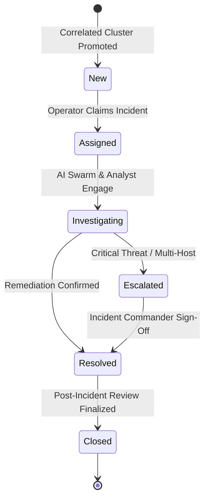
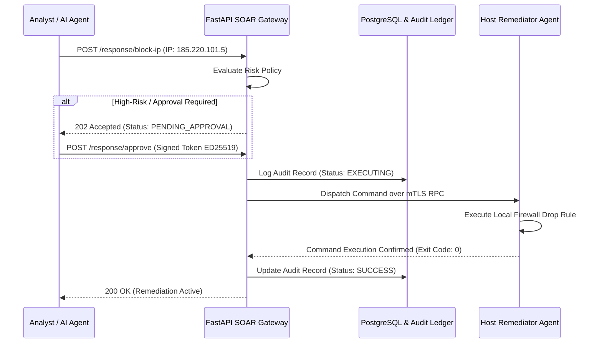

# SKYNET: Low-Level Design (LLD)
# Autonomous AI-Powered SOC & XDR Platform

**System Designation:** SKYNET Low-Level Design (LLD)  
**Document Version:** 1.0  
**Status:** Approved Implementation Blueprint  
**Classification:** Confidential / Enterprise Restricted  
**Primary Repository Reference:** [SKYNET Workspace](file:///d:/hackathon/hackex/SKYNET)  
**Companion Documents:** [SRS.md](file:///d:/hackathon/hackex/SKYNET/SRS.md) | [ADD.md](file:///d:/hackathon/hackex/SKYNET/ADD.md) | [HLD.md](file:///d:/hackathon/hackex/SKYNET/HLD.md) | [MVP_ROADMAP.md](file:///d:/hackathon/hackex/SKYNET/MVP_ROADMAP.md)

---

## Table of Contents

1. [Purpose](#1-purpose)
2. [Backend Service Structure](#2-backend-service-structure)
3. [Database Models](#3-database-models)
   - 3.1 [User & Role Models](#31-user--role-models)
   - 3.2 [Alert Model](#32-alert-model)
   - 3.3 [Incident Model](#33-incident-model)
   - 3.4 [Evidence Model](#34-evidence-model)
   - 3.5 [IOC Model](#35-ioc-model)
   - 3.6 [Audit Log Model](#36-audit-log-model)
4. [Event Schema](#4-event-schema)
5. [Detection Engine Design](#5-detection-engine-design)
   - 5.1 [Sigma Rule Processing Workflow](#51-sigma-rule-processing-workflow)
   - 5.2 [IOC Matching Workflow](#52-ioc-matching-workflow)
   - 5.3 [Behavioral & ML Anomaly Detection Workflow](#53-behavioral--ml-anomaly-detection-workflow)
6. [Correlation Engine](#6-correlation-engine)
7. [Attack Graph Design](#7-attack-graph-design)
8. [AI Agent Implementation](#8-ai-agent-implementation)
   - 8.1 [Investigation Agent](#81-investigation-agent)
   - 8.2 [Severity Agent](#82-severity-agent)
   - 8.3 [Reporting Agent](#83-reporting-agent)
9. [Incident Workflow Logic & State Machine](#9-incident-workflow-logic--state-machine)
10. [SOAR Workflow Design](#10-soar-workflow-design)
11. [API Design & Protocol Specifications](#11-api-design--protocol-specifications)
12. [Frontend Structure](#12-frontend-structure)
13. [Logging Strategy](#13-logging-strategy)
14. [Error Handling & Retry Policies](#14-error-handling--retry-policies)
15. [Testing Requirements](#15-testing-requirements)
16. [Acceptance Criteria](#16-acceptance-criteria)

---

## 1. Purpose

This Low-Level Design (LLD) document defines the granular implementation specifications for the **SKYNET** backend services, persistence schemas, detection algorithms, agent reasoning graphs, API contracts, and error-handling routines.

It translates the architectural standards outlined in the [High-Level Design (HLD)](file:///d:/hackathon/hackex/SKYNET/HLD.md) into concrete, production-ready code structures, data models, state transition machines, and endpoint signatures.

---

## 2. Backend Service Structure

### 2.1 Backend Framework
- **Framework**: **FastAPI** (Python 3.11+) with asynchronous execution (`async`/`await`).
- **Validation & Serialization**: **Pydantic v2** (`BaseModel`, strict type-checking).
- **ORM & Data Layer**: **SQLAlchemy 2.0 Async** with asyncpg driver for PostgreSQL, **clickhouse-connect** for ClickHouse, **neo4j-python-driver** for Neo4j, and **redis-py** for Redis caching.

### 2.2 Monorepo Project Layout

```text
skynet/
├── backend/
│   ├── auth/                    # Identity, OIDC/OAuth2, JWT tokens, session blacklist
│   │   ├── __init__.py
│   │   ├── router.py            # /auth endpoints
│   │   ├── service.py           # Password verification, JWT creation
│   │   └── dependencies.py      # OAuth2PasswordBearer, current_user guard
│   ├── telemetry/               # Ingestion receivers, Kafka producers/consumers
│   │   ├── __init__.py
│   │   ├── router.py            # /telemetry ingestion endpoint
│   │   ├── normalizer.py        # OCSF/ECS parser & field mapper
│   │   └── kafka_producer.py    # Async Kafka batched publisher
│   ├── detection/               # Threat detection engines
│   │   ├── __init__.py
│   │   ├── sigma_engine.py      # Sigma YAML evaluator
│   │   ├── ioc_matcher.py       # In-memory Redis IOC matcher
│   │   └── anomaly_engine.py    # Statistical drift & z-score evaluator
│   ├── correlation/             # Alert correlation & entity clustering
│   │   ├── __init__.py
│   │   ├── correlation_engine.py# Sliding window temporal state machine
│   │   └── candidate_builder.py # Groups alerts into incident candidates
│   ├── investigation/           # Forensic evidence gathering & timeline generation
│   │   ├── __init__.py
│   │   ├── timeline_builder.py  # ClickHouse microsecond event reconstruction
│   │   └── graph_service.py     # Neo4j Cypher query traverser
│   ├── incidents/               # Case lifecycle management
│   │   ├── __init__.py
│   │   ├── router.py            # /incidents endpoints
│   │   ├── service.py           # State transition enforcement, evidence linking
│   │   └── models.py            # Incident case schema definitions
│   ├── threatintel/             # External feed connectors & cache
│   │   ├── __init__.py
│   │   ├── router.py            # /ioc lookup endpoints
│   │   ├── vt_client.py         # VirusTotal v3 async client
│   │   ├── abuseipdb_client.py  # AbuseIPDB v2 client
│   │   └── urlhaus_client.py    # URLhaus API client
│   ├── soar/                    # Active defense containment actions
│   │   ├── __init__.py
│   │   ├── router.py            # /response endpoints
│   │   ├── policy_engine.py     # High-risk HITL approval gating
│   │   └── remediator_client.py # Dispatches signed tokens to endpoints
│   ├── reporting/               # Executive and compliance report synthesis
│   │   ├── __init__.py
│   │   ├── router.py            # /reports endpoints
│   │   ├── pdf_generator.py     # WeasyPrint PDF renderer
│   │   └── kpi_calculator.py    # MTTD / MTTR computation
│   ├── ai_agents/               # LangGraph cognitive reasoning fleet
│   │   ├── __init__.py
│   │   ├── state.py             # Shared Agent Blackboard Schema
│   │   ├── investigation_agent.py
│   │   ├── severity_agent.py
│   │   └── reporting_agent.py
│   ├── database/                # Persistence drivers & session factories
│   │   ├── __init__.py
│   │   ├── postgres.py          # SQLAlchemy async engine & SessionLocal
│   │   ├── clickhouse.py        # ClickHouse Client pool
│   │   ├── neo4j_client.py      # Neo4j Async Driver
│   │   └── redis_pool.py        # Redis connection pool
│   ├── common/                  # Shared utilities, constants, exceptions
│   │   ├── config.py            # Pydantic BaseSettings (.env loader)
│   │   ├── exceptions.py        # Custom HTTP & business exception classes
│   │   └── logging.py           # Structured JSON Loguru logger
│   └── api/                     # Root API router aggregator
│       ├── __init__.py
│       └── v1_router.py         # Mounts /auth, /alerts, /incidents, /soar
└── main.py                      # FastAPI application entrypoint
```

---

## 3. Database Models

The relational entities are defined using **SQLAlchemy 2.0 Declarative Mapping** with strict column typing and indices.

### 3.1 User & Role Models

```python
from sqlalchemy import Column, String, Boolean, DateTime, ForeignKey, JSON
from sqlalchemy.dialects.postgresql import UUID
from sqlalchemy.orm import declarative_base, relationship
from datetime import datetime, timezone
import uuid

Base = declarative_base()

class Role(Base):
    __tablename__ = "roles"

    id = Column(UUID(as_uuid=True), primary_key=True, default=uuid.uuid4)
    name = Column(String(64), unique=True, nullable=False) # e.g., 'L1_ANALYST', 'ADMIN'
    permissions = Column(JSON, nullable=False, default=list) # ['alerts:read', 'soar:execute_low']
    created_at = Column(DateTime(timezone=True), default=lambda: datetime.now(timezone.utc))

class User(Base):
    __tablename__ = "users"

    id = Column(UUID(as_uuid=True), primary_key=True, default=uuid.uuid4)
    username = Column(String(64), unique=True, nullable=False, index=True)
    email = Column(String(255), unique=True, nullable=False, index=True)
    hashed_password = Column(String(255), nullable=False)
    role_id = Column(UUID(as_uuid=True), ForeignKey("roles.id"), nullable=False)
    status = Column(String(32), default="ACTIVE") # ACTIVE, SUSPENDED, DEACTIVATED
    created_at = Column(DateTime(timezone=True), default=lambda: datetime.now(timezone.utc))
    updated_at = Column(DateTime(timezone=True), default=lambda: datetime.now(timezone.utc), onupdate=lambda: datetime.now(timezone.utc))

    role = relationship("Role")
```

### 3.2 Alert Model

```python
class Alert(Base):
    __tablename__ = "alerts"

    id = Column(UUID(as_uuid=True), primary_key=True, default=uuid.uuid4)
    title = Column(String(255), nullable=False, index=True)
    description = Column(String, nullable=False)
    severity = Column(String(16), nullable=False, index=True) # LOW, MEDIUM, HIGH, CRITICAL
    source = Column(String(64), nullable=False) # 'SIGMA_RULE', 'IOC_MATCH', 'BEHAVIORAL'
    status = Column(String(32), default="NEW", index=True) # NEW, ACKNOWLEDGED, SUPPRESSED, CLOSED
    assigned_to = Column(UUID(as_uuid=True), ForeignKey("users.id"), nullable=True)
    event_id = Column(UUID(as_uuid=True), nullable=True) # Reference to ClickHouse event_id
    host_uuid = Column(String(64), nullable=True, index=True)
    mitre_technique = Column(String(32), nullable=True) # e.g., 'T1059.001'
    created_at = Column(DateTime(timezone=True), default=lambda: datetime.now(timezone.utc), index=True)
    updated_at = Column(DateTime(timezone=True), default=lambda: datetime.now(timezone.utc))
```

### 3.3 Incident Model

```python
class Incident(Base):
    __tablename__ = "incidents"

    id = Column(UUID(as_uuid=True), primary_key=True, default=uuid.uuid4)
    incident_number = Column(String(32), unique=True, nullable=False, index=True) # e.g., 'INC-2026-00482'
    title = Column(String(255), nullable=False)
    severity = Column(String(16), nullable=False) # LOW, MEDIUM, HIGH, CRITICAL
    priority = Column(String(16), nullable=False) # P1_CRITICAL, P2_HIGH, P3_MODERATE, P4_LOW
    status = Column(String(32), default="NEW", index=True) # NEW, ASSIGNED, INVESTIGATING, ESCALATED, RESOLVED, CLOSED
    summary = Column(String, nullable=True) # AI-generated executive summary
    root_cause = Column(String, nullable=True) # AI-generated technical root cause
    assigned_to = Column(UUID(as_uuid=True), ForeignKey("users.id"), nullable=True)
    created_at = Column(DateTime(timezone=True), default=lambda: datetime.now(timezone.utc), index=True)
    closed_at = Column(DateTime(timezone=True), nullable=True)

    evidence_items = relationship("Evidence", back_populates="incident", cascade="all, delete-orphan")
```

### 3.4 Evidence Model

```python
class Evidence(Base):
    __tablename__ = "evidence"

    id = Column(UUID(as_uuid=True), primary_key=True, default=uuid.uuid4)
    incident_id = Column(UUID(as_uuid=True), ForeignKey("incidents.id", ondelete="CASCADE"), nullable=False)
    type = Column(String(32), nullable=False) # 'RAW_LOG', 'FILE_HASH', 'MEMORY_DUMP', 'NETWORK_FLOW'
    value = Column(String, nullable=False) # Hash string, IP, or raw payload excerpt
    source = Column(String(64), nullable=False) # 'ClickHouse:events_normalized', 'Sysmon'
    timestamp = Column(DateTime(timezone=True), default=lambda: datetime.now(timezone.utc))

    incident = relationship("Incident", back_populates="evidence_items")
```

### 3.5 IOC Model

```python
class IOC(Base):
    __tablename__ = "iocs"

    id = Column(UUID(as_uuid=True), primary_key=True, default=uuid.uuid4)
    indicator = Column(String(512), unique=True, nullable=False, index=True) # '185.220.101.5', SHA256
    type = Column(String(32), nullable=False, index=True) # 'IP', 'DOMAIN', 'URL', 'HASH_SHA256'
    reputation = Column(String(32), nullable=False) # 'MALICIOUS', 'SUSPICIOUS', 'BENIGN'
    source = Column(String(64), nullable=False) # 'VirusTotal', 'AbuseIPDB', 'URLhaus'
    confidence = Column(String(16), nullable=False) # 'HIGH', 'MEDIUM', 'LOW'
    created_at = Column(DateTime(timezone=True), default=lambda: datetime.now(timezone.utc))
```

### 3.6 Audit Log Model

```python
class AuditLog(Base):
    __tablename__ = "audit_logs"

    id = Column(UUID(as_uuid=True), primary_key=True, default=uuid.uuid4)
    user_id = Column(String(64), nullable=False) # User UUID or 'SYSTEM_AGENT_SOAR'
    action = Column(String(64), nullable=False) # 'BLOCK_IP', 'UPDATE_INCIDENT', 'LOGIN'
    resource = Column(String(128), nullable=False) # 'incidents/INC-2026-00482'
    old_value = Column(JSON, nullable=True)
    new_value = Column(JSON, nullable=False)
    signature_hash = Column(String(64), nullable=False) # SHA256(prev_hash + user_id + action + timestamp)
    timestamp = Column(DateTime(timezone=True), default=lambda: datetime.now(timezone.utc), index=True)
```

---

## 4. Event Schema

All heterogeneous logs ingested by the collection layer are validated and transformed into the standardized **Normalized Event** JSON schema:

```json
{
  "$schema": "http://json-schema.org/draft-07/schema#",
  "title": "NormalizedEvent",
  "type": "object",
  "required": [
    "event_id",
    "timestamp",
    "host",
    "user",
    "source_ip",
    "destination_ip",
    "event_type",
    "severity",
    "raw_log"
  ],
  "properties": {
    "event_id": {
      "type": "string",
      "format": "uuid",
      "example": "9b1deb4d-3b7d-4bad-9bdd-2b0d7b3dcb6d"
    },
    "timestamp": {
      "type": "string",
      "format": "date-time",
      "example": "2026-09-25T12:00:00.104921Z"
    },
    "host": {
      "type": "string",
      "example": "win-srv-dc01.corp.internal"
    },
    "user": {
      "type": "string",
      "example": "CORP\\jsmith"
    },
    "source_ip": {
      "type": "string",
      "format": "ipv4",
      "example": "192.168.1.105"
    },
    "destination_ip": {
      "type": "string",
      "format": "ipv4",
      "example": "185.220.101.5"
    },
    "event_type": {
      "type": "string",
      "enum": ["process_create", "network_connect", "logon_success", "logon_failure", "file_modify", "registry_set"],
      "example": "process_create"
    },
    "severity": {
      "type": "string",
      "enum": ["INFORMATIONAL", "LOW", "MEDIUM", "HIGH", "CRITICAL"],
      "example": "HIGH"
    },
    "raw_log": {
      "type": "string",
      "description": "Original unparsed log record preserved for forensic integrity."
    }
  }
}
```

---

## 5. Detection Engine Design

```
                     ┌──────────────────────────────────┐
                     │   Kafka: telemetry.normalized    │
                     └─────────────────┬────────────────┘
                                       │
            ┌──────────────────────────┼──────────────────────────┐
            │                          │                          │
            ▼                          ▼                          ▼
┌──────────────────────┐    ┌──────────────────────┐    ┌──────────────────────┐
│  Sigma Rule Matcher  │    │      IOC Matcher     │    │  Behavioral / ML     │
│ (Predicate Evaluation│    │ (In-Memory Redis Set)│    │  (Anomaly Drift Mod) │
└───────────┬──────────┘    └──────────┬───────────┘    └──────────┬───────────┘
            │                          │                           │
            └──────────────────────────┼───────────────────────────┘
                                       │ Match Found
                                       ▼
                     ┌──────────────────────────────────┐
                     │      Emit Alert to Kafka         │
                     │  Persist in PostgreSQL `alerts`  │
                     └──────────────────────────────────┘
```

### 5.1 Sigma Rule Processing Workflow
```text
Step 1: Event arrives on Kafka topic `telemetry.normalized`.
Step 2: Sigma Engine iterates pre-compiled AST predicates against JSON fields.
Step 3: If selection criteria match (e.g. process.name == "powershell.exe" and command_line contains "-enc"):
        a. Verify filter conditions (ignore approved administrative parent processes).
        b. If filter passes -> Match confirmed.
Step 4: Construct structured Alert payload mapping MITRE ATT&CK technique tags.
Step 5: Write Alert to PostgreSQL `alerts` table and publish to Kafka topic `detections`.
```

### 5.2 IOC Matching Workflow
```text
Step 1: Event Normalizer extracts indicators: process SHA256, destination IP, target domain.
Step 2: Check Redis in-memory bloom filter / hash sets:
        Redis query: SISMEMBER "threat:malicious_ips" event.destination_ip
Step 3: If match found in Redis cache:
        a. Retrieve cached IOC reputation context.
        b. Flag alert with source: "IOC_MATCH".
Step 4: If not in cache, dispatch asynchronous background lookup job to Threat Intel Service.
Step 5: Emit alert if confidence >= "MEDIUM" and reputation == "MALICIOUS".
```

### 5.3 Behavioral & ML Anomaly Detection Workflow
```text
Step 1: Ingest continuous time-series counters (events per minute per host, failed login counts).
Step 2: Sliding Window Aggregator computes dynamic mean and standard deviation:
        Z-Score = (Current_Rate - Baseline_Mean) / Baseline_StdDev
Step 3: If Z-Score > 3.5 (Statistical anomaly > 99.9% deviation):
        a. Evaluate sequence: Did failed logins precede process creation?
        b. If sequence matches attack signature -> Emit Behavioral Alert.
```

---

## 6. Correlation Engine

The Correlation Engine reduces raw alert volume by clustering related events into actionable **Incident Candidates**:

- **Inputs**:
  - Real-time stream from Kafka topic `detections`.
  - Historical context from ClickHouse `events_normalized`.
  - Threat Intelligence metadata.
- **Correlation Keys**:
  - `User`: Normalized username (`user.name`).
  - `Host`: Unique hardware identifier (`device.uuid`) or hostname.
  - `IP`: Network source or destination IP.
  - `Time`: Sliding temporal window ($T_{\text{window}} = 15 \text{ minutes}$).
  - `Domain`: External FQDN / C2 server.
  - `Process`: Execution hash or PID tree.

```
                    ┌────────────────────────────┐
                    │  Incoming Stream of Alerts │
                    └─────────────┬──────────────┘
                                  │
                                  ▼
                    ┌────────────────────────────┐
                    │ Extract Entity Keys & Time │
                    └─────────────┬──────────────┘
                                  │
                                  ▼
                    ┌────────────────────────────┐
                    │ Match Active Cluster in    │
                    │ Redis (Key = Host or User) │
                    └─────────────┬──────────────┘
                                  │
                  ┌───────────────┴───────────────┐
                  ▼                               ▼
      [No Existing Cluster]             [Existing Cluster Found]
      Create New Cluster State          Append Alert to Cluster
      Start 15-Minute Timer             Reset / Extend Sliding Window
                  │                               │
                  └───────────────┬───────────────┘
                                  │
                                  ▼
                    ┌────────────────────────────┐
                    │ Does Cluster exceed score? │
                    │ Threshold: Score >= 70     │
                    └─────────────┬──────────────┘
                                  │
                                  ▼
                    ┌────────────────────────────┐
                    │ Emit Incident Candidate    │
                    │ Topic: `incidents`         │
                    └────────────────────────────┘
```

---

## 7. Attack Graph Design

The Attack Graph models relationships in **Neo4j** to illuminate lateral movement and assess organizational blast radius:

### 7.1 Node Types
- `(:User {username, domain, is_admin})`
- `(:Host {uuid, hostname, ip, os})`
- `(:IP {address, is_external, abuse_score})`
- `(:Domain {fqdn, reputation})`
- `(:File {path, hash_sha256})`
- `(:Process {pid, name, cmdline})`
- `(:Alert {id, title, severity})`
- `(:Incident {incident_number, risk_score})`

### 7.2 Relationships & Topology
```cypher
(:User)-[:EXECUTED]->(:Process)
(:Process)-[:CONNECTED_TO]->(:IP)
(:Process)-[:SPAWNED]->(:Process)
(:Process)-[:CREATED]->(:File)
(:File)-[:DOWNLOADED_FROM]->(:Domain)
(:Alert)-[:TRIGGERED_ON]->(:Host)
(:Incident)-[:INCLUDES]->(:Alert)
```

### 7.3 Graph Traversal Pattern (Account Compromise & C2 Beaconing)
```
(:User {username: "jsmith"})
      │
      │ EXECUTED
      ▼
(:Process {name: "powershell.exe", pid: 4812})
      │
      │ CONNECTED_TO
      ▼
(:IP {address: "185.220.101.5", abuse_score: 95})
```

---

## 8. AI Agent Implementation

The AI Agent fleet is developed using **LangGraph**, operating with an explicit shared state dictionary:

```python
from typing import TypedDict, List, Dict, Any

class AgentState(TypedDict):
    incident_id: str
    alerts: List[Dict[str, Any]]
    related_events: List[Dict[str, Any]]
    threat_intel: Dict[str, Any]
    timeline: List[Dict[str, Any]]
    findings: List[str]
    root_cause: str
    severity_recommendation: str
    recommended_actions: List[Dict[str, Any]]
    executive_summary: str
```

### 8.1 Investigation Agent
- **Inputs**: Raw `alerts` cluster, ClickHouse `related_events` ($T \pm 15\text{m}$), and enriched `threat_intel`.
- **Logic**:
  1. Orders all related events by microsecond timestamps.
  2. Identifies the initial entry point (e.g. Word document execution, external RDP login).
  3. Maps attacker execution stages to MITRE ATT&CK techniques.
- **Outputs**: Reconstructed chronological `timeline`, key forensic `findings`, and technical `root_cause`.

### 8.2 Severity Agent
- **Inputs**: Detection types in cluster, IOC reputation scores, and target asset criticality rating.
- **Formula**:
  $$\text{Risk Score} = \min\left(100, \; (0.4 \cdot S_{\text{detection}}) + (0.3 \cdot S_{\text{asset}}) + (0.3 \cdot S_{\text{ioc}})\right)$$
- **Outputs**: Recommended severity level (`LOW` if $< 40$, `MEDIUM` if $40–69$, `HIGH` if $70–89$, `CRITICAL` if $\ge 90$).

### 8.3 Reporting Agent
- **Inputs**: Final populated `AgentState` dictionary.
- **Outputs**:
  - `executive_summary`: High-level plain-English narrative for leadership.
  - `incident_report`: Comprehensive technical dossier with evidence citations.

---

## 9. Incident Workflow Logic & State Machine



### State Validation Rules
1. **Rule 1 (Closed Immutability)**: Incidents in `Closed` status **CANNOT** be reopened without explicit `ADMIN` cryptographic approval.
2. **Rule 2 (Mandatory Escalation Notes)**: Transition to `Escalated` **REQUIRES** non-empty analyst notes detailing justification.
3. **Rule 3 (Resolution Evidence Guard)**: Transition to `Resolved` **REQUIRES** at least one linked evidence artifact in the Evidence Locker and all active containment actions verified as executed.

---

## 10. SOAR Workflow Design



### 10.1 Block IP Workflow
1. Alert / Analyst triggers `POST /response/block-ip`.
2. Gateway verifies operator RBAC permissions.
3. If target IP is a public address -> Approved; if internal gateway IP -> Rejected (safety blacklist).
4. Dispatch signed action payload to Host Remediator (`agent/remediator.py`).
5. Execute `netsh advfirewall firewall add rule ...` (Windows) or `iptables -A INPUT -s ... -j DROP` (Linux).
6. Record output and SHA-256 signature in `audit_logs`.

### 10.2 Disable User Workflow
1. Triggered on confirmed credential compromise: `POST /response/disable-user`.
2. Evaluates target user account: If `Domain Admins` or `Enterprise Admins`, require Dual-Analyst Approval.
3. Push LDAP command to Active Directory (`userAccountControl:1.2.840.113556.1.4.803:=2`).
4. Blacklist active JWT sessions in Redis.

---

## 11. API Design & Protocol Specifications

The FastAPI gateway exposes OpenAPI 3.1 RESTful interfaces:

### 11.1 Authentication Endpoints
- `POST /api/v1/auth/login`
  - **Body**: `{"username": "jsmith", "password": "...", "totp_token": "123456"}`
  - **Response 200**: `{"access_token": "...", "refresh_token": "...", "token_type": "bearer"}`
- `POST /api/v1/auth/logout`
  - **Headers**: `Authorization: Bearer <token>`
  - **Response 200**: `{"message": "Session invalidated"}`
- `POST /api/v1/auth/refresh`
  - **Body**: `{"refresh_token": "..."}`
  - **Response 200**: `{"access_token": "..."}`

### 11.2 Alert Management Endpoints
- `GET /api/v1/alerts`
  - **Query Params**: `severity=CRITICAL&status=NEW&limit=50&offset=0`
  - **Response 200**: `{"total": 12, "items": [{"id": "...", "title": "...", "severity": "CRITICAL"}]}`
- `GET /api/v1/alerts/{id}`
  - **Response 200**: Detailed alert record with raw event payload.
- `PATCH /api/v1/alerts/{id}`
  - **Body**: `{"status": "ACKNOWLEDGED", "assigned_to": "<uuid>"}`
  - **Response 200**: Updated alert object.

### 11.3 Incident Management Endpoints
- `POST /api/v1/incidents`
  - **Body**: `{"title": "Compromised DC", "severity": "CRITICAL", "priority": "P1_CRITICAL"}`
  - **Response 201**: `{"id": "...", "incident_number": "INC-2026-00482"}`
- `GET /api/v1/incidents`
  - **Query Params**: `status=INVESTIGATING&page=1`
  - **Response 200**: Paginated array of incident summaries.
- `PUT /api/v1/incidents/{id}`
  - **Body**: `{"status": "RESOLVED", "notes": "Host isolated and malware quarantined"}`
  - **Response 200**: Updated incident record.

### 11.4 Threat Intelligence Endpoints
- `GET /api/v1/ioc/ip/{ip}`: Returns reputation, abuse score, and country code.
- `GET /api/v1/ioc/domain/{domain}`: Returns DNS history and blacklist verdicts.
- `GET /api/v1/ioc/hash/{hash}`: Returns VirusTotal detection ratio and signature tags.

### 11.5 SOAR Active Defense Endpoints
- `POST /api/v1/response/block-ip`
  - **Body**: `{"target_ip": "185.220.101.5", "incident_id": "<uuid>", "reason": "C2 Traffic"}`
  - **Response 200**: `{"action_id": "...", "status": "EXECUTED"}`
- `POST /api/v1/response/isolate-host`
  - **Body**: `{"device_uuid": "win-srv-dc01-5829", "approval_token": "..."}`
  - **Response 200**: `{"status": "ISOLATED"}`
- `POST /api/v1/response/disable-user`
  - **Body**: `{"username": "corp\\jsmith", "reason": "Compromised credentials"}`
  - **Response 200**: `{"status": "ACCOUNT_DISABLED"}`

---

## 12. Frontend Structure

Built with **Next.js 14** (App Router), **Tailwind CSS**, and **ShadCN UI**:

```text
frontend/
├── app/
│   ├── layout.tsx               # Root layout, theme provider, global state
│   ├── page.tsx                 # Default redirect to /dashboard
│   ├── auth/
│   │   ├── login/page.tsx       # Operator login & MFA TOTP input
│   ├── dashboard/
│   │   ├── page.tsx             # CISO & Executive KPI views
│   ├── alerts/
│   │   ├── page.tsx             # Live alert feed with real-time WebSocket updates
│   ├── incidents/
│   │   ├── page.tsx             # Incident Kanban board (New, Investigating, Resolved)
│   │   └── [id]/page.tsx        # Incident detail: timeline, evidence locker, notes
│   ├── investigations/
│   │   ├── page.tsx             # Interactive Neo4j attack graph visualization
│   ├── threatintel/
│   │   ├── page.tsx             # IOC lookup search engine & reputation inspector
│   ├── reports/
│   │   ├── page.tsx             # Scheduled and on-demand PDF report generator
│   └── settings/
│       ├── page.tsx             # User management, RBAC configuration, API keys
├── components/
│   ├── ui/                      # ShadCN reusable primitives (Button, Modal, Table)
│   ├── AlertBadge.tsx           # Color-coded severity badge (Critical: Red, High: Orange)
│   ├── TimelineView.tsx         # Chronological microsecond attack step visualizer
│   └── GraphCanvas.tsx          # D3.js / Vis.js canvas for Neo4j entity rendering
└── lib/
    ├── api_client.ts            # Axios wrapper with automatic JWT refresh interceptors
    └── types.ts                 # TypeScript interfaces mirroring backend schemas
```

---

## 13. Logging Strategy

Structured JSON logging is implemented using **Loguru** across five dedicated log categories:
1. **Application Logs**: General operational logs (startup, dependency connections, worker pool status).
2. **Security Logs**: Authentication attempts, failed logins, permission denials, and token refresh calls.
3. **Audit Logs**: Irreversible system modifications, policy updates, and SOAR execution records with cryptographic hashes.
4. **Detection Logs**: Raw matching telemetry detailing which Sigma rule or IOC matched an incoming event.
5. **Agent Decision Logs**: Complete prompt/response traces and tool call executions from the AI Agent swarm.

---

## 14. Error Handling & Retry Policies

### 14.1 Standard API Error Response
All FastAPI error handlers return a standardized error JSON structure:
```json
{
  "error": true,
  "message": "Resource with identifier INC-2026-00482 not found",
  "code": "ERR_NOT_FOUND",
  "timestamp": "2026-09-25T12:00:00.104921Z",
  "details": {
    "resource_type": "incident",
    "resource_id": "INC-2026-00482"
  }
}
```

### 14.2 Distributed Retry Policies
- **Kafka Producer Retry**: Re-attempts publishing up to 5 times with exponential backoff ($50\text{ms}, 100\text{ms}, 200\text{ms}, 400\text{ms}, 800\text{ms}$) before routing to a Dead Letter Queue (DLQ).
- **API Client Retry**: External Threat Intelligence API requests retry up to 3 times on HTTP 429 (Rate Limit) or 503 (Unavailable) honoring `Retry-After` headers.

---

## 15. Testing Requirements

- **Unit Testing**: Minimum **80%+ code coverage** across all Python modules using `pytest` and `pytest-asyncio`.
- **Integration Testing**: Automated tests verifying Kafka $\rightarrow$ Normalization $\rightarrow$ ClickHouse $\rightarrow$ Detection pipeline execution.
- **Security Testing**: OWASP ZAP automated vulnerability scanning, Trivy container scanning, and Bandit static analysis for Python.
- **Performance Benchmarking**: Load testing with Locust and k6 validating sustained **100,000 EPS** ingestion with sub-5 second alert delivery.

---

## 16. Acceptance Criteria

A deployment of SKYNET shall be certified and accepted when:
1. **Telemetry Ingestion**: Ingests Windows, Sysmon, and Syslog telemetry without data loss under operational load.
2. **Detection Generation**: Accurately triggers alerts for Brute Force, PowerShell abuse, and Malicious IP matches within 5 seconds.
3. **Correlation Validation**: Correlates related alerts within a 15-minute window into a single Incident Candidate.
4. **Autonomous AI Investigation**: Generates a valid JSON investigation report containing an executive summary and timeline.
5. **SOAR Active Defense**: Successfully executes approved host isolation or IP blocking with complete audit trail logging.
6. **Immutable Audit Verification**: Confirms that all operator actions are persisted in the tamper-evident audit ledger.

---

*End of Low-Level Design (LLD) — SKYNET Version 1.0.*
