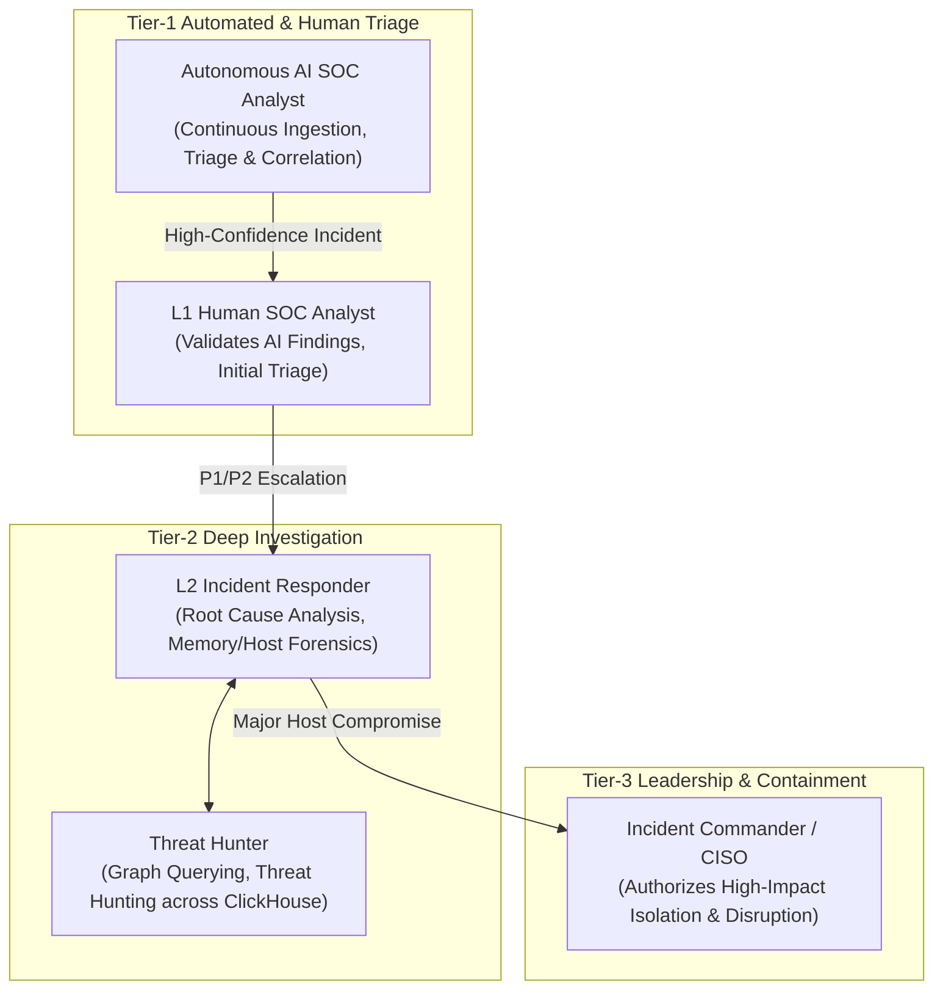
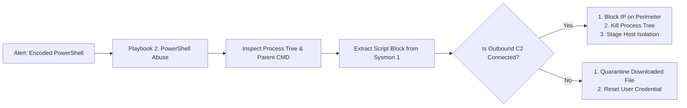

# SKYNET: SOC Operations Playbook & Incident Response Manual
# Autonomous AI-Powered SOC & XDR Platform

**System Designation:** SKYNET SOC Operations Playbook & Incident Response Manual (Document 8)  
**Document Version:** 1.0  
**Status:** Approved SOC Operations Baseline  
**Classification:** Confidential / Enterprise Restricted  
**Primary Repository Reference:** [SKYNET Workspace](file:///d:/hackathon/hackex/SKYNET)  
**Companion Documents:** [SRS.md](file:///d:/hackathon/hackex/SKYNET/SRS.md) | [ADD.md](file:///d:/hackathon/hackex/SKYNET/ADD.md) | [HLD.md](file:///d:/hackathon/hackex/SKYNET/HLD.md) | [LLD.md](file:///d:/hackathon/hackex/SKYNET/LLD.md) | [DDD.md](file:///d:/hackathon/hackex/SKYNET/DDD.md) | [API_SPEC.md](file:///d:/hackathon/hackex/SKYNET/API_SPEC.md) | [THREAT_MODEL.md](file:///d:/hackathon/hackex/SKYNET/THREAT_MODEL.md)

---

## Table of Contents

1. [Purpose & Incident Response Framework](#1-purpose--incident-response-framework)
2. [SOC Operational Roles & Escalation Matrix](#2-soc-operational-roles--escalation-matrix)
3. [Standard Operating Procedures (SOPs)](#3-standard-operating-procedures-sops)
   - SOP-001: [Alert Triage & False-Positive Suppression](#sop-001-alert-triage--false-positive-suppression)
   - SOP-002: [Incident Escalation & Severity Rating](#sop-002-incident-escalation--severity-rating)
   - SOP-003: [Evidence Preservation & Chain of Custody](#sop-003-evidence-preservation--chain-of-custody)
   - SOP-004: [Human-in-the-Loop SOAR Authorization](#sop-004-human-in-the-loop-soar-authorization)
4. [Threat-Specific Response Playbooks](#4-threat-specific-response-playbooks)
   - Playbook 1: [Phishing & Malicious Macro Execution (T1566.001)](#playbook-1-phishing--malicious-macro-execution-t1566001)
   - Playbook 2: [Suspicious Encoded PowerShell Execution (T1059.001)](#playbook-2-suspicious-encoded-powershell-execution-t1059001)
   - Playbook 3: [Credential Dumping & LSASS Access (T1003.001)](#playbook-3-credential-dumping--lsass-access-t1003001)
   - Playbook 4: [Internal Reconnaissance & Port Scanning (T1046)](#playbook-4-internal-reconnaissance--port-scanning-t1046)
   - Playbook 5: [Lateral Movement via Pass-the-Hash / WMI (T1021 / T1047)](#playbook-5-lateral-movement-via-pass-the-hash--wmi-t1021--t1047)
   - Playbook 6: [Command & Control (C2) Beaconing & Data Exfiltration (T1071 / T1048)](#playbook-6-command--control-c2-beaconing--data-exfiltration-t1071--t1048)
   - Playbook 7: [Ransomware Outbreak & Mass File Encryption (T1486)](#playbook-7-ransomware-outbreak--mass-file-encryption-t1486)
5. [Active Defense & Containment Runbooks](#5-active-defense--containment-runbooks)
6. [Post-Incident Review & Root Cause Analysis](#6-post-incident-review--root-cause-analysis)

---

## 1. Purpose & Incident Response Framework

This manual codifies the Standard Operating Procedures (SOPs), triage workflows, escalation paths, and automated playbooks for security operations teams operating the **SKYNET** platform.

It is structured in alignment with the **NIST SP 800-61 Rev. 2** (Computer Security Incident Handling Guide) lifecycle:

```
┌─────────────────┐       ┌─────────────────┐       ┌─────────────────┐       ┌─────────────────┐
│ 1. PREPARATION  │  ──►  │ 2. DETECTION &  │  ──►  │ 3. CONTAINMENT, │  ──►  │ 4. POST-INCIDENT│
│ (Rules & Feeds) │       │    ANALYSIS     │       │ ERADICATION &   │       │    ACTIVITY     │
│                 │       │ (AI Correlation)│       │    RECOVERY     │       │(Lessons Learned)│
└─────────────────┘       └─────────────────┘       └─────────────────┘       └─────────────────┘
```

---

## 2. SOC Operational Roles & Escalation Matrix



| Severity Level | Response SLA | Autonomous Action | Escalation Target |
|---|---|---|---|
| **P1 - Critical** | **$< 15 \text{ Minutes}$** | Block External C2 IP, Stage Host Isolation for Approval | Incident Commander, Lead Analyst |
| **P2 - High** | **$< 30 \text{ Minutes}$** | Quarantine unexecuted malicious file, alert operator | L2 Incident Responder |
| **P3 - Moderate** | **$< 2 \text{ Hours}$** | Tag alert for review, enrich IOCs in Redis | L1 SOC Analyst |
| **P4 - Low** | **$< 8 \text{ Hours}$** | Correlate with historical baseline, log audit record | Automated Batch Queue |

---

## 3. Standard Operating Procedures (SOPs)

### SOP-001: Alert Triage & False-Positive Suppression
1. **Receipt**: Alert arrives via Next.js Dashboard or WebSocket stream (`/ws/alerts`).
2. **Review AI Assessment**: Inspect the AI Detection Analyst verdict and confidence index.
3. **Verify IOCs**: Click into the Threat Intelligence modal to inspect VirusTotal, AbuseIPDB, and URLhaus scores.
4. **Suppression Decision**:
   - If alert is verified as legitimate administrative automation (e.g., scheduled backup script):
     - Click `[Mark False Positive]`.
     - Enter suppression rationale.
     - System computes suppression hash and writes to Redis/PostgreSQL policy cache, preventing future identical alerts.

### SOP-002: Incident Escalation & Severity Rating
1. High-risk correlated alert clusters (Composite Score $\ge 70$) automatically elevate to an **Incident Case** (`INC-2026-XXXX`).
2. Analysts must update incident status from `NEW` to `INVESTIGATING` upon claiming the case.
3. If more than 2 hosts or a Domain Controller are involved, the analyst must escalate the case to `P1_CRITICAL` and notify the Incident Commander.

### SOP-003: Evidence Preservation & Chain of Custody
1. All forensic artifacts must be linked directly to the case Evidence Locker (`POST /api/v1/investigations/evidence`).
2. Evidence values (SHA256 hashes, memory excerpts, process trees) are permanently recorded with microsecond timestamps and ingested raw log IDs to preserve forensic legal chain of custody.

### SOP-004: Human-in-the-Loop SOAR Authorization
1. When the AI Response Analyst proposes a high-impact containment action (`ISOLATE_HOST`, `DISABLE_USER`):
   - Review the blast-radius graph in Neo4j to ensure critical production servers are not mistakenly severed.
   - Verify that the action target matches the true compromised identity.
   - Click `[APPROVE REMEDIATION]`, providing your MFA token.
   - The gateway signs an ED25519 authorization token and dispatches it to the host remediator daemon.

---

## 4. Threat-Specific Response Playbooks



### Playbook 1: Phishing & Malicious Macro Execution (T1566.001)
- **Trigger**: Microsoft Word or Excel spawning a command shell (`winword.exe` $\rightarrow$ `cmd.exe` or `powershell.exe`).
- **Procedure**:
  1. Inspect the parent process command line to extract the weaponized attachment filename.
  2. Query ClickHouse `telemetry_events` for any subsequent file drops in `%APPDATA%` or `%TEMP%`.
  3. Extract dropped file SHA256 and query VirusTotal via `/api/v1/ioc/hash/{hash}`.
  4. **Containment**: Terminate spawned child process tree; quarantine dropped payload using `POST /response/quarantine-file`.
  5. Search email logs for identical attachment hashes to identify other targeted corporate mailboxes.

### Playbook 2: Suspicious Encoded PowerShell Execution (T1059.001)
- **Trigger**: PowerShell executed with `-enc`, `-EncodedCommand`, `-ep bypass`, or `IEX (New-Object Net.WebClient)`.
- **Procedure**:
  1. Decode the base64 command block using the built-in AI Analyst de-obfuscation tool.
  2. Identify target URLs, download endpoints, or reflection DLL injection techniques.
  3. Cross-reference destination IP in AbuseIPDB.
  4. **Containment**: Execute `POST /response/block-ip` for identified C2 IPs; execute `POST /response/kill-process` for the target PID.

### Playbook 3: Credential Dumping & LSASS Access (T1003.001)
- **Trigger**: Sysmon Event ID 10 indicating unexpected process granted access `0x1010` or `0x1F0FFF` to `lsass.exe`.
- **Procedure**:
  1. Identify calling binary (e.g., `mimikatz.exe`, `procdump.exe`, `comsvcs.dll`).
  2. Inspect memory dump target directory (e.g., `C:\Windows\Temp\lsass.dmp`).
  3. **Immediate Containment**: Immediately isolate the host from the network using `POST /response/isolate-host` to prevent lateral movement.
  4. Force global credential revocation for all accounts logged into that endpoint within the past 24 hours.

### Playbook 4: Internal Reconnaissance & Port Scanning (T1046)
- **Trigger**: Single endpoint initiating connection attempts across $\ge 20$ internal ports within 10 seconds.
- **Procedure**:
  1. Determine if the source is an authorized vulnerability scanner (e.g., Tenable, Qualys).
  2. If unauthorized, inspect the host process tree to identify the reconnaissance tool (`nmap`, `fscan`, `masscan`, or custom PowerShell).
  3. **Containment**: Terminate scanning process; apply host firewall drop rule isolating the scanner from internal server subnets.

### Playbook 5: Lateral Movement via Pass-the-Hash / WMI (T1021 / T1047)
- **Trigger**: WMI process execution (`wmic.exe process call create`) or remote service creation (`sc.exe create`) from a non-admin workstation.
- **Procedure**:
  1. Open the Neo4j Attack Graph view in the investigation dashboard to trace source and destination hosts.
  2. Identify the compromised credentials used to authenticate to remote target hosts.
  3. **Containment**: Disable the compromised Active Directory user account via `POST /response/disable-user`; isolate both source and target endpoints.

### Playbook 6: Command & Control (C2) Beaconing & Data Exfiltration (T1071 / T1048)
- **Trigger**: Regular outbound HTTPS/DNS connections occurring at periodic intervals (jitter $< 10\%$) with abnormal outbound payload volume.
- **Procedure**:
  1. Analyze destination domain WHOIS creation date and reputation score in VirusTotal.
  2. Review ClickHouse DNS query logs to detect high-frequency entropy (DNS tunneling).
  3. **Containment**: Inject immediate boundary firewall drop rule using `POST /response/block-ip`. Terminate originating socket owner process.

### Playbook 7: Ransomware Outbreak & Mass File Encryption (T1486)
- **Trigger**: High rate of file renames ($\ge 50$ renames/min) with known ransomware extensions (`.locked`, `.crypto`, `.cpt`) or execution of `vssadmin delete shadows`.
- **Procedure**:
  1. **EMERGENCY ACTION**: Instantly trigger **Automated Emergency Host Isolation** on the affected machine.
  2. Terminate the ransomware process tree and any active PowerShell/CMD instances.
  3. Inspect Neo4j attack graph to identify shared network SMB shares accessed by the host and immediately disable SMB write permissions.
  4. Initiate post-containment volume shadow restoration or backup recovery from offline snapshots.

---

## 5. Active Defense & Containment Runbooks

| Containment Action | Target Primitive | Safety Check / Whitelist | Verification Method |
|---|---|---|---|
| **Host Isolation** | `ISOLATE_HOST` | Domain Controllers and Core Ingress Gateway IPs **CANNOT** be severed without dual-analyst override. | Host Remediator sends periodic ping over management port 8000; all other interfaces drop traffic. |
| **IP Blacklisting** | `BLOCK_IP` | Internal subnet gateways (`10.0.0.1`, `192.168.1.1`) and cloud provider metadata IPs (`169.254.169.254`) are permanently whitelisted. | Verify inbound/outbound packets to the IP are dropped at the host or perimeter firewall. |
| **Process Termination** | `KILL_PROCESS` | Critical OS daemons (`ntoskrnl.exe`, `csrss.exe`, `smss.exe`, `systemd`) cannot be terminated. | Verify target PID and child PIDs no longer appear in endpoint process table. |
| **Account Disablement** | `DISABLE_USER` | Break-Glass Emergency Administrator accounts cannot be disabled via API. | Verify user account control flag in Active Directory reflects disabled state (`0x0002`). |

---

## 6. Post-Incident Review & Root Cause Analysis

Following the resolution of all `P1_CRITICAL` and `P2_HIGH` incidents, the security team must complete the post-incident lifecycle within 5 business days:

```
┌───────────────────────────┐     ┌───────────────────────────┐     ┌───────────────────────────┐
│ 1. AI Post-Mortem Dossier │ ──► │ 2. Root Cause Autopsy     │ ──► │ 3. Policy & Rule Tuning   │
│ Generate comprehensive    │     │ Identify initial entry,   │     │ Author new Sigma rules to │
│ timeline & PDF report.    │     │ dwell time & blast radius.│     │ close detection gap.      │
└───────────────────────────┘     └───────────────────────────┘     └───────────────────────────┘
```

1. **AI Post-Mortem Compilation**: The Reporting Agent generates an Incident Retrospective PDF (`GET /api/v1/incidents/{id}/report.pdf`).
2. **Root Cause Identification**: Document the initial compromise vector (e.g., unpatched VPN gateway, spear-phishing email, weak password).
3. **Detection Gap Closure**: Author and deploy new Sigma rules to the Detection Engine within 48 hours to ensure identical attack patterns trigger immediate `CRITICAL` alerts.
4. **Evidence Archival**: Secure all linked forensic evidence in the PostgreSQL cold storage vault for long-term regulatory compliance.

---

*End of SOC Operations Playbook & Incident Response Manual (Document 8) — SKYNET Version 1.0.*
