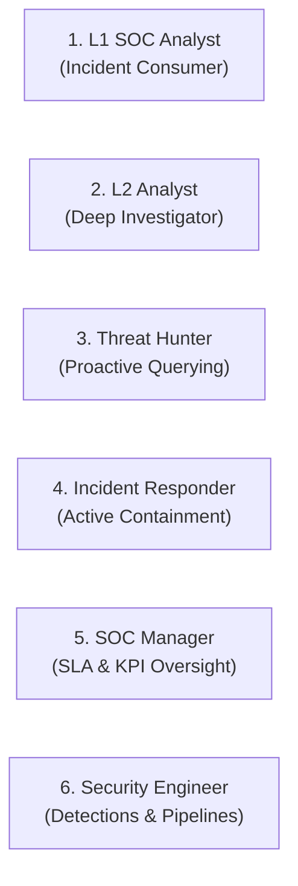
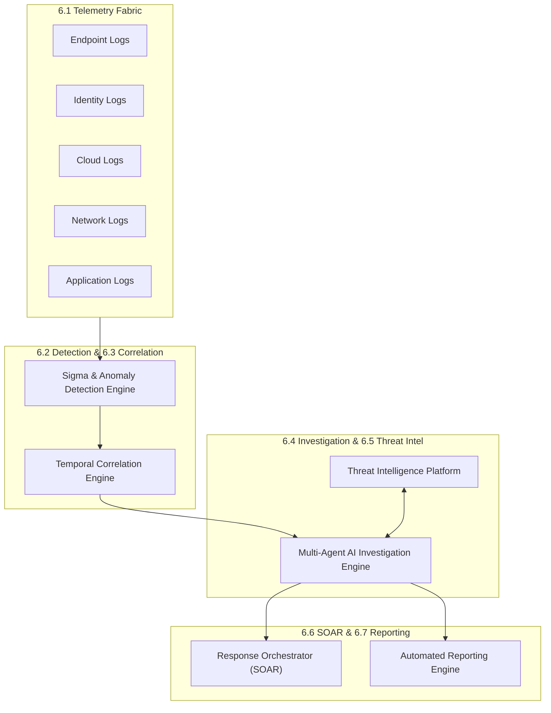

# SKYNET: Version 5.0 – Autonomous SOC Platform
# Product Requirements Document (PRD)

**System Designation:** SKYNET Autonomous SOC & XDR Enterprise Platform  
**Document Version:** 5.0  
**Classification:** Internal Product Specification / Enterprise Restricted  
**Primary Repository Reference:** [SKYNET Workspace](file:///d:/hackathon/hackex/SKYNET)  
**Parent Specifications:** [PRODUCT.md](file:///d:/hackathon/hackex/SKYNET/PRODUCT.md) | [SRS.md](file:///d:/hackathon/hackex/SKYNET/SRS.md) | [ADD.md](file:///d:/hackathon/hackex/SKYNET/ADD.md) | [HLD.md](file:///d:/hackathon/hackex/SKYNET/HLD.md) | [LLD.md](file:///d:/hackathon/hackex/SKYNET/LLD.md)

---

## Table of Contents

1. [Executive Summary](#1-executive-summary)
2. [Product Vision](#2-product-vision)
3. [Product Objectives](#3-product-objectives)
4. [Business Goals & Stakeholder Value](#4-business-goals)
5. [Target Users & Persona Profiles](#5-target-users)
6. [Core Product Modules](#6-core-product-modules)
   - 6.1 [Telemetry Fabric](#61-telemetry-fabric)
   - 6.2 [Detection Engine](#62-detection-engine)
   - 6.3 [Correlation Engine](#63-correlation-engine)
   - 6.4 [Investigation Engine](#64-investigation-engine)
   - 6.5 [Threat Intelligence Platform](#65-threat-intelligence-platform)
   - 6.6 [Response Orchestrator (SOAR)](#66-response-orchestrator)
   - 6.7 [Reporting Engine](#67-reporting-engine)
7. [Product Capabilities & Functional Scope](#7-product-capabilities)
8. [Success Metrics & Key Performance Indicators (KPIs)](#8-success-metrics)
9. [Competitive Positioning & Market Differentiation](#9-competitive-positioning)
10. [Release Criteria](#10-release-criteria)
11. [Product Acceptance Criteria](#11-product-acceptance-criteria)

---

# 1. Executive Summary

**SKYNET Version 5.0** is an Autonomous Security Operations Platform designed to automate the majority of Tier-1 Security Operations Center (SOC) workflows through AI-driven detection, correlation, investigation, enrichment, incident management, and response orchestration.

Unlike traditional SIEM platforms that generate raw alerts requiring exhaustive manual analyst review, SKYNET generates **investigation-ready incidents** equipped with forensic evidence, microsecond-precision timelines, threat intelligence scoring, multi-hop blast radius graphs, risk calculations, and pre-computed response recommendations.

The platform unifies seven core cybersecurity technologies into a cohesive architecture:

```
┌─────────────────────────────────────────────────────────────────────────────┐
│                       SKYNET VERSION 5.0 UNIFIED PLATFORM                   │
├───────────────┬───────────────┬────────────────┬────────────────────────────┤
│     SIEM      │      XDR      │      SOAR      │     Threat Intelligence    │
│ Next-Gen Logs │ Cross-Source  │ Playbooks and  │   Enrichment & Feeds       │
│ & Normalizing │ Telemetry Hub │ Orchestration  │   (VT, AbuseIPDB, MISP)    │
├───────────────┴───────────────┴────────────────┴────────────────────────────┤
│           AI Cognitive Agents           │          Knowledge Graph          │
│     LangGraph Autonomous Swarm          │    Neo4j Entity Traversal & Paths │
├─────────────────────────────────────────┴───────────────────────────────────┤
│                          Autonomous Investigation Engine                    │
│           Evidence Correlation ➔ Root Cause ➔ Cryptographic Response        │
└─────────────────────────────────────────────────────────────────────────────┘
```

---

# 2. Product Vision

Enable modern enterprise security teams and MSSPs to achieve continuous, hands-off defense operations:

```text
Monitor
   │
   ▼
Detect
   │
   ▼
Investigate
   │
   ▼
Respond
   │
   ▼
Document
   │
   ▼
Learn
```

with minimal analyst intervention, transforming the SOC from reactive firefighting into autonomous operational resilience.

---

# 3. Product Objectives

### Objective 1: Reduce Alert Fatigue
Reduce alert fatigue by at least **80%** through contextual deduplication, multi-signal correlation, and automated false-positive dismissal.

### Objective 2: Automate Tier-1 Investigations
Fully automate the repetitive responsibilities of Level-1 SOC analysts, including evidence gathering, entity extraction, IOC lookups, and timeline reconstruction.

### Objective 3: Reduce Mean Time To Detect (MTTD)
Cut Mean Time To Detect (MTTD) from industry averages of hours/days down to **sub-minute real-time stream evaluation**.

### Objective 4: Reduce Mean Time To Respond (MTTR)
Accelerate Mean Time To Respond (MTTR) by providing pre-verified containment actions with one-click cryptographic authorization.

### Objective 5: Provide Explainable AI-Driven Investigations
Ensure every AI hypothesis, severity rating, and recommended action is backed by an auditable, deterministic chain of telemetry evidence and MITRE ATT&CK alignment.

---

# 4. Business Goals

### Security Teams
Reduce manual analyst workloads by $> 80\%$, enabling senior engineers to focus on proactive threat hunting and defensive engineering rather than repetitive triage.

### Managed Security Service Providers (MSSPs)
Dramatically increase the analyst-to-customer endpoint ratio from 1:500 to 1:5,000+, enabling high-margin scalability without linear headcount expansion.

### Enterprises
Achieve comprehensive cross-layer security visibility across on-premises endpoints, cloud tenants, identity providers, and network boundaries.

### Critical Infrastructure & Defense
Slash adversary dwell time to seconds, neutralizing ransomware, credential theft, and living-off-the-land attacks before lateral progression or data exfiltration occurs.

---

# 5. Target Users & Persona Profiles



### L1 SOC Analyst
- **Role**: First-line case consumer and triage operator.
- **Workflow**: Reviews auto-generated incident dossiers, validates AI-synthesized root cause summaries, and flags false positives.

### L2 Analyst
- **Role**: Advanced threat investigator and forensic specialist.
- **Workflow**: Performs deep-dive graph traversal, cross-correlates multi-host activity, and examines memory/process artifacts.

### Threat Hunter
- **Role**: Proactive hypothesis tester and adversary pursuer.
- **Workflow**: Queries normalized ClickHouse telemetry using SQL/EQL to hunt for zero-day patterns and stealthy LotL persistence.

### Incident Responder
- **Role**: Tactical emergency response and containment controller.
- **Workflow**: Evaluates AI-proposed containment actions, executes cryptographically signed host isolation, IP blocking, or process kills.

### SOC Manager
- **Role**: Strategic leader and operational compliance owner.
- **Workflow**: Monitors real-time executive dashboards, tracks MTTD/MTTR benchmarks, evaluates SLA adherence, and exports compliance reports.

### Security Engineer
- **Role**: Platform architect and detection engineer.
- **Workflow**: Configures Sigma rules, manages ingestion pipelines, tunes Kafka/ClickHouse storage policies, and integrates external threat feeds.

---

# 6. Core Product Modules



### 6.1 Telemetry Fabric
High-throughput ingestion layer supporting 100,000+ EPS:
- **Endpoint Logs**: Windows Security, Microsoft Sysmon, Linux Auditd, macOS Unified Logs.
- **Identity Logs**: Active Directory, Azure AD / Entra ID, Okta, PingFederate.
- **Cloud Logs**: AWS CloudTrail, GCP Cloud Audit, Azure Activity & NSG flow logs.
- **Network Logs**: Cisco, Palo Alto, Fortinet, Zeek / Bro, Suricata PCAP alerts.
- **Application Logs**: Kubernetes audit logs, NGINX / Envoy ingress, database audit logs.

### 6.2 Detection Engine
Continuous real-time stream evaluation against:
- **Malware**: Hashes, known signatures, heuristic PE anomaly markers.
- **Phishing**: Malicious domains, suspicious email ingress, credential harvest URLs.
- **Credential Abuse**: Kerberoasting, DCSync, Pass-the-Hash, LSASS memory dumping.
- **Ransomware**: Mass file rename patterns, shadow copy destruction (`vssadmin`), MBR overwrites.
- **Privilege Escalation**: Token impersonation, vulnerable driver abuse (BYOVD), sudo exploits.
- **Lateral Movement**: WMI execution, PsExec, WinRM, SSH key reuse, internal port sweeping.
- **Data Exfiltration**: DNS tunneling, abnormal outbound data volume spikes, cloud sync anomalies.

### 6.3 Correlation Engine
Stateful temporal correlation engine:
- Clusters disparate alerts across endpoints, users, and time windows (30s to 48h).
- Converts low-fidelity isolated alerts into unified high-fidelity **Incident Candidates**.
- Suppresses recurring benign noise and deduplicates alerts.

### 6.4 Investigation Engine
Autonomous multi-agent cognitive system:
- Collects raw evidence items automatically from ClickHouse columnar storage.
- Traverses Neo4j Knowledge Graph to determine attack propagation and blast radius.
- Reconstructs microsecond-precision chronological attack chains.
- Identifies root cause and aligns telemetry directly to MITRE ATT&CK tactics and techniques.

### 6.5 Threat Intelligence Platform
Continuous automated IOC enrichment:
- Integrates with VirusTotal v3, AbuseIPDB v2, URLhaus, AlienVault OTX, and MISP.
- Caches IOC reputation scores in Redis to conserve API quotas and enable sub-millisecond lookups.
- Calculates unified normalized threat confidence scores (0 to 100).

### 6.6 Response Orchestrator (SOAR)
Deterministic, policy-governed containment execution:
- **Host Isolation**: Disconnects compromised host from corporate network while preserving management channel.
- **Perimeter IP Blocking**: Injects malicious C2 addresses into border firewalls and cloud security groups.
- **Account Disablement**: Revokes active tokens and locks compromised directory credentials.
- **Process Termination**: Halts malicious process trees across target endpoints.
- **Cryptographic Safeguards**: Enforces dual-authorization signatures and auto-generates 1-click rollback plans.

### 6.7 Reporting Engine
Comprehensive document and telemetry synthesis:
- Generates plain-language **Executive Incident Briefs** for non-technical leadership.
- Compiles **Technical Forensic Dossiers** with raw evidence hashes for legal and compliance review.
- Visualizes MTTD, MTTR, false-positive ratios, and analyst workload distribution.

---

# 7. Product Capabilities

| Capability | Functional Scope & Description |
|---|---|
| **Monitoring** | 24/7/365 real-time continuous telemetry collection across physical, virtual, and cloud workloads. |
| **Detection** | Behavioral, statistical, and signature-driven multi-stage adversary detection. |
| **Investigation** | Autonomous forensic analysis, root-cause hypothesis generation, and evidence aggregation. |
| **Enrichment** | Global threat intelligence context mapping for all observed hashes, IPs, and domains. |
| **Correlation** | Cross-source, cross-protocol event linking through temporal sliding windows. |
| **Incident Management** | End-to-end lifecycle management (`NEW` $\to$ `TRIAGED` $\to$ `INVESTIGATING` $\to$ `RESOLVED` $\to$ `CLOSED`). |
| **SOAR** | Policy-gated, audited, and rollback-capable active containment execution. |
| **Reporting** | Instant generation of executive briefs, forensic case reports, and compliance audit exports. |

---

# 8. Success Metrics & Key Performance Indicators

```
┌─────────────────────────────────────────────────────────────┐
│               SKYNET V5.0 PERFORMANCE BENCHMARKS            │
├────────────────────────────────────────┬────────────────────┤
│ Metric                                 │ Target SLA         │
├────────────────────────────────────────┼────────────────────┤
│ Alert Volume Reduction                 │ ≥ 80%              │
│ Investigation Automation Ratio         │ ≥ 85%              │
│ Threat Detection Accuracy              │ ≥ 95%              │
│ False Positive Rate Reduction          │ ≥ 70%              │
│ Mean Time To Detect (MTTD) Reduction   │ ≥ 50%              │
│ Mean Time To Respond (MTTR) Reduction  │ ≥ 60%              │
│ Ingestion Throughput Capacity          │ ≥ 100,000 EPS      │
│ Investigation Completion Latency       │ < 30 Seconds       │
└────────────────────────────────────────┴────────────────────┘
```

---

# 9. Competitive Positioning & Market Differentiation

```
                             Autonomous AI-First
                                     ▲
                                     │         ★ SKYNET v5.0
                                     │
                                     │    Microsoft Sentinel + Copilot
                                     │
           Cortex XSIAM              │    CrowdStrike NG-SIEM
                                     │
   Legacy SIEM ──────────────────────┼────────────────────── Modern XDR
   (Splunk, QRadar)                  │    (Google SecOps)
                                     │
                                     │
                                     ▼
                               Manual Triage
```

### Key Differentiators
1. **AI-First Autonomous Core**: While competitors offer conversational copilot assistants that merely answer analyst queries, SKYNET's multi-agent swarm autonomously performs the investigation, builds the evidence locker, and formulates the response without waiting for prompts.
2. **Polyglot High-Performance Architecture**: Combines ClickHouse columnar speed with Neo4j graph relationships and PostgreSQL transactional rigor.
3. **Cryptographic Human-in-the-Loop Active Defense**: Eliminates operational disruption fear by providing pre-calculated rollback scripts and role-based cryptographic action signing.

---

# 10. Release Criteria

SKYNET Version 5.0 is considered production-ready when:

- [x] **Multi-Agent Architecture Operational**: LangGraph cognitive swarm (Investigation, Severity, and Reporting agents) executes deterministic triage loops.
- [x] **Autonomous Investigations Functional**: Root cause, timeline, and evidence dossiers are generated within 30 seconds of alert correlation.
- [x] **Correlation Engine Operational**: Temporal sliding windows accurately group multi-host attack signals and suppress duplicate noise.
- [x] **Threat Intelligence Platform Integrated**: Multi-vendor feeds (VT, AbuseIPDB, URLhaus) actively enrich indicators with local cache preservation.
- [x] **SOAR Workflows Functional**: Host isolation, IP blocking, and credential revocation operate with automated rollback safety.
- [x] **Enterprise Deployment Validated**: Verified single-node Docker Compose for lab environments and multi-node Kubernetes blueprints for enterprise production.

---

# 11. Product Acceptance Criteria

SKYNET Version 5.0 shall autonomously:

1. **Detect Threats**: Continuously identify malicious activity across endpoint and network telemetry streams.
2. **Correlate Events**: Formulate multi-signal attack chains linking disparate events by host, user, and parent process trees.
3. **Investigate Incidents**: Aggregate forensic evidence items and formulate root-cause explanations without manual analyst steering.
4. **Enrich IOCs**: Contextualize discovered indicators against global threat databases and local historical reputation records.
5. **Generate Timelines**: Construct microsecond-precision forensic chronologies documenting adversary actions from initial access to objective execution.
6. **Execute Approved Responses**: Dispatch signed containment actions to endpoints and network perimeters following authorized human sign-off.
7. **Produce Reports**: Generate executive summaries and forensic documentation instantly.
8. **Maintain Audit Logs**: Cryptographically record every telemetry ingest, detection match, user interaction, and containment trigger in immutable audit storage.

---
*SKYNET Version 5.0 PRD Approved as Master Product Specification Canon.*
