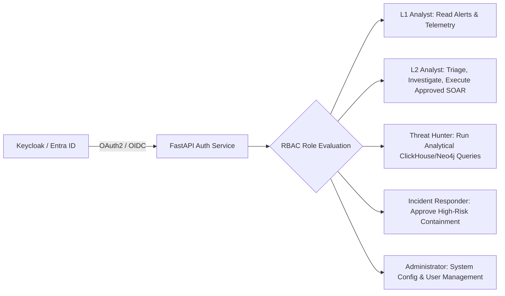
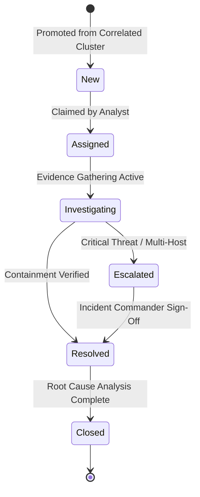

# SKYNET: Operations Runbook & Administration Guide
# Autonomous AI-Powered SOC & XDR Platform

**System Designation:** SKYNET Operations Runbook & Administration Guide (Document 10)  
**Document Version:** 1.0  
**Status:** Approved Operational Runbook  
**Classification:** Confidential / Enterprise Restricted  
**Primary Repository Reference:** [SKYNET Workspace](file:///d:/hackathon/hackex/SKYNET)  
**Companion Documents:** [SRS.md](file:///d:/hackathon/hackex/SKYNET/SRS.md) | [ADD.md](file:///d:/hackathon/hackex/SKYNET/ADD.md) | [HLD.md](file:///d:/hackathon/hackex/SKYNET/HLD.md) | [LLD.md](file:///d:/hackathon/hackex/SKYNET/LLD.md) | [DEPLOYMENT.md](file:///d:/hackathon/hackex/SKYNET/DEPLOYMENT.md) | [PLAYBOOK.md](file:///d:/hackathon/hackex/SKYNET/PLAYBOOK.md)

---

## Table of Contents

1. [Purpose](#1-purpose)
2. [Daily SOC & Platform Operations](#2-daily-soc--platform-operations)
3. [Weekly Operational Maintenance](#3-weekly-operational-maintenance)
4. [Monthly Administrative Cadence](#4-monthly-administrative-cadence)
5. [User Provisioning & RBAC Administration](#5-user-provisioning--rbac-administration)
6. [Detection Engineering & Rule Deployment Management](#6-detection-engineering--rule-deployment-management)
7. [Threat Intelligence Feed Operations](#7-threat-intelligence-feed-operations)
8. [AI Agent Fleet Administration & Health Checks](#8-ai-agent-fleet-administration--health-checks)
9. [Incident Operations & Lifecycle Governance](#9-incident-operations--lifecycle-governance)
10. [SOAR Active Defense Administration & Policies](#10-soar-active-defense-administration--policies)
11. [Audit Log Management & WORM Compliance](#11-audit-log-management--worm-compliance)
12. [Backup Operations & Verification](#12-backup-operations--verification)
13. [Disaster & Failure Recovery Scenarios](#13-disaster--failure-recovery-scenarios)
14. [Platform Security & Health Checklist](#14-platform-security--health-checklist)
15. [Upgrade & Zero-Downtime Rollout Procedures](#15-upgrade--zero-downtime-rollout-procedures)
16. [Capacity Management & Auto-Scaling Triggers](#16-capacity-management--auto-scaling-triggers)
17. [Administrative Acceptance Criteria](#17-administrative-acceptance-criteria)

---

## 1. Purpose

This Operations Runbook & Administration Guide codifies the daily, weekly, and monthly procedures required to operate, monitor, tune, and maintain the **SKYNET** platform in production.

It provides security engineers, platform administrators, and SOC managers with clear, executable instructions for routine administration, incident lifecycle governance, SOAR authorization policy management, and disaster recovery execution.

---

## 2. Daily SOC & Platform Operations

```
┌─────────────────────────────────┐      ┌─────────────────────────────────┐      ┌─────────────────────────────────┐
│        08:00 MORNING CHECK      │ ──►  │       13:00 MID-DAY TRIAGE      │ ──►  │      17:00 END-OF-DAY HANDOVER  │
│ Verify Kafka, Databases, Agents │      │ Review Open Incidents & Feeds   │      │ Audit Trails & Executive Brief  │
└─────────────────────────────────┘      └─────────────────────────────────┘      └─────────────────────────────────┘
```

### 2.1 Morning Health Checks (08:00 UTC)
1. **Kafka Cluster Health**:
   - Check consumer lag across topics: `telemetry.raw`, `telemetry.normalized`, `detections`.
   - Command: `kubectl exec -n skynet-data kafka-0 -- kafka-consumer-groups.sh --bootstrap-server localhost:9092 --describe --group skynet-normalizers`
   - *Pass Criteria*: Lag $< 1,000$ messages across all partitions.
2. **Database Connectivity**:
   - Verify PostgreSQL Patroni cluster status: `patronictl -c /etc/patroni/patroni.yml list` (Verify 1 Leader, 2 Sync Standbys).
   - Check ClickHouse query responsiveness: Execute `SELECT count() FROM skynet.telemetry_events WHERE event_time >= now() - INTERVAL 5 MINUTE`.
3. **AI Agent Swarm Status**:
   - Inspect agent worker pods in `skynet-security`. Confirm zero pod restarts in the last 24 hours.

### 2.2 Alert Review & Operational Triage
- Review all unassigned `CRITICAL` and `HIGH` severity alerts in the SOC Dashboard.
- Audit any failed automated SOAR actions in the `audit_logs` view and re-dispatch or assign for manual intervention.

### 2.3 Infrastructure Resource Review
- Check Prometheus/Grafana dashboards for compute bottlenecks:
  - Node CPU Utilization $< 70\%$.
  - Node RAM Utilization $< 75\%$.
  - NVMe Disk Usage $< 80\%$.
  - Ingress API 5xx Error Rate $< 0.01\%$.

---

## 3. Weekly Operational Maintenance

1. **Detection Rule Review & Tuning**:
   - Extract top 10 most triggered alerts for the past 7 days.
   - Analyze false-positive ratios; fine-tune Sigma rule filters for noisy enterprise admin scripts.
2. **Threat Intelligence Feed Freshness Audit**:
   - Verify that automated sync jobs from VirusTotal, AbuseIPDB, URLhaus, and MISP executed successfully.
   - Purge stale Redis IOC keys older than 30 days.
3. **False-Positive Suppression Review**:
   - Audit all operator-submitted suppression rules in the policy engine; revoke temporary suppressions that have exceeded their operational window.

---

## 4. Monthly Administrative Cadence

1. **Capacity Planning & Storage Growth Analysis**:
   - Evaluate ClickHouse hot NVMe consumption trends; project storage needs for the next 90 days.
   - Verify that automated ClickHouse cold partition moves to S3 object storage executed according to schedule.
2. **Security Audit & Privileged Access Review**:
   - Audit all operator accounts with `ADMIN` and `INCIDENT_RESPONDER` roles.
   - Deprovision inactive accounts ($> 30\text{ days}$ without login) and rotate API service tokens.
3. **Disaster Recovery Backup Testing**:
   - Execute an automated test restore of the daily PostgreSQL WAL backup into an isolated staging namespace to verify backup integrity.

---

## 5. User Provisioning & RBAC Administration



### User Management Workflows
- **Create User**:
  - `POST /api/v1/users` with payload `{"username": "...", "email": "...", "role": "L1_ANALYST"}`.
  - User receives invitation email to establish password and enroll MFA authenticator token.
- **Revoke / Suspend User**:
  - `PATCH /api/v1/users/{id}` with `{"status": "SUSPENDED"}`.
  - Gateway immediately invalidates active refresh tokens and adds active JWT `jti` to Redis blacklist.

---

## 6. Detection Engineering & Rule Deployment Management

All custom detection rules follow a strict GitOps lifecycle:

```
[Create Rule YAML] ──► [Test against Historical ClickHouse Data] ──► [Peer Review & Approval] ──► [Deploy to Kafka Stream]
```

1. **Authoring**: Author rules in Sigma YAML format.
2. **Backtesting**: Run rule against past 14 days of normalized telemetry:
   `python scripts/backtest_sigma.py --rule rules/suspicious_powershell.yml --days 14`
3. **Threshold Check**: Rule must produce $< 5\%$ false positives during backtesting.
4. **Approval**: Lead Detection Engineer approves pull request in GitHub repository.
5. **Hot Deployment**: CI/CD pipeline commits compiled rule predicates to the running Detection Engine pods without service restart.

---

## 7. Threat Intelligence Feed Operations

- **Supported Integrations**: VirusTotal v3, AbuseIPDB v2, URLhaus, MalwareBazaar, MISP, OpenCTI.
- **Cache Eviction Policy**:
  - Redis memory limit: 16 GB with `allkeys-lru` eviction policy.
  - Active keys automatically expire via TTL (Hashes: 30 days, IPs: 30 days, Domains: 30 days).

---

## 8. AI Agent Fleet Administration & Health Checks

The AI SOC swarm is monitored via Prometheus heartbeat gauges:

| Agent Name | Function | Heartbeat Threshold | Max Allowable Inference Latency |
|---|---|---|---|
| **Telemetry Analyst** | Mines raw ClickHouse event tables | Ping every 30s | $< 3.0 \text{ Seconds}$ |
| **Detection Analyst** | Filters noise & validates triggers | Ping every 30s | $< 2.0 \text{ Seconds}$ |
| **Investigation Analyst** | Builds timelines & graph hops | Ping every 30s | $< 10.0 \text{ Seconds}$ |
| **Response Analyst** | Formulates containment plans | Ping every 30s | $< 5.0 \text{ Seconds}$ |
| **Reporting Analyst** | Synthesizes executive PDF dossiers | Ping every 60s | $< 15.0 \text{ Seconds}$ |

---

## 9. Incident Operations & Lifecycle Governance



- **Mandatory Incident Fields**: Every incident must maintain `severity`, `priority`, `assigned_to`, linked `evidence` records, and an approved `resolution_reason` before closing.

---

## 10. SOAR Active Defense Administration & Policies

| Risk Tier | Example Remediation Actions | Required Authorization Policy |
|---|---|---|
| **Low Risk** | Block external C2 IP on perimeter firewall; quarantine unexecuted payload | **Automatic Execution** (if AI Confidence $\ge 95\%$) |
| **Medium Risk** | Terminate non-system user process; isolate non-critical workstation | **Manager Approval** (Single L2/Responder approval via Web/Telegram) |
| **High Risk** | Sever Domain Controller; disable domain admin; inject subnet drop rules | **Dual Authorization** (Incident Commander + Lead Analyst sign-off) |

---

## 11. Audit Log Management & WORM Compliance

- **Storage Location**: PostgreSQL `audit_logs` table.
- **Integrity Enforcement**: Cryptographic SHA-256 hash chains connecting each record to its ancestor.
- **Retention Period**: **7 Years** immutable retention to satisfy ISO/IEC 27001, SOC 2, and NIST requirements.
- **Tamper Alerting**: A daily cron job verifies hash chain continuity; any broken signature triggers an immediate `P1_CRITICAL` security incident to the CISO.

---

## 12. Backup Operations & Verification

1. **Daily Backup Validation Routine**:
   - Inspect backup status: `pgbackrest --stanza=skynet info`.
   - Verify ClickHouse remote partition snapshot: `clickhouse-backup list`.
2. **Automated Monthly Restore Drill**:
   - The backup testing worker spins up an ephemeral database pod, loads yesterday's snapshot, and verifies that table row counts match production within 0.1% tolerance.

---

## 13. Disaster & Failure Recovery Scenarios

### Scenario A: Kafka Broker Failure
1. Inspect broker logs: `kubectl logs -n skynet-data kafka-0`.
2. If broker is unresponsive, delete pod to trigger statefulset replacement: `kubectl delete pod -n skynet-data kafka-0`.
3. Check partition recovery: KRaft consensus re-balances partitions; clients automatically route to in-sync replicas (`min.insync.replicas = 2`).

### Scenario B: PostgreSQL Primary Database Node Failure
1. Patroni automatically detects lost heartbeat within 10 seconds.
2. `etcd` consensus promotes Standby Replica 1 to Primary.
3. HAProxy/PgBouncer redirects all application write traffic to the new Primary with zero manual administrator intervention.

### Scenario C: AI Agent Pod Failure
1. In-flight investigation task returns to Redis queue.
2. Kubernetes restarts crashed agent container (`restartPolicy: Always`).
3. Surviving agent replicas pick up the unacknowledged investigation task from the queue.

---

## 14. Platform Security & Health Checklist

- [ ] All operator accounts enforce MFA (TOTP / FIDO2).
- [ ] TLS 1.3 certificates verified and $> 30\text{ days}$ prior to expiration.
- [ ] Database credentials rotated in HashiCorp Vault within the last 30 days.
- [ ] Zero unpatched Critical CVEs in running container images (verified via Trivy).
- [ ] Audit log hash-chain verification passing with 100% integrity.

---

## 15. Upgrade & Zero-Downtime Rollout Procedures

```
[Pre-Upgrade DB Backup] ──► [Deploy Staging Release] ──► [Execute Contract Tests] ──► [Canary 10% Rollout] ──► [Full Production Release]
```

- **Rollback Procedure**: In the event of regression, execute immediate Helm rollback:
  `helm rollback skynet-core <previous-revision-number> -n skynet-core`

---

## 16. Capacity Management & Auto-Scaling Triggers

| Resource Metric | Normal Threshold | Scale-Out Action Trigger |
|---|---|---|
| **FastAPI Gateway CPU** | $40–60\%$ | CPU $> 70\%$ for 3 consecutive minutes $\rightarrow$ HPA adds 2 pods |
| **Kafka Ingestion Lag** | $< 1,000\text{ msgs}$ | Lag $> 10,000\text{ msgs}$ for 5 minutes $\rightarrow$ Add Normalization workers |
| **ClickHouse Disk Space**| $< 70\%$ | Disk $> 80\% \rightarrow$ Trigger immediate cold partition move to S3 |

---

## 17. Administrative Acceptance Criteria

Administrators must be able to perform all routine maintenance tasks without direct database modification:
1. Provision and revoke users via Web UI / API.
2. Deploy and tune Sigma detection rules without service downtime.
3. Monitor system telemetry, consumer lag, and database health via Grafana.
4. Execute disaster recovery failover and restore validation drills within specified SLA targets.

---

*End of Operations Runbook & Administration Guide (Document 10) — SKYNET Version 1.0.*
