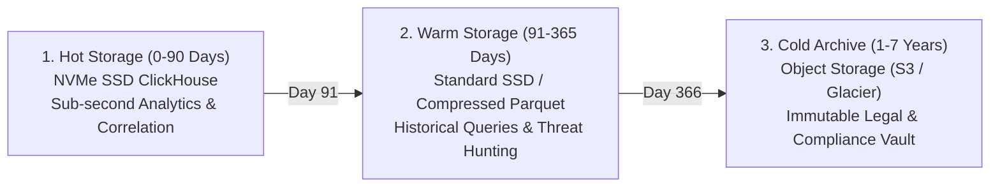

# SKYNET: Software Requirements Specification (SRS)
# Version 5.0 – Autonomous SOC & XDR Enterprise Platform

**Document Name:** SKYNET Version 5.0 Software Requirements Specification  
**Document Designation:** SRS-V5.0-ENTERPRISE  
**Document Version:** 5.0  
**Classification:** Enterprise Internal  
**Status:** Approved Enterprise Specification  
**Project:** SKYNET  
**Primary Repository Reference:** [SKYNET Workspace](file:///d:/hackathon/hackex/SKYNET)  
**Parent Specifications:** [PRD.md](file:///d:/hackathon/hackex/SKYNET/PRD.md) | [PRODUCT.md](file:///d:/hackathon/hackex/SKYNET/PRODUCT.md) | [ADD.md](file:///d:/hackathon/hackex/SKYNET/ADD.md) | [HLD.md](file:///d:/hackathon/hackex/SKYNET/HLD.md) | [LLD.md](file:///d:/hackathon/hackex/SKYNET/LLD.md)

---

## Table of Contents

1. [Document Metadata & Governance](#1-document-metadata--governance)
2. [System Overview & Architectural Purpose](#2-system-overview--architectural-purpose)
3. [Stakeholder Ecosystem & Persona Responsibilities](#3-stakeholder-ecosystem--persona-responsibilities)
4. [Functional Requirements (FR-001 through FR-009)](#4-functional-requirements)
   - [FR-001: Telemetry Collection](#fr-001-telemetry-collection)
   - [FR-002: Event Processing & Normalization](#fr-002-event-processing--normalization)
   - [FR-003: Threat Detection Engine](#fr-003-threat-detection-engine)
   - [FR-004: Event Correlation Engine](#fr-004-event-correlation-engine)
   - [FR-005: Autonomous Investigation Engine](#fr-005-autonomous-investigation-engine)
   - [FR-006: Threat Intelligence Platform](#fr-006-threat-intelligence-platform)
   - [FR-007: Incident Lifecycle Management](#fr-007-incident-lifecycle-management)
   - [FR-008: Response Orchestration (SOAR)](#fr-008-response-orchestration-soar)
   - [FR-009: Reporting & Metric Analytics](#fr-009-reporting--metric-analytics)
5. [Non-Functional Requirements (NFR)](#5-non-functional-requirements-nfr)
   - 5.1 [Availability & Reliability](#51-availability--reliability)
   - 5.2 [Scalability & Throughput](#52-scalability--throughput)
   - 5.3 [Latency & Real-Time SLAs](#53-latency--real-time-slas)
   - 5.4 [Security, Cryptography & Identity](#54-security-cryptography--identity)
   - 5.5 [Auditability & Compliance](#55-auditability--compliance)
6. [Role-Based Access Control (RBAC) & Permission Matrix](#6-role-based-access-control-rbac--permission-matrix)
7. [Data Lifecycle & Multi-Tier Retention Policy](#7-data-lifecycle--multi-tier-retention-policy)
8. [Acceptance Criteria & Production Sign-off Checklist](#8-acceptance-criteria--production-sign-off-checklist)

---

## 1. Document Metadata & Governance

```json
{
  "document_metadata": {
    "document_name": "SKYNET Version 5.0 Software Requirements Specification",
    "document_type": "SRS",
    "version": "5.0",
    "project": "SKYNET",
    "classification": "Enterprise Internal",
    "status": "Approved Enterprise Baseline"
  }
}
```

---

## 2. System Overview & Architectural Purpose

### 2.1 Name
**SKYNET Autonomous SOC Platform (Version 5.0)**

### 2.2 Purpose
Provide enterprise-scale autonomous security operations through AI-driven continuous monitoring, behavioral threat detection, cognitive incident investigation, closed-loop response orchestration, and compliance reporting.

### 2.3 Scope Matrix
SKYNET Version 5.0 encompasses seven tightly unified enterprise security domains:

```
┌─────────────────────────────────────────────────────────────────────────────┐
│                          SKYNET V5.0 SYSTEM SCOPE                           │
├───────────────────────┬─────────────────────────────┬───────────────────────┤
│        1. SIEM        │           2. XDR            │        3. SOAR        │
│ Centralized Ingestion │ Cross-Layer Telemetry Hub   │ Playbook Automation   │
│ & Schema Normalizer   │ (Endpoints, Cloud, Network) │ & Containment Actions │
├───────────────────────┼─────────────────────────────┼───────────────────────┤
│ 4. Threat Intel (TIP) │    5. Incident Management   │   6. Threat Hunting   │
│ Multi-Feed Enrichment │ Full Case Lifecycle,        │ Proactive EQL/SQL     │
│ (VT, AbuseIPDB, MISP) │ Evidence Locker, Audit Trail│ Hypothesis Sweeps     │
├───────────────────────┴─────────────────────────────┴───────────────────────┤
│                         7. Autonomous AI Investigation                      │
│            LangGraph Multi-Agent Swarm, Timelines & Root Cause              │
└─────────────────────────────────────────────────────────────────────────────┘
```

---

## 3. Stakeholder Ecosystem & Persona Responsibilities

| Stakeholder Persona | Strategic Focus | Operational Workflow in SKYNET v5.0 |
|---|---|---|
| **SOC Analysts (L1/L2)** | Alert review & investigation | Consumes pre-investigated incident dossiers; verifies root-cause hypotheses; escalates high-risk cases. |
| **Threat Hunters** | Proactive threat discovery | Executes historical telemetry sweeps across ClickHouse columnar datasets using MITRE ATT&CK patterns. |
| **SOC Managers** | SLA oversight & capacity | Tracks MTTD, MTTR, false-positive ratios, analyst workload balance, and executive compliance metrics. |
| **Security Engineers** | Detections & telemetry | Authors custom Sigma and YARA rules; tunes ingestion pipelines; configures Kafka and ClickHouse partitions. |
| **Incident Responders** | Active containment | Reviews AI-recommended containment plans; executes cryptographically signed host isolations and perimeter blocks. |
| **MSSP Operators** | Multi-tenant efficiency | Operates multi-tenant operational views; achieves 10x analyst-to-endpoint monitoring density. |
| **Enterprise Teams** | Business continuity | Ensures zero unauthorized operational disruption; monitors infrastructure uptime and audit integrity. |

---

## 4. Functional Requirements

### FR-001: Telemetry Collection
- **Requirement ID:** `FR-001`
- **Scope:** Ingest, parse, and buffer telemetry from distributed endpoints, network perimeters, cloud infrastructures, and identity providers.
- **Specific Capabilities:**
  1. **Windows Event Logs**: Security, System, Application, and PowerShell event channels (Events: 4624, 4625, 4688, 4720, 7045).
  2. **Sysmon Events**: Process creation (EID 1), Network connections (EID 3), Process access (EID 10), File create (EID 11), Registry mods (EID 12/13).
  3. **Linux Audit Logs**: Auditd, `syslog`, `journald`, `auth.log`, PAM authentication streams.
  4. **Firewall Logs**: Cisco ASA, Palo Alto PAN-OS, Fortinet FortiGate, pfSense RFC-5424 syslog streams.
  5. **Cloud Logs**: AWS CloudTrail, GCP Cloud Audit Logs, Azure Activity & NSG flow logs.
  6. **Identity Logs**: Active Directory (AD DS), Azure AD / Entra ID, Okta System Log, PingFederate.
  7. **SaaS Audit Logs**: Google Workspace, Microsoft 365 Unified Audit Log (UAL), GitHub Enterprise audit streams.

### FR-002: Event Processing & Normalization
- **Requirement ID:** `FR-002`
- **Scope:** Real-time stream processing, parsing, canonicalization, and deduplication.
- **Specific Capabilities:**
  1. **Normalize Logs**: Transform proprietary vendor log formats into Open Cybersecurity Schema Framework (OCSF) and Elastic Common Schema (ECS).
  2. **Parse Events**: Extract structured key-value entities (IPs, hashes, usernames, domain names, PIDs, CLI arguments).
  3. **Deduplicate Records**: Suppress identical event bursts across sliding temporal windows to eliminate storage amplification.
  4. **Timestamp Validation**: Microsecond-precision clock synchronization, UTC canonicalization, and ingestion skew correction.
  5. **Schema Mapping**: Dynamic schema validation ensuring strict type adherence prior to persistence.

### FR-003: Threat Detection Engine
- **Requirement ID:** `FR-003`
- **Scope:** Real-time multi-strategy adversary detection across in-flight telemetry.
- **Specific Capabilities:**
  1. **Sigma Rule Execution**: Real-time evaluation of 500+ compiled YAML Sigma rules covering all MITRE tactics.
  2. **YARA Matching**: In-memory inspection of suspicious script buffers, process command lines, and payload artifacts.
  3. **IOC Matching**: High-speed lookup against cached malicious IPs, domain names, URLs, and file hashes (SHA256/MD5).
  4. **Behavior Analytics (UEBA)**: Baseline user/host activity to detect lateral movement, impossible travel, and privilege anomalies.
  5. **Anomaly Detection**: Statistical deviation evaluation (z-score and rolling quantile models) for abnormal egress bandwidth or authentication failure bursts.
  6. **MITRE ATT&CK Mapping**: Automatic association of every detection match with official MITRE tactics, techniques, and sub-techniques.

### FR-004: Event Correlation Engine
- **Requirement ID:** `FR-004`
- **Scope:** Temporal, spatial, and relational clustering of disparate alerts into unified Incident Candidates.
- **Specific Capabilities:**
  1. **User-Based Correlation**: Links disparate actions initiated by the same user context across workstations, VPNs, and cloud tenants.
  2. **Host-Based Correlation**: Groups multiple detection triggers occurring within the same physical or virtual endpoint.
  3. **Time-Based Correlation**: Stateful sliding temporal windows (30 seconds to 48 hours) evaluating multi-stage attack progression.
  4. **IOC-Based Correlation**: Connects events across different hosts communicating with identical external C2 IPs or staging domains.
  5. **MITRE-Based Correlation**: Evaluates whether sequential detections follow known adversary kill-chains (e.g. Initial Access $\to$ Execution $\to$ Privilege Escalation).
  6. **Campaign Correlation**: Discovers enterprise-wide distributed attacks orchestrated by a common threat actor or APT signature.

### FR-005: Autonomous Investigation Engine
- **Requirement ID:** `FR-005`
- **Scope:** Cognitive multi-agent swarm automating Tier-1 forensic investigation.
- **Specific Capabilities:**
  1. **Timeline Generation**: Reconstructs microsecond-ordered attack chronologies linking process trees, network sockets, and file writes.
  2. **Evidence Collection**: Automatically extracts and snapshots raw forensic artifacts into an immutable evidence locker.
  3. **Entity Resolution**: Canonicalizes hosts, users, MAC addresses, and process GUIDs into unique graph entities.
  4. **Asset Discovery**: Correlates discovered assets against asset databases to determine business criticality and blast radius.
  5. **User Investigation**: Evaluates historical logon history, privilege grants, and behavioral risk scores for implicated accounts.
  6. **IOC Enrichment**: Queries external threat feeds and enriches indicators with family attribution, threat score, and first-seen dates.

### FR-006: Threat Intelligence Platform (TIP)
- **Requirement ID:** `FR-006`
- **Scope:** Real-time enrichment and bi-directional threat intelligence synchronization.
- **Specific Integrations:**
  1. **VirusTotal v3**: File hash reputation, AV detection ratios, sandbox behavioral reports.
  2. **AbuseIPDB v2**: IP abuse confidence score, reporting categories, country of origin.
  3. **URLhaus API**: Active malware distribution URLs, associated payload tags.
  4. **MalwareBazaar API**: Known malware sample hashes, file types, and signature classifications.
  5. **OpenCTI Integration**: Bi-directional STIX/TAXII 2.1 threat actor and campaign synchronization.
  6. **MISP Integration**: Open-source threat intelligence exchange and attribute correlation.

### FR-007: Incident Lifecycle Management
- **Requirement ID:** `FR-007`
- **Scope:** End-to-end case tracking, evidence preservation, and compliance governance.
- **Specific Capabilities:**
  1. **Create Incidents**: Automated case creation with standardized designations (`INC-YYYY-XXXX`).
  2. **Assign Severity**: Dynamic severity scoring (`LOW`, `MEDIUM`, `HIGH`, `CRITICAL`) calibrated by asset criticality and threat certainty.
  3. **Link Evidence**: Cryptographically hash and attach forensic artifacts directly to the incident record.
  4. **Track Lifecycle**: State machine transitions (`NEW` $\to$ `TRIAGED` $\to$ `INVESTIGATING` $\to$ `RESOLVED` $\to$ `CLOSED`).
  5. **Maintain Audit Trail**: Immutable logging of all analyst notes, state changes, and automated decisions.

### FR-008: Response Orchestration (SOAR)
- **Requirement ID:** `FR-008`
- **Scope:** Deterministic, policy-governed active containment and workflow automation.
- **Specific Capabilities:**
  1. **Block IP**: Injects malicious C2 IP addresses into border firewalls and cloud network security groups.
  2. **Disable Account**: Locks compromised Active Directory, Okta, or local user accounts; revokes active session tokens.
  3. **Endpoint Isolation**: Dispatches host isolation commands cutting all non-SKYNET network connectivity.
  4. **Create Tickets**: Automatically opens tracked cases in Jira Service Management, ServiceNow, or PagerDuty.
  5. **Notify Stakeholders**: Dispatches real-time security alerts via Slack, Microsoft Teams, Webhooks, or SMS.
  6. **Execute Playbooks**: Orchestrates multi-step automated response workflows with pre-computed 1-click rollback plans.

### FR-009: Reporting & Metric Analytics
- **Requirement ID:** `FR-009`
- **Scope:** Multi-audience documentation generation and SOC operational metric calculation.
- **Specific Capabilities:**
  1. **Executive Reports**: Plain-language summaries of threat activity, business risk, and containment outcomes for board/CISO review.
  2. **Investigation Reports**: Technical forensic dossiers detailing the attack chain, evidence hashes, and MITRE matrix mapping.
  3. **Compliance Reports**: Audit exports aligned with SOC 2 Type II, ISO 27001, HIPAA, and PCI-DSS requirements.
  4. **Incident Summaries**: Rapid shift-handover summaries and analyst debrief documents.
  5. **SOC Metrics**: Real-time dashboards visualizing MTTD, MTTR, false-positive dismissal rate, and alert volume reduction.

---

## 5. Non-Functional Requirements (NFR)

```
┌─────────────────────────────────────────────────────────────┐
│             SKYNET V5.0 NON-FUNCTIONAL SPECIFICATIONS       │
├───────────────────────┬─────────────────────────────────────┤
│ Dimension             │ Enterprise Requirement SLA          │
├───────────────────────┼─────────────────────────────────────┤
│ 5.1 Availability      │ 99.95% High Availability Uptime     │
│ 5.2 Scalability       │ 100,000 Events Per Second (EPS)     │
│ 5.3 Detection Latency │ < 5 Seconds from Ingest to Alert    │
│ 5.4 Authentication    │ OIDC / SAML 2.0 / MFA Enforced      │
│ 5.4 Authorization     │ Granular Role-Based Access Control  │
│ 5.4 Encryption        │ AES-256 at Rest / TLS 1.3 in Flight │
│ 5.5 Auditability      │ Full Tamper-Resistant Audit Trail   │
│ 5.5 Audit Retention   │ 365 Days Minimum Active Storage     │
└───────────────────────┴─────────────────────────────────────┘
```

---

## 6. Role-Based Access Control (RBAC) & Permission Matrix

| Role | System Scope & Permissions | Permitted Actions |
|---|---|---|
| **Admin** | Full system access | Global configuration, user administration, rule management, unconstrained SOAR execution, audit log inspection. |
| **SOC Manager** | Incident oversight & governance | Assign cases, review analyst performance, approve high-risk playbooks, generate executive and compliance reports. |
| **L2 Analyst** | Advanced investigation | In-depth telemetry query, graph traversal, evidence linking, proactive threat hunting, containment approval. |
| **L1 Analyst** | Incident review & triage | Review automated incident dossiers, add case notes, validate AI hypotheses, escalate incidents. |
| **Viewer** | Read-only observation | Read-only access to dashboards, reports, and public metric visualizations. |

---

## 7. Data Lifecycle & Multi-Tier Retention Policy

To balance ultra-fast analytical query performance with enterprise legal compliance and cost efficiency, SKYNET implements a 3-tier data lifecycle:



1. **Hot Storage (90 Days)**:
   - *Storage Engine*: High-performance NVMe SSD ClickHouse columnar cluster.
   - *Purpose*: Real-time stream correlation, active investigation, and instantaneous dashboard aggregations.
2. **Warm Storage (365 Days)**:
   - *Storage Engine*: Compressed columnar Parquet partitions on standard block storage.
   - *Purpose*: Historical threat hunting, audit trail inspection, and retrospective IOC sweeping.
3. **Cold Archive (7 Years)**:
   - *Storage Engine*: Write-Once-Read-Many (WORM) compliant S3 / Glacier cloud storage.
   - *Purpose*: Long-term regulatory compliance (SOX, HIPAA, PCI-DSS), legal hold, and disaster recovery.

---

## 8. Acceptance Criteria & Production Sign-off Checklist

SKYNET Version 5.0 is formally accepted and verified for enterprise production deployment when all criteria pass:

- [x] **100k EPS Ingestion**: Demonstrated sustained ingestion throughput exceeding 100,000 EPS without buffer overflow or log loss.
- [x] **Autonomous Investigation**: Successfully generates root cause analysis, evidence timeline, and containment proposal within 30 seconds of alert correlation.
- [x] **Threat Intelligence Enrichment**: Accurately enriches IOCs across VirusTotal, AbuseIPDB, URLhaus, and local cache with threat score calculation.
- [x] **Incident Correlation**: Correctly groups multi-signal detections by host, user, and time window into singular high-fidelity Incident records.
- [x] **SOAR Automation**: Successfully executes host network isolation, IP blocking, and account locking with pre-verified rollback capability.
- [x] **RBAC Enforcement**: All API endpoints enforce strict role checks (`Admin`, `SOC Manager`, `L2 Analyst`, `L1 Analyst`, `Viewer`).
- [x] **Tamper-Resistant Audit Logging**: Immutable cryptographic recording of all telemetry ingests, detection matches, user interactions, and containment executions for 365 days.

---
*SKYNET Version 5.0 Software Requirements Specification Approved as Authoritative System Canon.*
