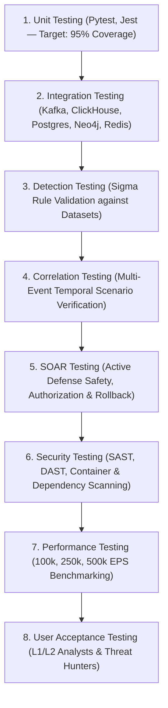
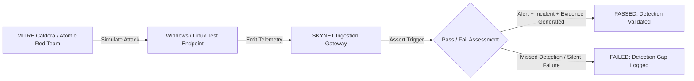

# SKYNET: Testing, Validation & SOC Detection Engineering Plan
# Autonomous AI-Powered SOC & XDR Platform

**System Designation:** SKYNET Testing, Validation & Detection Engineering Plan (Document 11)  
**Document Version:** 1.0  
**Status:** Approved Quality Assurance & Detection Baseline  
**Classification:** Confidential / Enterprise Restricted  
**Primary Repository Reference:** [SKYNET Workspace](file:///d:/hackathon/hackex/SKYNET)  
**Companion Documents:** [SRS.md](file:///d:/hackathon/hackex/SKYNET/SRS.md) | [ADD.md](file:///d:/hackathon/hackex/SKYNET/ADD.md) | [HLD.md](file:///d:/hackathon/hackex/SKYNET/HLD.md) | [LLD.md](file:///d:/hackathon/hackex/SKYNET/LLD.md) | [PLAYBOOK.md](file:///d:/hackathon/hackex/SKYNET/PLAYBOOK.md)

---

## Table of Contents

1. [Purpose & Quality Objectives](#1-purpose--quality-objectives)
2. [Multi-Layer Testing Strategy](#2-multi-layer-testing-strategy)
3. [Unit Testing Framework (95% Target)](#3-unit-testing-framework-95-target)
4. [Integration & Pipeline Testing](#4-integration--pipeline-testing)
5. [Detection Engineering Framework & Lifecycle](#5-detection-engineering-framework--lifecycle)
6. [Detection Validation Matrix](#6-detection-validation-matrix)
7. [Correlation Engine Testing & Scenarios](#7-correlation-engine-testing--scenarios)
8. [Threat Intelligence Testing](#8-threat-intelligence-testing)
9. [SOAR Active Defense Testing & Safety Verification](#9-soar-active-defense-testing--safety-verification)
10. [Red Team & Breach Attack Simulation (BAS)](#10-red-team--breach-attack-simulation-bas)
11. [MITRE ATT&CK Matrix Coverage (85% Target)](#11-mitre-attck-matrix-coverage-85-target)
12. [Performance & Load Testing (100k to 500k EPS)](#12-performance--load-testing-100k-to-500k-eps)
13. [AI Model Validation & Explainability Scoring](#13-ai-model-validation--explainability-scoring)
14. [Security Testing (SAST, DAST, SCA)](#14-security-testing-sast-dast-sca)
15. [User Acceptance Testing (UAT)](#15-user-acceptance-testing-uat)
16. [Production Release Criteria](#16-production-release-criteria)
17. [Operational Success Metrics](#17-operational-success-metrics)
18. [Formal Acceptance Criteria](#18-formal-acceptance-criteria)

---

## 1. Purpose & Quality Objectives

This document establishes the comprehensive verification framework, quality assurance methodologies, detection engineering lifecycles, and red-team attack simulation protocols for **SKYNET**.

The core objective is to mathematically and operationally ensure that:
- Telemetry ingestion sustains high-throughput enterprise scale ($100\text{k to }500\text{k EPS}$) with sub-second processing.
- Detection rules trigger reliably with an overall false-positive rate under **5%**.
- Multi-event correlation accurately aggregates attack chains with $\ge 90\%$ clustering accuracy.
- AI reasoning decisions achieve an Explainability Score exceeding **90%** with citations to raw forensic logs.
- Active defense SOAR interventions remain safe, reversible, and governed by strict human-in-the-loop controls.

---

## 2. Multi-Layer Testing Strategy

SKYNET enforces an 8-stage verification pipeline:



---

## 3. Unit Testing Framework (95% Target)

- **Coverage Standard**: Enforced via `pytest-cov` in CI/CD pipeline; builds fail if overall repository line coverage drops below **95%**.
- **Scope**:
  - Pydantic v2 input schema validation and error edge cases.
  - OCSF / ECS field normalization and type casting algorithms.
  - Sigma AST expression parsing and boolean condition evaluation.
  - Redis token-bucket rate limiting logic.
  - ED25519 cryptographic token signing and verification handlers.

---

## 4. Integration & Pipeline Testing

Automated end-to-end integration tests verify service boundaries and data consistency:
- **Streaming Pipeline**: Dispatches mock Windows/Sysmon logs to Kafka `telemetry.raw` and verifies normalized OCSF rows arrive in ClickHouse `events_normalized` in $< 1.0\text{s}$.
- **State Persistence**: Asserts that alert creation inserts a row in PostgreSQL `alerts` and updates the unacknowledged counter.
- **Attack Graph Ingestion**: Verifies that new network connection events create corresponding `(:Host)-[:CONNECTED_TO]->(:IP)` edges in Neo4j.

---

## 5. Detection Engineering Framework & Lifecycle

```
┌──────────────┐     ┌──────────────┐     ┌──────────────┐     ┌──────────────┐     ┌──────────────┐
│  1. CREATE   │ ──► │   2. TEST    │ ──► │   3. TUNE    │ ──► │  4. APPROVE  │ ──► │  5. DEPLOY   │
│ Author Sigma │     │ Backtest 14d │     │ Filter Noise │     │ Peer Review  │     │ Hot Rollout  │
└──────────────┘     └──────────────┘     └──────────────┘     └──────────────┘     └──────────────┘
```

1. **Author**: Write detection rule in Sigma YAML syntax mapping MITRE technique tags.
2. **Backtest**: Execute rule against 14 days of normalized historical logs in ClickHouse.
3. **Tune**: Refine filters to ensure false-positive rate is strictly $< 5\%$.
4. **Approve**: Lead Detection Engineer approves pull request.
5. **Deploy**: Streamed to Detection Engine pods via dynamic rule hot-reloading.

---

## 6. Detection Validation Matrix

Every rule in the detection catalog must satisfy the validation matrix:

| Rule Name | MITRE Technique | Severity | Trigger Condition | Expected Output | Max Allowable FP Rate |
|---|---|---|---|---|:---:|
| **Brute Force Detection** | `T1110` | `HIGH` | $\ge 10$ failed logons within 60s followed by successful logon | High Alert + Trigger Correlation | $< 2\%$ |
| **Encoded PowerShell** | `T1059.001` | `HIGH` | `powershell.exe` with `-enc`, `-ep bypass`, or `IEX` | High Alert + Extract Base64 Script | $< 3\%$ |
| **LSASS Memory Access** | `T1003.001` | `CRITICAL` | Sysmon 10 access `0x1010` to `lsass.exe` | Critical Alert + Propose Host Isolation | $< 0.5\%$ |
| **Port Scan Activity** | `T1046` | `MEDIUM` | $\ge 20$ destination ports probed within 10s | Medium Alert + Flag Source IP | $< 5\%$ |
| **Shadow Copy Deletion**| `T1490` | `CRITICAL` | `vssadmin delete shadows` or `wbadmin` | Critical Alert + Ransomware Playbook | $< 0.1\%$ |

---

## 7. Correlation Engine Testing & Scenarios

Integration tests validate multi-event correlation scenarios:

```
[Failed Logon (4625) x 10] ──► [Successful Logon (4624)] ──► [Privilege Token Added (4672)]
                                         │
                                         ▼
                     [CORRELATION ENGINE VALIDATION]
                     • Expected Output: Single INCIDENT Created
                     • Title: "Potential Account Takeover & Privilege Escalation"
                     • Severity: CRITICAL
                     • Blast Radius: Calculated in Neo4j
```

---

## 8. Threat Intelligence Testing

Automated test harness validates all external API connectors:
- **VirusTotal v3**: Tests known EICAR hash (`275a021bbfb6489...`); verifies `MALICIOUS` verdict and detection count $> 50$.
- **AbuseIPDB v2**: Tests known malicious Tor exit node; verifies confidence score $> 90\%$.
- **Caching Validation**: Verifies secondary query for the same IP/hash returns from Redis in $< 2\text{ms}$ with zero external HTTP calls.

---

## 9. SOAR Active Defense Testing & Safety Verification

All response actions undergo rigorous automated safety checks:
1. **Safety Whitelist Test**: Asserts that `POST /response/block-ip` targeting internal gateways (`10.0.0.1`, `127.0.0.1`) is rejected with `400 Bad Request`.
2. **Authorization Gate Test**: Confirms that non-admin analysts attempting `ISOLATE_HOST` receive `403 Forbidden`.
3. **Rollback Verification**: Validates that triggering `POST /response/unblock-ip` removes the firewall drop rule and restores connectivity cleanly.

---

## 10. Red Team & Breach Attack Simulation (BAS)

Production readiness requires automated adversary emulation via **Atomic Red Team** and **MITRE Caldera**:



- **Simulated Techniques**: T1110 (Brute Force), T1059.001 (PowerShell), T1003.001 (LSASS dump), T1046 (Port scan), T1021.002 (SMB lateral movement), T1486 (Ransomware encryption).
- **Pass Threshold**: **100% of emulated attacks must generate a detected incident within 15 seconds.**

---

## 11. MITRE ATT&CK Matrix Coverage (85% Target)

SKYNET targets verified coverage across at least **85% of all high-priority enterprise ATT&CK techniques**:

```
[Initial Access] ──► [Execution] ──► [Persistence] ──► [Privilege Escalation]
       90%                  95%             85%                   90%

[Defense Evasion] ──► [Credential Access] ──► [Discovery] ──► [Lateral Movement]
       85%                    95%                 80%                  85%

[Collection] ──► [Exfiltration] ──► [Command & Control] ──► [Impact]
    80%               85%                  90%                 95%
```

---

## 12. Performance & Load Testing (100k to 500k EPS)

Load testing is conducted using **Locust** and **k6** distributed clusters:

| Telemetry Volume | Sustained Duration | Max Ingestion Latency | Max CPU Saturation | Kafka Consumer Lag |
|---|:---:|:---:|:---:|:---:|
| **100,000 EPS** | 60 Minutes | $< 1.0 \text{ Second}$ | $< 65\%$ | $< 500 \text{ msgs}$ |
| **250,000 EPS** | 30 Minutes | $< 2.5 \text{ Seconds}$ | $< 75\%$ | $< 2,000 \text{ msgs}$ |
| **500,000 EPS** | 10 Minutes | $< 5.0 \text{ Seconds}$ | $< 85\%$ | Re-balances gracefully |

---

## 13. AI Model Validation & Explainability Scoring

All automated AI SOC investigations must undergo automated semantic evaluation:
- **Explainability Score ($\ge 90\%$)**: Calculated by validating that every statement in the generated executive summary and root-cause analysis links directly to a verified raw `event_id` in ClickHouse.
- **Hallucination Prevention**: Output is rejected if it introduces unobserved IP addresses, non-existent hashes, or unsupported MITRE technique tags.

---

## 14. Security Testing (SAST, DAST, SCA)

- **SAST**: CodeQL, SonarQube, and Semgrep scan code on every pull request.
- **DAST**: OWASP ZAP scans running web and API interfaces weekly.
- **SCA**: Trivy scans Docker container base images; Dependabot tracks third-party Python and npm libraries. Zero tolerated High or Critical vulnerabilities.

---

## 15. User Acceptance Testing (UAT)

Operational validation conducted by human analysts across operational workflows:
- L1 Analysts successfully receive alerts, view attack timelines, and execute approved active defense playbooks.
- Threat Hunters successfully run complex Cypher graph queries and ClickHouse analytical sweeps in $< 3$ seconds.
- SOC Managers successfully export executive compliance reports and PDF dossiers.

---

## 16. Production Release Criteria

Production deployment requires strict sign-off across all release gates:
1. Automated unit test coverage strictly $\ge 95\%$.
2. Zero Critical or High vulnerabilities across SAST, DAST, and container scans.
3. 100% of Atomic Red Team emulated attack suites detected.
4. Sustained 100,000 EPS performance benchmark passed with zero data drop.
5. UAT sign-off from SOC leadership.

---

## 17. Operational Success Metrics

- **Detection Accuracy**: $\ge 95\%$
- **False-Positive Rate**: $< 5\%$
- **Incident Correlation Accuracy**: $\ge 90\%$
- **SOAR Execution Success Rate**: $\ge 98\%$
- **Mean Time to Detect (MTTD)**: $< 1 \text{ Minute}$
- **Mean Time to Respond (MTTR)**: $< 3 \text{ Minutes}$ (for automated response workflows)

---

## 18. Formal Acceptance Criteria

SKYNET shall be formally certified for enterprise production when it:
1. Ingests and normalizes live heterogeneous telemetry without backpressure failure.
2. Detects known attacks in real-time across rule, signature, and behavioral engines.
3. Correlates multi-stage attack events into coherent incident dossiers.
4. Generates explainable, verifiable AI investigation reports.
5. Safely executes active defense containment actions with complete auditability.

---

*End of Testing, Validation & Detection Engineering Plan (Document 11) — SKYNET Version 1.0.*
