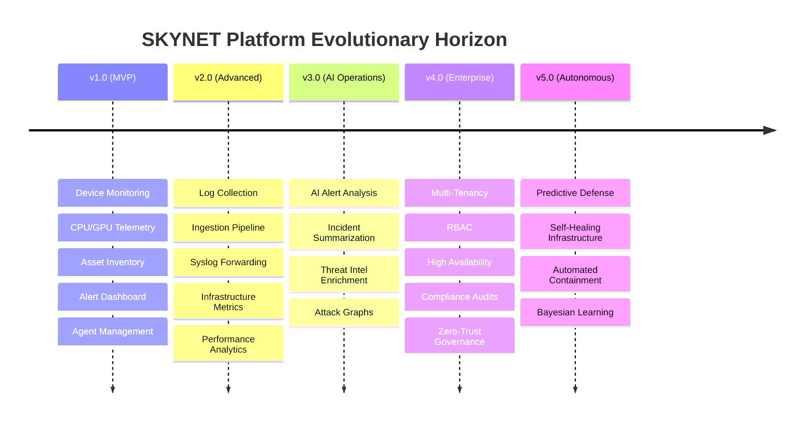
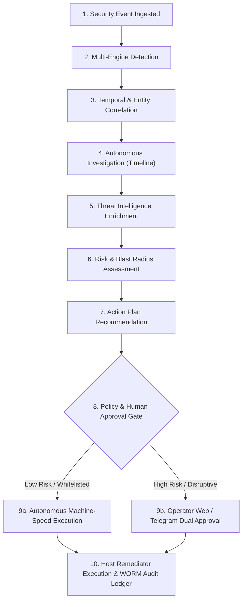
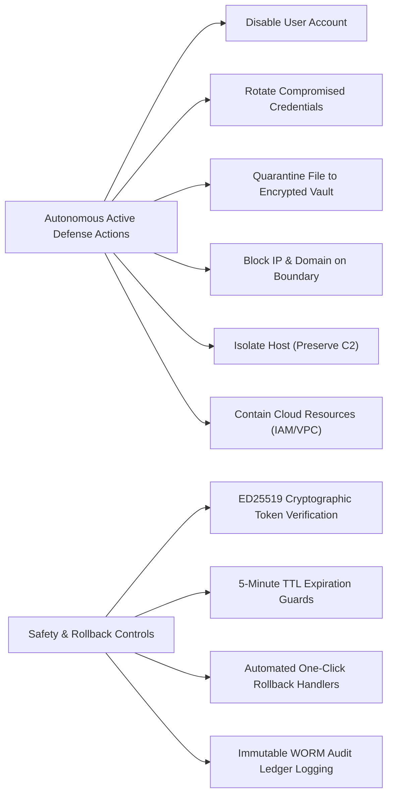

# SKYNET: Product Vision, Roadmap & Autonomous SOC Evolution Strategy
# Autonomous AI-Powered SOC & XDR Platform

**System Designation:** SKYNET Product Vision, Roadmap & Autonomous SOC Evolution Strategy (Document 12)  
**Document Version:** 1.0  
**Status:** Approved Product Strategy & Evolutionary Roadmap  
**Classification:** Confidential / Enterprise Restricted  
**Primary Repository Reference:** [SKYNET Workspace](file:///d:/hackathon/hackex/SKYNET)  
**Companion Documents:** [SRS.md](file:///d:/hackathon/hackex/SKYNET/SRS.md) | [ADD.md](file:///d:/hackathon/hackex/SKYNET/ADD.md) | [HLD.md](file:///d:/hackathon/hackex/SKYNET/HLD.md) | [LLD.md](file:///d:/hackathon/hackex/SKYNET/LLD.md) | [MVP_ROADMAP.md](file:///d:/hackathon/hackex/SKYNET/MVP_ROADMAP.md)

---

## Table of Contents

1. [Executive Vision: The Autonomous SOC Paradigm](#1-executive-vision-the-autonomous-soc-paradigm)
2. [Product Mission & Core Scope](#2-product-mission--core-scope)
3. [Strategic Business & Operational Objectives](#3-strategic-business--operational-objectives)
4. [Versioned Product Evolution (v1.0 to v5.0)](#4-versioned-product-evolution-v10-to-v50)
5. [Five-Phase Security Evolution Roadmap](#5-five-phase-security-evolution-roadmap)
6. [Cognitive AI Agent Fleet Roadmap](#6-cognitive-ai-agent-fleet-roadmap)
7. [The Autonomous SOC Workflow Topology](#7-the-autonomous-soc-workflow-topology)
8. [Human Oversight & Governance Model](#8-human-oversight--governance-model)
9. [Enterprise & Vertical Expansion Strategy](#9-enterprise--vertical-expansion-strategy)
10. [Cloud & Multi-Platform Expansion](#10-cloud--multi-platform-expansion)
11. [Autonomous Active Response Roadmap](#11-autonomous-active-response-roadmap)
12. [Strategic Product KPIs & Performance Benchmarks](#12-strategic-product-kpis--performance-benchmarks)
13. [The Five-Year Architectural Vision](#13-the-five-year-architectural-vision)
14. [Final Product Objective](#14-final-product-objective)

---

## 1. Executive Vision: The Autonomous SOC Paradigm

The modern Security Operations Center faces an unsustainable crisis: telemetry volumes are expanding exponentially, adversaries are operating at machine speed, and human security analysts are overwhelmed by alert fatigue and repetitive Level-1 triage tasks.

**SKYNET** is architected to fundamentally transform cybersecurity operations by executing an evolutionary leap from reactive, human-constrained monitoring to proactive, cognitive autonomy:

```
┌─────────────────────────┐
│ 1. HUMAN-ASSISTED SOC   │  Manual triage, human-driven querying, static dashboards.
└───────────┬─────────────┘
            │
            ▼
┌─────────────────────────┐
│ 2. AI-AUGMENTED SOC     │  Rule detection, automated IOC enrichment, AI-suggested summaries.
└───────────┬─────────────┘
            │
            ▼
┌─────────────────────────┐
│ 3. AI-DRIVEN SOC        │  Autonomous investigation, attack graphs, automated risk scoring.
└───────────┬─────────────┘
            │
            ▼
┌─────────────────────────┐
│ 4. AUTONOMOUS SOC       │  Self-healing infrastructure, proactive threat hunting, machine-speed defense.
└─────────────────────────┘
```

The ultimate mandate of SKYNET is to automate the vast majority of Tier-1 and Level-1 SOC analyst responsibilities while retaining strict human-in-the-loop (HITL) oversight, explainable reasoning, and cryptographic auditability for all active defense decisions.

---

## 2. Product Mission & Core Scope

### 2.1 Mission Statement
To deliver an autonomous, unified, and explainable cyber-defense platform that unceasingly monitors, ingests, detects, investigates, correlates, and neutralizes infrastructure threats at machine speed.

### 2.2 Coverage Ecosystem
- **Workstations & Laptops**: Windows 10/11, macOS, enterprise desktop fleets.
- **Physical & Virtual Servers**: Windows Server 2016–2022, Linux (Ubuntu, Debian, RHEL, Rocky Linux).
- **Mobile Endpoints**: Android daemons and MDM-connected enterprise devices.
- **Cloud Infrastructure**: AWS, Microsoft Azure, Google Cloud Platform (GCP), Oracle Cloud.
- **Containerized Environments**: Docker engines, Kubernetes clusters, Red Hat OpenShift.
- **Network Boundaries**: Edge firewalls, VPN concentrators, and IDS/IPS appliances.

---

## 3. Strategic Business & Operational Objectives

- **Objective 1: Eliminate Alert Fatigue**: Suppress false positives and algorithmically cluster related alerts, reducing raw operational alert volume by **at least 70%**.
- **Objective 2: Automate L1 SOC Investigations**: Eliminate manual log searches by automatically reconstructing attack timelines, gathering evidence, and writing technical root-cause analyses in $< 15\text{ seconds}$.
- **Objective 3: Slash Mean Time to Detect (MTTD)**: Compress enterprise intrusion detection latency from hours to under **60 seconds** ($50\%$ overall reduction).
- **Objective 4: Accelerate Mean Time to Respond (MTTR)**: Reduce response execution time from an industry average of 45 minutes to under **3 minutes** ($60\%$ overall reduction) through automated SOAR workflows.
- **Objective 5: Guarantee Explainable AI Decisions**: Enforce deterministic reasoning where 100% of AI conclusions cite raw forensic log IDs, eliminating hallucination risks.

---

## 4. Versioned Product Evolution (v1.0 to v5.0)



### Version 1.0 — MVP Core
- *Capabilities*: Hardware telemetry collection (CPU, GPU, RAM, Disk, Net), asset inventory, basic threshold alerts, and real-time dashboard.
- *Target Audience*: Internal engineering validation, security research labs.

### Version 2.0 — Advanced Monitoring
- *Capabilities*: High-throughput log collection (Windows Events, Sysmon, Auditd, Syslog), Kafka streaming ingestion, and historical time-series analytics.
- *Target Audience*: Small organizations and internal IT security teams.

### Version 3.0 — AI Operations
- *Capabilities*: Multi-engine Sigma detection, automated IOC enrichment (VirusTotal, AbuseIPDB), LangGraph AI incident investigation, and Neo4j attack graph pathing.
- *Target Audience*: Modern SOC teams and security operations centers.

### Version 4.0 — Enterprise Edition
- *Capabilities*: High availability clustering (Patroni PostgreSQL, ClickHouse Keeper, Kafka KRaft), granular RBAC, multi-tenant isolation, and regulatory compliance mapping.
- *Target Audience*: Global enterprises, government defense, and Managed Security Service Providers (MSSPs).

### Version 5.0 — Autonomous Infrastructure
- *Capabilities*: Predictive cyber defense, machine-speed host containment, reinforcement learning threat anticipation, and self-healing systems.
- *Target Audience*: Critical national infrastructure, global banking, and large-scale enterprises.

---

## 5. Five-Phase Security Evolution Roadmap

```
Phase 1: Infrastructure Monitoring (Hardware counters, CPU/GPU, Network IO, Host Identity)
                         │
                         ▼
Phase 2: Security Telemetry Monitoring (Windows Security, Sysmon, Linux Auditd, Syslog)
                         │
                         ▼
Phase 3: Real-Time Threat Detection (Sigma Rules, YARA, IOC Matching, Behavioral Drifts)
                         │
                         ▼
Phase 4: SOC Operations & Case Management (Triage, Neo4j Attack Graph, Evidence Lockers)
                         │
                         ▼
Phase 5: Autonomous SOC & Active Defense (Multi-Agent Swarm, HITL Gated Containment)
```

---

## 6. Cognitive AI Agent Fleet Roadmap

The cognitive reasoning core deploys specialized autonomous agents whose capabilities expand over successive releases:

| Agent Designation | Core Mandate | Assigned Toolsets & Integrations |
|---|---|---|
| **Telemetry Agent** | Real-time stream monitoring, heartbeat validation, and anomalous telemetry drift detection. | `get_metrics()`, `get_processes()` |
| **Detection Agent** | Continuous evaluation of Sigma rules, IOC cache matching, and administrative noise filtering. | `query_sigma()`, `check_cves()` |
| **Investigation Agent**| Forensic evidence harvesting, timeline reconstruction, and attack graph traversal. | `query_timeline()`, `get_attack_graph()` |
| **Threat Intelligence Agent** | Global indicator enrichment, vendor reputation scoring, and adversary context mapping. | `lookup_hash()`, `lookup_ip()`, `lookup_domain()` |
| **Response Agent** | Formulating targeted containment action plans (`BLOCK_IP`, `KILL_PROCESS`, `ISOLATE_HOST`). | `propose_remediation()`, `verify_policy()` |
| **Reporting Agent** | Authoring plain-language executive briefs, technical root-cause analyses, and compliance reports. | `export_incident_report()`, `calculate_kpis()` |

---

## 7. The Autonomous SOC Workflow Topology



---

## 8. Human Oversight & Governance Model

To eliminate operational risk while maximizing response velocity, SKYNET implements a 4-tier risk governance matrix:

| Action Risk Tier | Operations / Primitives | Governance & Approval Policy |
|---|---|---|
| **Tier 1: Low Risk** | Block external C2 IP on perimeter; quarantine unexecuted payload; send Slack/Email alert | **Fully Autonomous Execution** (if AI Confidence $\ge 95\%$) |
| **Tier 2: Medium Risk**| Terminate non-critical user process; isolate non-server workstation; reset user session | **AI Recommendation + Single Analyst Approval** |
| **Tier 3: High Risk** | Isolate application server; disable corporate user account; inject subnet drop rules | **Dual Authorization** (Lead Analyst + Incident Responder) |
| **Tier 4: Critical Risk**| Sever Active Directory Domain Controller; revoke enterprise root CA; core network cut | **Incident Commander / CISO Cryptographic Sign-Off** |

---

## 9. Enterprise & Vertical Expansion Strategy

SKYNET's modular architecture enables deployment across high-assurance industry verticals:
- **Enterprise SOC**: Centralized internal monitoring across hybrid corporate workloads.
- **MSSP (Managed Security Service Providers)**: Multi-tenant partitioning allowing a single platform deployment to serve hundreds of distinct client organizations.
- **Government & Defense**: Fully air-gapped, zero-cloud on-premise deployments with self-hosted open-weights LLMs (Llama-3 / DeepSeek-R1).
- **Critical Infrastructure & Energy**: Monitoring of IT/OT converged networks with low-footprint edge sensors.
- **Healthcare & Financial Services**: HIPAA, PCI-DSS, and SOC 2 Type II compliant storage with 7-year immutable WORM audit logs.

---

## 10. Cloud & Multi-Platform Expansion

- **AWS Integration**: Native ingestion of CloudTrail, VPC Flow Logs, GuardDuty findings, and automated containment via AWS Security Groups and IAM policies.
- **Microsoft Azure & Entra ID**: Ingestion of Azure Activity logs, Defender alerts, and direct session revocation via Microsoft Graph API.
- **Google Cloud Platform (GCP)**: Integration with Google Cloud Audit Logs and Security Command Center.
- **Oracle Cloud & Private Enclaves**: OCI Audit log streaming and Bare-Metal server telemetry.

---

## 11. Autonomous Active Response Roadmap



---

## 12. Strategic Product KPIs & Performance Benchmarks

| Metric | Baseline (Traditional Tier-1 SOC) | SKYNET Target Performance |
|---|:---:|:---:|
| **Detection Accuracy** | $70–80\%$ | **$\ge 95\%$** |
| **False-Positive Reduction** | High Alert Fatigue ($40–60\%$ noise) | **$\ge 70\%$ Reduction ($< 5\%$ overall noise)** |
| **Mean Time to Detect (MTTD)** | 4 to 24 Hours | **$< 60 \text{ Seconds}$ ($50\%+$ Reduction)** |
| **Mean Time to Respond (MTTR)**| 45 Minutes | **$< 3 \text{ Minutes}$ ($60\%+$ Reduction)** |
| **L1 Investigation Automation**| 100% Manual | **$\ge 85\%$ Fully Automated** |
| **Explainability Score** | Opaque / Ad-hoc | **$\ge 90\%$ (Raw log citations)** |

---

## 13. The Five-Year Architectural Vision

Over the next 5 years, SKYNET converges the traditionally fragmented enterprise security stack into a single unified cognitive architecture:

$$\mathbf{SKYNET} = \text{XDR} + \text{SIEM} + \text{SOAR} + \text{TIP} + \text{Autonomous AI SOC Swarm}$$

1. **Extended Detection and Response (XDR)**: Universal cross-platform visibility from endpoint kernels to cloud workloads.
2. **Security Information and Event Management (SIEM)**: 100k+ EPS ClickHouse columnar event storage with 7-year retention.
3. **Security Orchestration, Automation, and Response (SOAR)**: Policy-gated, cryptographically signed active defense actions.
4. **Threat Intelligence Platform (TIP)**: Real-time global threat enrichment and local indicator caching.
5. **Autonomous AI SOC Swarm**: Continuous cognitive reasoning, attack graph traversal, and automated incident case synthesis.

---

## 14. Final Product Objective

**SKYNET shall become the industry-standard enterprise autonomous security operations platform**, delivering continuous monitoring, instant threat detection, multi-agent investigation, attack graph correlation, threat intelligence enrichment, policy-gated active defense, and regulatory compliance reporting through a unified, resilient, and explainable AI architecture.

---

*End of Product Vision, Roadmap & Autonomous SOC Evolution Strategy (Document 12) — SKYNET Version 1.0.*
