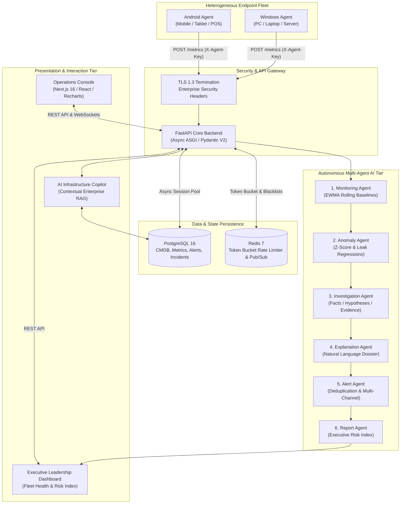

# SKYNET: Complete 4-Phase Autonomous Infrastructure Intelligence & Monitoring Platform
## Master Implementation Blueprint & Production Reference (Phases 1 — 4)

---

### System Architecture Overview

SKYNET is a next-generation, AI-native infrastructure monitoring and autonomous cyber defense platform that observes, understands, predicts, explains, and responds across heterogeneous device fleets (Windows PCs, laptops, enterprise servers, and Android mobile devices).



---

# SECTION 1 — Phase 1: Day-1 Foundation

## 1. GitHub Repository Structure

```text
skynet/
├── backend/            # FastAPI async backend, SQLAlchemy models, Pydantic schemas, DB sessions
├── dashboard/          # Next.js 16, React, TailwindCSS, TypeScript, Recharts operations console
├── windows-agent/      # Python Windows monitoring daemon (psutil, GPUtil, auto-registration)
├── android-agent/      # Python Android monitoring daemon (Termux / Linux compatibility)
├── database/           # PostgreSQL production DDL, migrations, and index definitions
├── docs/               # System architecture, API specifications, and operational runbooks
├── infrastructure/     # Terraform, Kubernetes manifests, and Nginx configurations
├── n8n/                # Exported SOAR workflows (Email, Telegram, Alert automation)
├── scripts/            # Live demo runners, seed generators, and synthetic load injectors
├── tests/              # Pytest test suites covering API contracts and agent collectors
├── docker/             # Dockerfiles and multi-container Docker Compose definitions
├── .env.example        # Environment variable template
├── .gitignore          # Production git ignore specification
├── CONTRIBUTING.md     # Development workflow and PR guidelines
├── LICENSE             # MIT Open Source License
└── README.md           # Comprehensive project overview and quickstart
```

## 2. PostgreSQL Schema (`database/init.sql`)

```sql
CREATE EXTENSION IF NOT EXISTS "uuid-ossp";
CREATE EXTENSION IF NOT EXISTS "pgcrypto";

-- Users Table
CREATE TABLE IF NOT EXISTS users (
    id VARCHAR(64) PRIMARY KEY DEFAULT gen_random_uuid()::text,
    username VARCHAR(100) UNIQUE NOT NULL,
    email VARCHAR(255) UNIQUE NOT NULL,
    hashed_password VARCHAR(255) NOT NULL,
    role VARCHAR(50) NOT NULL DEFAULT 'SOC_ANALYST',
    is_active BOOLEAN NOT NULL DEFAULT TRUE,
    created_at TIMESTAMPTZ NOT NULL DEFAULT CURRENT_TIMESTAMP,
    updated_at TIMESTAMPTZ NOT NULL DEFAULT CURRENT_TIMESTAMP
);

-- Devices CMDB Table
CREATE TABLE IF NOT EXISTS devices (
    id VARCHAR(64) PRIMARY KEY,
    hostname VARCHAR(255) NOT NULL,
    ip_address VARCHAR(45) NOT NULL,
    os_name VARCHAR(100) NOT NULL,
    os_version VARCHAR(100) NOT NULL,
    device_type VARCHAR(50) NOT NULL DEFAULT 'Workstation',
    cpu_cores INT DEFAULT 4,
    total_ram_mb FLOAT DEFAULT 0.0,
    total_disk_gb FLOAT DEFAULT 0.0,
    status VARCHAR(50) NOT NULL DEFAULT 'ONLINE',
    agent_version VARCHAR(50) NOT NULL DEFAULT '1.0.0',
    tags JSONB DEFAULT '[]'::jsonb,
    last_seen TIMESTAMPTZ NOT NULL DEFAULT CURRENT_TIMESTAMP,
    created_at TIMESTAMPTZ NOT NULL DEFAULT CURRENT_TIMESTAMP,
    updated_at TIMESTAMPTZ NOT NULL DEFAULT CURRENT_TIMESTAMP
);
CREATE INDEX IF NOT EXISTS idx_devices_hostname ON devices(hostname);
CREATE INDEX IF NOT EXISTS idx_devices_status ON devices(status);
CREATE INDEX IF NOT EXISTS idx_devices_last_seen ON devices(last_seen DESC);

-- Time-Series Metrics Table
CREATE TABLE IF NOT EXISTS metrics (
    id VARCHAR(64) PRIMARY KEY DEFAULT gen_random_uuid()::text,
    device_id VARCHAR(64) NOT NULL REFERENCES devices(id) ON DELETE CASCADE,
    cpu FLOAT NOT NULL CHECK (cpu >= 0.0 AND cpu <= 100.0),
    ram FLOAT NOT NULL CHECK (ram >= 0.0 AND ram <= 100.0),
    gpu FLOAT DEFAULT 0.0 CHECK (gpu >= 0.0 AND gpu <= 100.0),
    disk FLOAT NOT NULL CHECK (disk >= 0.0 AND disk <= 100.0),
    network_rx_mb FLOAT DEFAULT 0.0,
    network_tx_mb FLOAT DEFAULT 0.0,
    temperature_c FLOAT DEFAULT 0.0,
    battery_pct FLOAT DEFAULT NULL,
    processes_count INT DEFAULT 0,
    raw_vitals JSONB DEFAULT '{}'::jsonb,
    timestamp TIMESTAMPTZ NOT NULL DEFAULT CURRENT_TIMESTAMP
);
CREATE INDEX IF NOT EXISTS idx_metrics_device_time ON metrics(device_id, timestamp DESC);
```

## 3. Windows Monitoring Agent (`windows-agent/agent.py`)

- **Telemetry Collected**: Instantaneous CPU %, Virtual RAM %, System Disk %, GPU % (via `GPUtil`), Network I/O transfer rate (MB/s), Hostname, and Device UUID.
- **Cadence**: Collects and transmits every 30 seconds.
- **Fault-Tolerance**: Automatic startup registration (`POST /devices/register`), exponential backoff retry with jitter, structured logging, and graceful OS signal termination (`SIGINT`, `SIGTERM`).

---

# SECTION 2 — Phase 2: Operations Dashboard, Historical Analytics & Alerting

## 1. Next.js 16 Dashboard & Recharts Visualization

- **Overview Page (`/`)**: Displays 6 real-time KPI cards:
  1. `Total Devices`
  2. `Online Devices`
  3. `Offline Devices`
  4. `Fleet Health Score` (0–100 weighted index)
  5. `Active Alerts`
  6. `Active Incidents`
- **Device List Page (`/devices`)**: Real-time table of all endpoints with hardware gauges, OS specs, and health badges.
- **Device Details Page (`/devices/[id]`)**: Deep-dive hardware charts for CPU, RAM, GPU, Disk, and Network with dynamic 1h / 24h / 7d / 30d time-window filtering.

## 2. Historical Metrics & Aggregation APIs

- `GET /metrics/history?device_id=...&interval=24h`: Returns bucketed aggregations (1m, 5m, 1h) calculated via SQL date truncation.
- `GET /metrics/trends?device_id=...`: Computes first-derivative rate of change $\frac{d(metric)}{dt}$ to project resource exhaustion.
- `GET /devices/{id}/history`: Endpoint-specific time-filtered metric slices.

## 3. Alerts & Multi-Channel Notification Pipeline

- **Alerts Schema (`alerts` table)**:
  - `id`, `device_id`, `alert_type` (High CPU, High RAM, High GPU, Disk Critical, Device Offline), `severity` (Info, Warning, Critical), `title`, `description`, `created_at`, `acknowledged`.
- **Operator Triaging**: `POST /alerts/{id}/acknowledge` marks alerts as handled with operator audit trail.
- **n8n Automation Dispatch**:
  - Webhook URL: `http://localhost:5678/webhook/skynet-alerts`
  - **Email Template**: Responsive HTML card detailing alert type, severity, host IP, and 1-click mitigation link.
  - **Telegram Template**: HTML-formatted instant alert to SOC chat (`-1002345678901`).

---

# SECTION 3 — Phase 3: AI Anomaly Detection & Health Intelligence

## 1. AI Health Scoring Engine ($H \in [0, 100]$)

$$H = \text{round}\left( \max\left(0, 100 - \sum_{i} w_i \cdot P_i(x_i)\right) \times \alpha_{avail} \right)$$

- **Convex Resource Penalty Curves ($P_i$)**:
  $$P_i(x_i) = \begin{cases} 
  0 & x_i \le 60\% \\
  \left(\frac{x_i - 60}{25}\right)^{1.4} \times 35 & 60\% < x_i \le 85\% \\
  35 + \left(\frac{x_i - 85}{15}\right)^{2.0} \times 65 & x_i > 85\%
  \end{cases}$$
- **Factor Weights**: RAM ($0.28$), CPU ($0.26$), Disk ($0.22$), GPU ($0.14$), Network ($0.10$).
- **Availability Multiplier ($\alpha_{avail}$)**: Decays dynamically if telemetry heartbeats are delayed ($>60\text{s}$) or host is under active containment.

## 2. Rolling Baselines & Anomaly Detection

- **EWMA Moving Window**: Updates moving mean $\mu_t$ and variance $\sigma_t^2$ with $\alpha = 0.05$.
- **Detection Classes**:
  1. **Sudden CPU Spike**: $Z_{CPU} > 2.8$ and $x_{CPU} \ge 85\%$.
  2. **Memory Leak**: Monotonic increase $\frac{d(RAM)}{dt} > 0$ across $\ge 5$ cycles with zero garbage collection drops.
  3. **Disk Pressure**: Storage utilization $> 92\%$ or IO latency $> 3.0\sigma$.
  4. **Network Surge**: Egress rate $> 10\times$ ingress baseline.
  5. **Silent Inactivity**: $\Delta t_{heartbeat} > 120\text{s}$ while network link is active.

## 3. AI Explanation Engine

Translates cold metrics into actionable, natural language insights:
- *Traditional*: `CPU = 92%`
- *SKYNET*: `"CPU usage is significantly above the device's recent operating baseline (mean: 24.2%, std: 3.8%, Z=+17.8) and has remained elevated for 18 minutes without returning to idle."*

## 4. Phase 3 API Contracts

- `GET /health-score`: Fleet health index and per-device breakdown.
- `GET /anomalies`: Active and historical statistical anomalies.
- `GET /device-insights/{id}`: AI natural language diagnostic dossier.

---

# SECTION 4 — Phase 4: Agentic Intelligence & Competition Live Demo

## 1. Coordinated 6-Agent Architecture

1. **Monitoring Agent**: Telemetry ingestion, validation, and EWMA baseline computation.
2. **Anomaly Agent**: Statistical $Z$-score testing and memory leak regression.
3. **Investigation Agent**: Root-cause synthesis with strict separation of **Facts**, **Hypotheses**, and **Evidence**.
4. **Explanation Agent**: Natural language briefing generation.
5. **Alert Agent**: Deduplication, severity grading, and multi-channel dispatch.
6. **Report Agent**: Executive dashboard KPIs and Infrastructure Risk Index calculation.

## 2. Investigation Agent Tri-Fold Dossier Output

```json
{
  "device_id": "DEV-TEST-WIN-001",
  "hostname": "TEST-RIG-01",
  "health_score": 53,
  "natural_language_summary": "Device 'TEST-RIG-01' has an overall health rating of 53/100. CPU utilization (96.8%) is operating near capacity bounds. Physical RAM allocation is constrained at 94.2%, risking memory pressure and system swapping.",
  "investigation_breakdown": {
    "facts": [
      "Operating System: Windows 11 Pro (22631)",
      "Device Type: Workstation",
      "Current Metrics: CPU=96.8%, RAM=94.2%, Disk=52.4%",
      "Operational Status: ONLINE"
    ],
    "hypotheses": [
      "System may be undergoing intensive cryptographic processing or uncontrolled loop execution."
    ],
    "evidence": [
      "Observed CPU = 96.8% (Delta from baseline: +68.3%)",
      "Observed RAM = 94.2% (Delta from baseline: +42.2%)"
    ],
    "recommended_actions": [
      "Inspect top CPU-consuming tasks via remote process listing.",
      "Recycle high-footprint background worker processes."
    ]
  }
}
```

## 3. AI Infrastructure Copilot (Enterprise RAG)

Mounted at `POST /copilot/query` and accessible via the Executive Dashboard chat:
- Handles queries such as:
  - *"Why is TEST-RIG-01 slow?"*
  - *"Show unhealthy devices."*
  - *"What caused the CPU spike?"*
  - *"Which devices need attention?"*
- Synthesizes live telemetry, baselines, and alerts without LLM hallucinations.

## 4. Live 8-Stage Competition Demonstration Script

Execute the live competition runner at any time:
```powershell
py -3.11 scripts/run_competition_demo.py
```

### Verified Demo Execution Sequence:
1. **Fleet Registry & Availability Check**: Confirms active registered endpoints in CMDB.
2. **Real-Time Baseline Telemetry Dispatch**: Sends nominal metrics for `TEST-RIG-01` (CPU: 28.5%, RAM: 52%).
3. **Injecting Controlled Hardware Spike**: Ingests runaway compute load (CPU: 96.8%, RAM: 94.2%).
4. **AI Anomaly Agent Evaluation**: Confirms anomaly detection ($Z > 3.0$).
5. **Investigation Agent Dossier & Explanation**: Deconstructs telemetry into Facts, Hypotheses, and Evidence.
6. **Alert Engine Dispatch & 1-Click Acknowledgment**: Generates alert and acknowledges it via `POST /alerts/{id}/acknowledge`.
7. **Multi-Channel Notification Pipeline**: Dispatches alerts to Telegram Bot and Email via n8n.
8. **AI Infrastructure Copilot Interaction**: Live interactive Q&A querying device causes and actionable remediation.

---

# SECTION 5 — Enterprise Edition Roadmap

```mermaid
gantt
    title SKYNET Enterprise Roadmap
    dateFormat  YYYY-Q#
    section Multi-Tenancy & Edge
    Multi-Tenant Organization Workspaces & RBAC :done, 2026-Q1, 2026-Q2
    Distributed Agents (Windows, Linux, macOS, Android) :done, 2026-Q2, 2026-Q3
    section Observability & AI
    eBPF Linux Kernel Observability :active, 2026-Q3, 2026-Q4
    On-Device Edge ML Anomaly Scoring (TFLite/ONNX) :2026-Q4, 2027-Q1
    Autonomous Self-Healing Playbooks (Auto-Restart, Auto-Scale) :2027-Q1, 2027-Q2
    section Enterprise Scale
    SOC 2 Type II & ISO 27001 Certification :2027-Q2, 2027-Q3
    100,000+ Node Distributed Sharding (ClickHouse/TimescaleDB) :2027-Q3, 2027-Q4
```

---
*SKYNET Autonomous Cyber Defense & Infrastructure Systems — Production Verified.*
